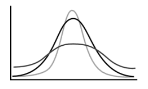
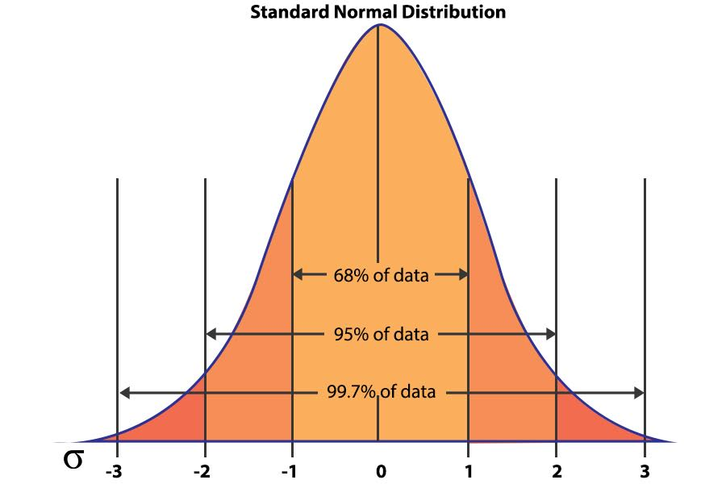

<style>
body {
text-align: justify;
font-size: 12pt}
</style>


```{r setup, include=FALSE}
knitr::opts_chunk$set(echo = TRUE)
```

## 1. The European Social Survey (ESS) 2024 Data

The <a href="https://github.com/KoLa992/Computational-Statistics-Lecture-Notes/blob/main/ess_hun_2024.xlsx" target="_blank">ess_hun_2024.xlsx</a> file contains a dataset with the responses of 2048 Hungarian participants to 29 questions (plus an id column) from the 2024 European Social Survey (ESS2024). The survey was taken at the first months (January-March) of 2024, so the rise of the TISZA party is not yet covered by this survey. The raw database is available on <a href="https://ess.sikt.no/en/series/321b06ad-1b98-4b7d-93ad-ca8a24e8788a" target="_blank">this link</a> after a free registration.

If an empty value is found in any column, it means that the respondent in that row did not answer the question. The respondents in the database can be considered a **random sample** drawn **from** the entire **Hungarian population** aged 18 and over. Description of the 29+1 variables in the dataset is as follows:

- **idno**: Respondent's identification number
- **Age**: Age of respondent at the time of the survey
- **Sex**: Biological sex of the respondent
- **PoliticalNews**: News about politics and current affairs, watching, reading or listening, in minutes
- **DailyNetUse**: Internet use, how much time on typical day, in minutes
- **TrustPeople**: Most people can be trusted (0: No, 10: Yes)
- **InterestPolitics**: How interested in politics (1: Very interested, 4: Not at all interested)
- **TrustHunParlament**: Trust in Hungary's parliament (0: No, 10: Yes)
- **TrustEuParlament**: Trust in the European Parliament (0: No, 10: Yes)
- **PartyVoted2022**: Party voted for in last national election (2022)
- **PublicDemonstration**: Taken part in public demonstration last 12 months
- **PartyPreference**: Which party feel closest to
- **FreeHomosex**: Gays and lesbians free to live life as they wish
- **AshamedHomosexInFamily**: Ashamed if close family member gay or lesbian
- **ObedienceImportant**: Obedience and respect for authority most important virtues children should learn
- **FeelHappy**: How happy are you (0: unhappy, 10: happy)
- **ClimateChangeCause**: Climate change caused by natural processes, human activity
- **ClimateChangeWorry**: How worried about climate change
- **Huxit**: Would vote for Hungary to remain member of European Union or leave
- **AlcoholWeekday**: Grams alcohol, last time drinking on a weekday
- **AlcoholWeekend**: Grams alcohol, last time drinking on a weekend day
- **Height**: Height of respondent (cm)
- **Weight**: Weight of respondent (kg)
- **EqualPayGoodEconomy**: Bad or good for economy in if women and men receive equal pay for doing the same work (0: bad, 6: good)
- **EqualManagGoodBusiness**: Bad or good for economy in if equal numbers of women and men are in higher management positions (0: bad, 6: good)
- **Education**: Highest level of education
- **YearsOfEducation**: Years of full-time education completed
- **WeeklyWorkHours**: Total hours normally worked per week
- **Region**: Region the respondent is living in
- **vacc19**: Respondent received at least one dose of a vaccine against coronavirus

Let's read the Excel file into an R data frame with the `readxl` package! I don't include the `readxl` package in my R environment, as I only need one function from it and no more. So, I use the `read_excel` function with the `readxl::` prefic instead of `library(readxl)`.

```{r}
ess <- readxl::read_excel("ess_hun_2024.xlsx")
str(ess)
```
Great, we have all the $n=2048$ observations and all the $p=30$ variables! :)

This dataset of the ESS gives room to many interesting analyses, but first We'll examine the obesity of the Hungarian population. <a href="https://iris.who.int/bitstream/handle/10665/43190/9241593024_eng.pdf" target="_blank">According to the WHO</a>, a good variable to describe the obesity of a population is the Body Mass Index (BMI). BMI is defined as the body mass divided by the square of the body height, and is expressed in units of kg/m2. Major adult BMI classifications by WHO are underweight (under 18.5 kg/m2), normal weight (18.5 to 24.9), overweight (25 to 29.9), and obese (30 or more). BMIs under 20 and over 25 have been associated with higher all-cause mortality, with the risk increasing with distance from the 20–25 range.

So, let's **calculate the BMI** for the 2048 Hungarian people observed in this ESS data. Be careful that the **Height** variable is given in cm, so we need to convert it into m before calculating BMI. **Weight** is given in kg, so we have no such issues in this variable.

```{r}
ess$BMI <- ess$Weight/(ess$Height/100)^2
head(ess$BMI)
```

Great, looks like the first 6 BMIs that we got are valid BMI values! But let's check if we have any missing values in this new variable due to having people with missing height and/or weight data in the sample. We can use a combination of `is.na` and `sum` function for this. The  `is.na` function returns a `logical vector` indicating if an element is missing with `TRUE` value. If we provide a `logical vector` for the `sum` function, it converts it to `numeric` according to `TRUE = 1` and `FALSE = 0`, and sums up these numbers, so it returns the number of `TRUE = 1` values, which is the number of missing BMIs in our case.

```{r}
sum(is.na(ess$BMI))
```
Ok, so We have 39 missing BMI values. This is only $39/2048 = 0.019 = 1.9\%$ of all observations. These are not many, so let's omit these in a new, restricted data frame.

```{r}
ess_small <- ess[!is.na(ess$BMI),c("idno", "BMI")]
str(ess_small)
```
Great, since $2048-39=2009$, it seems that the machine spirit did our bidding. :)

We can see that this **BMI is** a comfy little statistical variable, as it is **on ratio scale**: all 4 mathematical operations are interpretable here. Let's analyse it's empirical and theoretical distribution!

## 2. Empirical vs Theoretical Distributions

The **empirical probability distribution is** basically the (relative) **frequency distribution for a numerical variable**. This is the **distribution that we observe** in our dataset.

We can see that the BMI variable is continuous as it can take lots of unique values, namely 889 different values.

```{r}
length(unique(ess_small$BMI))
```

This suggests that the BMI's **empirical distribution is best shown by a histogram**. Let's create one with `ggplot`!

```{r}
library(ggplot2)
ggplot(ess_small, aes(x=BMI)) + geom_histogram()
```

We can nicely observe that most people (roughly 200) in this survey have a BMI around 27, which is in the overweight category according to WHO, and around this mode of 27, we have smaller and larger BMIs with proportionally decreasing frequencies. Extremely small and large values have only a few observations. This is an almost perfectly symmetrical/normal distribution: most observations are concentrated in the middle of the value set and there are fewer and fewer observations in both edges or *tails* of the value set.

For our purposes, it'll be beneficial to see our histograms with relative frequencies on the `y` axis. We can create a histogram like this with `ggplot` via the `aes(y = after_stat(density))` setting in the `geom_histogram` function.

```{r}
ggplot(ess_small, aes(x=BMI)) +
  geom_histogram(aes(y = after_stat(density)))
```

Now, what we have received is exactly the same histogram as before, just the `y` axis is in the range of $(0,1)$. Actually what we see in the vertical axis is not precisely the relative frequency of the bins in the `x` axis but a value very close to it. We'll see the differences in just a bit. But **for illustrative purposes, we can treat these `y` values like relative frequencies**: e.g. most people (about $12\%$) in the sample have a BMI value of roughly 27.

Now, looking at this histogram and seeing it's nice, bell-shaped form, we don't need much fantasy to see that connecting the columns of the histogram with a continuous line **results in a function similar to the one just below**:

```{r echo=FALSE}
mu = mean(ess_small$BMI)
szigma = sd(ess_small$BMI)

x <- seq(mu-3*szigma, mu+3*szigma)
y <- dnorm(x, mean = mu, sd = szigma)

DFRajz <- data.frame(x=x, y=y)

library(ggplot2)
ggplot(DFRajz, aes(x=x, y=y)) + geom_line(linewidth=1)
```

Now, this beauty right here is a **nice, $y=f(x)$ style function** that we can use to describe the shape of our histogram with a mathematical formula. A **function that can describe the shape of the relative frequency distribution shown on a histogram is called a density function**. When we want to use a density function to describe the shape of our histogram, then we want to **use a theoretical probability distribution to describe/model our statistical variable**.<br>
In this case, **when we want use a bell-curved shape to describe the empirical distribution of our variable, then we want to use a normal distribution to model/describe our BMI variable**. And the bell-shaped density function we see is the **density function of the normal distribution**.

To be more precise, the bell curve we've seen above is the **density function of a normal distribution with a mean of $\mu=26.27\$$ and a standard deviation of $\sigma=4.03\$$ since this is the mean and standard deviation of the variable containing the BMIs**, based on which we've drawn the bell-shaped density function above.

```{r}
mu = mean(ess_small$BMI)
sigma = sd(ess_small$BMI)
c(mu, sigma)
```

So, to what we can say is that we see the density function of a $N(26.27,4.03)$ distribution. Therefore, the **general notation** for normal distributions is $N(\mu, \sigma)$. And with the notation $y_i \sim N(26.27,4.03)$ we say that our $y_i$ observations (now the BMIs of the respondents) follow a $N(26.27,4.03)$ distribution.

Why is that? because, the exact shape of the density function for the normal distribution depends on the mean and standard deviation of the data that we want to fit this density function on.

- The **mean** defines where the **maximum of the function** is (since for symmetrical distributions the mean equals the mode)
- The **standard deviation** defines how **pointy or flat** the function is

You can see all of this in the interactive plot below:

<iframe src ="https://kola992.shinyapps.io/normaldensityplot/" height=500px width=800px data-external="1" />

The $f(x)$ formula for the density function with a given $\mu$ and $\sigma$ is the following: $$f(x)=\frac{1}{\sigma\sqrt{2\pi}}e^{-\frac{1}{2}\left(\frac{x-\mu}{\sigma}\right)^2}$$

Don't get PTSD from Calculus classes: we won't use this formula directly. It's just good to see one time what kind of formula can produce this beautiful bell shape of the density function! :)

### 2.1. Histogram vs Probability Density Function

Ok, but "*What have the Romans ever done for us?*". So, we can rightly ask the question: what is this density function good for? First and foremost, if we substitute an $x$ number to the $f(x)$ formula of the density function, we get **the probability for a random number drawn from the variable $Y$ being equal with $x$.** With mathematical notations, this means $f(x)=P(y_i=x)$.<br>
Ok, technically I am not very accurate here, since the probability of the $y_i=x$ event would be practically $0$. Since a variable with normal distribution can take so many unique values that the probability of taking just one of these values is really-really small. The bell curve of the normal density function limits to $0$ in $x=\pm \infty$, but it never actually reaches $0$, so we have an infinite amount of $x$ values to take with some positive probability. Hence, the density function actually shows the probability of a random $y_i$ element being in the small area of $x$ with a radius of $\epsilon$. So, the correct formula would be $P(x \leq Y_i \leq x + \epsilon)$.<br>
But, for **our purposes it's perfectly fine if we think of the $f(x)$ value as the probability of $x$'s occurrence in our $Y$ variable: $P(y_i=x)$.**

So, if we want to know the probability of a random Hungarian person's BMI being exactly $20.6$ (the BMI of the 1st person in the data frame), then we just need to substitute this $x=20.6$ value into the density function formula of the $N(26.27,4.03)$ distribution: $$P(y_i=20.6)=f(20.6)=\frac{1}{4.03\sqrt{2\pi}}e^{-\frac{1}{2}\left(\frac{20.6-26.27}{4.03}\right)^2}$$

Since based on the observed trading data the mean of price changes is $\mu=26.27\$$ and the standard deviation is $\sigma=4.03\$$.

We can apply the `dnorm` function in R to calculate this substitution into the $f(x)$ density function:

```{r}
mu = mean(ess_small$BMI)
sigma = sd(ess_small$BMI)

dnorm(20.6, mean = mu, sd = sigma)
```

Perfect! So, the probability of a person having a BMI of $20.6$ is $3.7\%$.

At this point, let's **think back how the shape of the density function reacted to increasing he standard deviation: it got flat!** Now, this reaction is absolutely understandable since **if the standard deviation is increasing**, then the **probability of extremely high and low $y_i$ values is also increasing**! And **if $f(x)=P(y_i=x)$, then the function will "get fat" at the two ends of the $x$ axis**, so the **shape of the function gets to flatten**.

If we think about it, **we can get this probability empirically**, without using the density function, just **by looking at the histogram with relative frequencies**.

```{r}
ggplot(ess_small, aes(x=BMI)) +
  geom_histogram(aes(y = after_stat(density)))
```

Since we can see that the relative frequency of the histogram bin that includes $20.6$ is just around roughly $0.04=4\%$, just like the result of the $f(20.6)$ density function value. We can get the exact value by using the `binnedCounts` function from the `RcmdrMisc` package seen in <a href="Prelude03.html" target="_blank">Prelude 3</a>

```{r}
RcmdrMisc::binnedCounts(ess_small$BMI, breaks = 30)
```
The exact empirical probability is $83/2009=0.0413=4.13\%$.

So the **main philosophical difference** here is that **empirical distribution with histogram** gets the $P(Y=20.6)$ probability by just **concentrating on the observed data** (number of people with BMI around $20.6$ divided with total number of observed people), **while the theoretical distribution** gets the $P(Y=20.6)$ probability by **using a mathematical formula, the $f(20.6)$ density function**.

### 2.2. Cumulative Relative Frequencies vs Cumulative Distribition Function

We can see from the result in the previous 2.1. section that the occurrence of specific values in a normal distribution is not very high, due to what we discussed before: the occurrence of a specific value in a variable with lots of unique values is very small, i.e. BMI is a **continuous variable**.<br>
Therefore, we usually ask from our theoretical distribution that **what is the probability of a random $y_i$ being smaller than $x$?** So, we usually look for the $P(y_i < x)$ probabilities.<br>
This is nothing more than the **area of the density function below $x$.** So, we can calculate this with the $F(x)=\int_{-\infty}^x{f(x)}dx$ improper integral. This is called as the **cumulative distribution function**: $F(x)$.

If we didn't want to manually substitute $x$ into the formula of the $f(x)$ density function, it's sure as hell, we don't want to take the integral of it!<br>
Luckily, the machine spirit of R has blessed us with the `pnorm` function that will calculate this integral and the $P(y_i < x)$ probability for us!

Let's see what is the probability of getting a BMI smaller than  $18.5$ (the threshold for being underweight) in the Hungarian population. So, we actually look for the $P(y_i<18.5)$ probability.

```{r}
pnorm(18.5, mean = mu, sd = sigma)
```

Thankfully, the probability of being so slim that it is a health hazard is just $2.7\%$, so we can breathe a bit easier. :)

Of course, if we can calculate the probability of being smaller than $x$, then we can also calculate the probability of being greater than $x$, since **being above $x$ is the complementary event of being below $x$,** so we the following formula is valid: $P(y_i>x)=1-P(y_i<x)$. We simply calculate the **area of the density function that is above $x$.**

So, let's see what's the probability of a random Hungarian being obese, i.e. having a BMI of more than 30! The whole thing can be handled by the `pnorm` function again:

```{r}
1 - pnorm(30, mean = mu, sd = sigma)
```

Oh wow, these obese people have a probability of $17.7\%$ for occurring. It's a bit embarrassing!

If we want to know the probability of a randomly drawn $y_i$ being between two numbers $a$ and $b$, then we simply need to **subtract the probability of being below the smaller value from the probability of being below the higher value**. So, if $a>b$, then $P(b<y_i<a)=P(y_i<a)-P(y_i<b)$, but if $a<b$, then $P(a<y_i<b)=P(y_i<b)-P(Y_i<a)$ is the way to calculate. So, the `pnorm` function still solves our problems here. On the plot side, we take the **area between $a$ and $b$ under the density function**.

If I want to see the probability of a BMI in the "normal range", that is a BMI between $18.5$ and $24.9$ in the Hungarian population, we just take the probability of being smaller than $18.5$ and we subtract it from the probability of being smaller than $24.9$:

```{r}
pnorm(24.9, mean = mu, sd = sigma) - pnorm(18.5, mean = mu, sd = sigma)
```

Perfect, so the probability of a normal BMI in Hungary is $34\%$.

**To sum up**, we can calculate the following probabilities with the help of a $f(x)$ density function, where $y_i$ is a random observation of our currently examined $Y$ variable, plus $x$ and $y$ are given numbers:

- being exactly $x$: $P(y_i=x)=f(x)$
- being below $x$: $P(y_i<x)=\int_{-\infty}^x{f(x)}dx$
- being above $x$: $P(y_i>x)=1-P(y_i<x)$
- being between $x$ and $y$: $P(y<y_i<x)=P(y_i<x)-P(y_i<y)$

All of these calculations and their graphical representations can be reviewed in the interactive plot below.<br>
A *small comment*: in the formulas for the probabilities of the *below, above and between* events I didn't apply the $=$ sign since due to the great number of unique values in the variable, the probability of a specific value appearing is essentially $0$, so if we examine the *probability of being in a given range, including and excluding a given point does not really matter*.

<iframe src ="https://kola992.shinyapps.io/normalprobabilities/" height=600px width=800px data-external="1" />

Of course, **these probabilities can again be obtained empirically as well, using the observed dataset alone**. Precisely, using **cumulative relative frequencies**.

- the empirical probability of a BMI below $18.5$ is the number of observations being smaller than $18.5$ divided by the number of total observations, i.e. the **cumulative relative frequency for $18.5 \rightarrow CRF(18.5)$**
- the empirical probability of a BMI above $30$ is just $1-CRF(30)$
- the empirical probability of a BMI being between $18.5$ and $24.9$ is simply $CRF(24.9)-CRF(18.5)$

All of these empirical probabilities can be calculated using the `mean` function. Since if I take the mean of a logical expression in R like `ess_small$BMI < 18.5`, it is evaluated as a `logical vector` with `TRUE` values where the logical condition is met. Just like the `sum` function, the `mean` function evaluates a `logical vector` with `TRUE = 1` and `FALSE = 0` numerical encoding. Hence, the result is the proportion of observations meeting our logical condition. Which is exactly the cumulative relative frequency we are looking for.

```{r}
mean(ess_small$BMI < 18.5)
1 - mean(ess_small$BMI < 30)
mean(ess_small$BMI < 24.9) - mean(ess_small$BMI < 18.5)
```

As we can see, we have received somewhat similar empirical probabilities we did with the theoretical normal distribution.

### 2.3. Benefits of the Theoretical Distribution

All right, now we can use the normal distribution to obtain probabilities of some events occurring in the BMI variable. But **what's the point?** I mean, we could just see that we can **obtain these probability calculated from the normal distribution using the observed data alone** (empirically), just using the elementary school formula of number of favorable observations divided with number of total observations. So, truly, **what is the benefit of using a normal distribution that fits our BMI data instead of just using the BMI data alone??**

Let's examine a specific probability. Based on the relative frequencies (so just on our observed Hungarian people) we would say that the probability of encountering an obese Hungarian (BMI > 30) is $16.7\%$.

```{r}
1 - mean(ess_small$BMI < 30)
```

On the other hand, the normal distribution suggests that the probability of these high BMI values is 1 %.point higher,  $17.7\%$. Now, who is in the right? What's the difference?

```{r}
1 - pnorm(30, mean = mu, sd = sigma)
```

Now, the difference comes from the fact that **with the relative frequency of $16.7\%$ we only consider the observed data only, so the result only comes from the observed statistical SAMPLE!!** The $16.7\%$ only means that **only 16.7% of our observed Hungarians have a BMI higher than 30!!**

On the other hand, the $17.7\%$ is the *theoretical probability* calculated from the density function of the normal distribution, with mean and standard deviation fitted on the data. This a theoretical probability since **the $f(x)$ density function** (being a continuous function) **assigns positive occurrence probabilities to $x$ values that are not yet included in the observed sample!!** This means, that **when calculating probabilities the density function considers values that are OUTSIDE of the sample! In other words, it can "see" values that haven't occurred yet!** That is why we call the density function's $f(x)$ values *PROBABILITIES* and the proportions, or *empirical* probabilities are usually just called relative frequencies.

*Nota bene*: To rightfully call the density function's $f(x)$ values probabilities, it is required that the density function more or less fits to the observed histogram. We can check this quite easy visually. We can create a plot to see how well the theoretical normal distribution with the given $\mu$ mean and $\sigma$ standard deviation fits to the observed histogram.

We can just add another layer on the histogram plot with the `stat_function` function, where we specify in the parameter settings that we want to add a normal density function (`fun = dnorm`) with $\mu=26.27$ and $\sigma=4.03$ (`args = list(mean = 26.27, sd = 4.03)`). Plus we can also set the color of the density function as red for example (`col = 'red'`), and make the line of the density function a bit more thick (`linewidth = 1`).

```{r warning=FALSE}
mu = mean(ess_small$BMI)
sigma = sd(ess_small$BMI)

ggplot(ess_small, aes(x=BMI)) +
  geom_histogram(aes(y = after_stat(density))) +
  stat_function(
                fun = dnorm, 
                args = list(mean = mu, sd = sigma),
                col = 'red',
                linewidth = 1)
```

All right, we can see that the observed histogram is a bit too pointy (has positive kurtosis) compared to the density function of the classic normal distribution. So, we have more people in around the most frequent values of 26-27 (which is also where the mean is due to the symmetry of the distribution) than we would expect based on the fitted normal distribution. But otherwise, the density function fits on the observed histogram quite nicely.

During the course, we'll see a more exact method than staring at graphs to test whether a theoretical distribution fits to an observed histogram. :)

*Nota bene*: I've mentioned in the beginning of this Section 2 that the `aes(y = after_stat(density))` setting in the `geom_histogram` function does not put the relative frequencies exactly on the `y` axis. It **rescales them such that the area under the rectangles of the histogram would sum up to $1$**. It does this because the are under a probability density function (like the normal distribution's bell curve) also sums up to $1$. So, this way we can better observe whether a theoretical distribution's density function fits on the observed histogram. That's why this setting is called `after_stat(density)` in `ggplot`.

Okay, now that we've established that visually it seems that the **normal distribution is a rather good fit for the observed BMI data, let's see the practical benefits of knowing this information**.<br>
Let's say You work at the public health insurer of Hungary and You need to calculate the reserves of the public health insurance policies of Hungarian citizens. According to <a href="https://iris.who.int/bitstream/handle/10665/43190/9241593024_eng.pdf" target="_blank">WHO</a>, **Class III Obesity (BMI > 40) is a predictor of many health risks** (strokes, diabetes, several cancers and so on). So, for accurately assessing the expected risk of selling health insurances in Hungary, it would be good to know **the probability of insuring someone with a BMI greater than 40**. Furthermore, it is also an important information for developing **public health strategies** to see **how common Class III obesity is** in the Hungarian population. So, let's see the empirical and theoretical approaches for calculating this $P(y_i>40)$ probability.

```{r}
mean(ess_small$BMI > 40)
1 - pnorm(40, mean = mu, sd = sigma)
```

Oh wow, according to the **empirical approach** we have **no one with BMI > 40 in Hungary**, while the **theoretical normal distribution** suggests a **$0.03\%$ probability for finding people with Class III Obesity** in Hungary.<br>
So, even according to the normal distribution, this risk is low thankfully, but NOT 0 as the empirical way suggests!! This is because, as we have discussed, the **empirical calculation of probability can only consider events that we have observed, while the theoretical distribution can also see events that we have not observed**. So, **the point of using theoretical distributions to model our data is to calculate or consider probabilities for events that are NOT observed in our dataset**. So probability distributions are always about **describing the unobserved population** next to the observed sample.<br>
We can see that without using the normal distribution we would seriously underestimate the risk of Type III Obesity in the Hungarian population. We wouldn't have even calculated with it occurring!

The thing works in the other direction as well. Like, severe thinness (a BMI < 16) is also a high health risk as it means serious malnutrition. However, we have no one in our observed ESS sample with this condition, but based on the normal distribution we can see that they can appear in the whole Hungarian population a probability of $0.5\%$.

```{r}
mean(ess_small$BMI < 16)
pnorm(16, mean = mu, sd = sigma)
```

These differences seem small, but yearly medical costs for someone with Class III Obesity were 8354 USD in 2017 (according to <a href="https://pmc.ncbi.nlm.nih.gov/articles/PMC10394178/" target="_blank">a 2021 study in the Journal of Managed Care & Specialty Pharmacy</a>). So **taking the probability of Class III Obesity as 0 instead of 0.03% means** that in Hungary with a population of roughly $N=9.5$ million people, **we have ignored a yearly medical expenditure of 26.3 million USD**!$$8354 \times 0.0003280034 \times 9600000 = 26305348$$

And this average cost of 8354 USD has probably increased since 2017...

### 2.4. Empirical vs Theoretical Quantiles

We've already seen in <a href="Prelude03.html" target="_blank">Section 6 of Prelude 3</a> that a value that divides a statistical variable (like BMI) into equal-sized portions is called a **quantile**. In Section 6 of Prelude 3 we've seen how to calculate any quantile empirically (based on the observed data alone). So, let's calculate the quartiles of the observed BMI data.

```{r}
quantile(ess_small$BMI, probs = c(0.25, 0.5, 0.75))
```

So, we can say that 25% our observed Hungarians have a BMI lower than 23.4 and the "fattest" quarter has a BMI higher than 28.7 (it's quite close to the range of obesity: 30). The median suggests that half of the people in the sample have a BMI lower than 26.1, while the other half has a higher BMI. Note that this is quite close to the mean of 26.27, due to the fact that our observed histogram is more or less symmetric.

However, **quantiles can be obtained based on the theoretical distribution as well**. In this context the quantile tells us what is the value $x$ such that the probability of randomly drawing a number smaller than $x$ from our distribution is exactly $p$. In a more formal way, we need to find $x$ such that $P(y_i<x)=p$ and this $x$ is called the **p-th quantile of the distribution**, which can be calculated as the **inverse value of the cumulative distribution function**: $F^{-1}(x)$.

Of course, we have a built-in function in R for this purpose, called `qnorm` that can determine $x$ for us, if we give a $p=P(y_i<x)$ probability to it in its $1$st parameter. The other two parameters are just the mean and standard deviation of the normal distribution, defining the exact shape of the density function just like before. Let's calculate the 5th quantile of our normal distribution. That is, what is the BMI value below which we have only a 5% probability of finding Hungarian guy.

```{r}
qnorm(0.05, mean = mu, sd = sigma)
```

Now, that is $19.6$. So, we have only a 5% probability of finding a Hungarian with lower BMI than $19.6$.

Let's check the same value as the 5th percentile of our observed data.

```{r}
quantile(ess_small$BMI, 0.05)
```

Oh my good God in Heaven! That's just $20.2$! So only $5\%$ of our observed people had a smaller BMI than $20.2$! This is a **noticeably higher BMI level compared to the $19.6$ from the density function!** And the **value from the density function** is more proper to use here since it **considered BMI values** with some positive probabilities **that the observed dataset haven't seen occurring**, since they are smaller than the minimum of the observed data for example.<br>
Again, **if we look for the given percentile from a distribution, then I can consider data points outside of our observations!** So, we can **generalize to our whole population**.

Again, if we consider the case of the public health insurance fund, it would be a useful information for them to **find a reasonable maximum amount for the BMI in the Hungarian population**. E.g. the **BMI value above which we have only a very small chance of finding Hungarian people**, like $0.5\%$. Mathematically speaking, we need to find $x$ such that $P(y_i>x)=0.005$. However, **the `qnorm` function can only handle $P(y_i<x)$ probabilities**, so we need to rephrase the question as **let's find $x$ such that $P(y_i<x)=(1-0.005)=0.995$!** And now, the machine spirit will answer our prayers!

```{r}
quantile(ess_small$BMI, (1-0.005))
qnorm((1-0.005), mean = mu, sd = sigma)
```

We can see that if we only work empirically, the BMI limit $36.6$, while the theoretical distribution suggests a threshold of $38.3$. So, again the theoretical distribution proposes a higher quantile value by $+1.7$ compared to the empirical solution. Again, this comes down to the fact that the theoretical distribution can consider BMI values that are larger than the observed maximum in the sample.<br>
According to the <a href="https://pmc.ncbi.nlm.nih.gov/articles/PMC10394178/" target="_blank">study referred earlier</a>), each additional BMI value increases yearly medical costs per people by roughly 150 USD. So again, there is a not negligible cost of $1.7 \times 150 = 255$ USD/person/year of using the empirical quantiles instead of utilizing the best fitting theoretical distribution of the data.

**Theoretical quantiles** have an important role to play **in financial risk management** as well, specifically **in Value at Risk calculations**. Value at Risk (VaR) of an investment portfolio at level $p$ means that there is only a $p$ probability for a loss greater than this VaR value on a random trading day with the given investment portfolio. We can see that this VaR value is actually the p-th quantile of the loss history of that investment. However, the loss history is always just a sample (e.g. a loss history between 2020-2024), so it would be important to consider losses that are greater than observed in the historical data when calculating this VaR as a quantile. The best fitting theoretical distribution can help You in that here as well.<br>
Of course, the normal distribution is not necessarily the best fit for financial loss data, but we can find loads of exotic probability distributions on the menu, so we can choose! :)<br>
Naturally, choosing the best fitting distribution is intensive work, so there is a great temptation to just calculate VaR as a quantile from observed past loss data...some of the greatest investment banks before 2008 gave in to this temptation because the regulators allowed them to do so. The result is the **financial crisis of 2008**. This is partly the topic of the book titled <a href="https://en.wikipedia.org/wiki/The_Black_Swan:_The_Impact_of_the_Highly_Improbable" target="_blank">The Black Swan: The Impact of the Highly Improbable</a>. I recommend it to everyone interested in the topic, it's quite easy to understand reading. :)<br>
Since 2008, regulations (Basel III in Europe, Basel IV from 2023) compels banks to calculate *VaR* based on the best fitting probability distribution on their data.

#### Q-Q Plots

The ***relationship between empirical and theoretical quantiles can also be used to determine the goodness of fit for our theoretical distribution**. The idea is that **if our theoretical distribution fits our observed data well**, then the **empirical and theoretical quantiles** should be close to each other.<br>
We can check this nicely on a scatter plot. Let's calculate a lot of quantiles in both ways (e.g. every quantile from 0.005, 0.010, 0.015 until 0.995). Then, create a **scatter plot where theoretical quantiles are on the `x` axis and empirical quantiles are on the `y` axis**. If the two kinds of quantiles are roughly close, then the points defined by these $(x,y)$ coordinates should form a straight line of 45 degrees. This is the principle of the **Quantile on Quantile Plots, or just Q-Q Plots** for short!

We can easily create these Q-Q Plots and their corresponding 45-degree lines in `ggplot` with the `stat_qq` and `stat_qq_line` layers. It's important that inside the first layer's `aes` function, the examined variable should be put in a parameter named `sample` for these kinds of plots. In both the `stat_qq` and `stat_qq_line` layers, we need to give

1. the appropriate theoretical quantile function in the `distribution` parameter (this is the `qnorm` for our case)
2. the parameters that define the exact shape of our theoretical density function (these are $\mu, \sigma$ for our normal bell curve)

And voilá, our QQ Plot is ready fuw to the goodwill of the machine spirit! :)

```{r}
ggplot(ess_small, aes(sample = BMI)) +
  stat_qq(distribution = qnorm, dparams = c(mu, sigma)) +
  stat_qq_line(distribution = qnorm, dparams = c(mu, sigma)) +
  labs(x="Theoretical Quantiles", y="Empirical Quantiles")
```

We can observe that **theoretical and empirical quantiles match rather nicely in the middle** of the distribution, between BMI values of 20-30, but **on the tails** (tails = extremely low and high BMI values) **they are starting to differ**. This comes as **no surprise** as **on the tails**, we have **fewer and fewer empirical observations**, so the **empirical quantiles are not so reliable** as they are **calculated from a small number of observations here**. That is exactly why, we would want to use our theoretical normal distribution in these tail ranges! The point is that the **normal distribution is a good fit in the typical, middle values of our BMI data**.

### 2.5. Empirical vs Theoretical Moments

Another set of statistical measures that can describe a statistical variable next to quantiles are the moments. Usually we are familiar the **first non-centered and the second centered moments** ($M_1,M_2$), as they are the **mean and standard deviation** respectively. However, the **third and fourth moments** should be familiar from the formula for the $\alpha_3$ measure of **skewness** ($M_3$) and $\alpha_4$ measure of **kurtosis** ($M_4$).<br>
So, overall these following moments are worth our attentions usually.

- First non-centered moment: $M_1=\bar{y}=\frac{\sum_{i=1}^n{y_i}}{n}$
- Second centered moment: $M_2=s^2=\frac{\sum_{i=1}^n{(y_i-\bar{y})^2}}{n-1}$
- Third centered moment: $M_3=\frac{\sum_{i=1}^n{(y_i-\bar{y})^3}}{n-1}$
- Fourth centered moment: $M_4=\frac{\sum_{i=1}^n{(y_i-\bar{y})^4}}{n-1}$

Notice, that the term "centered" only means whether the mean ($\bar{y}$) is subtracted in the sum from the $y_i$ observations. So, we can easily see that the **first centered moment** doesn't make much sense as it **is automatically $0$** since $(\sum_{i=1}^n{y_i-\bar{y}})/n=0$.<br>
Also notice that for the 2nd, 3rd and 4th moments, we are taking number of observations minus 1 ($n-1$) in the denominator. This is because R calculates them this way instead of dividing with simply $n$. Just like in the case of the `sd` fucntion as seen in <a href="Prelude03.html" target="_blank">Section 7 of Prelude 3</a>. Reasons for this will be discussed in detail in <a href="Chapter04.html" target="_blank">Chapter 4</a>. But **for a high $n$,** like in our case we have $n=2009$, **this difference does not really matter in the end result**.

As I referred to it earlier, the natural habitat of $M_3$ and $M_4$ are the $\alpha_3$ measure of **skewness** ($M_3$) and $\alpha_4$ measure of **kurtosis** ($M_4$). These measures of shape are defined as follows with  the help of these two moments.

- $\alpha_3=\frac{M_3}{\sigma^3}$
- $\alpha_4=\frac{M_4}{\sigma^4}-3$

$\alpha_3$ **measures how well a histogram follows the symmetric normal distribution by its sign** according to the categories as seen in <a href="Prelude03.html" target="_blank">Section 5.3. of Prelude 3</a>.

- If $\alpha_3= \approx0 \rightarrow$ the distribution is **symmetric**
- If $\alpha_3=>0\rightarrow$ the distribution has a **long right tail**, or positive skew
- If $\alpha_3=<0\rightarrow$ the distribution has a **long left tail**, or negative skew

On the other hand, a **histogram can also differ in "peakedness" or in other words kurtosis to the classic normal distribution** it can be **"too pointy"**, which is called **positive kurtosis (leptokurtosis)** or it can be **"too flat"**, which is called **negative kurtosis (platykurtosis)** as seen in the figure below.

<center>
{width=40%}
</center>

We can see from the histograms for the **BMI data that it probably has a mild case of leptokurtosis**. This means in practice that the **unique values of the variable BMI do not really differ from the maximum of the frequency curve**, which is the **mode**. But to exactly measure this, we have the $\alpha_4$ indicator. The $-3$ in its formula is coming from the fact that for normal distribution $M_4/\sigma^4=3$, so we need to subtract $3$ to have an interpretation for $\alpha_4$ like we have for $\alpha_3$.

So, due to the $-3$ in its formula, we can **interpret the Kurtosis ($\alpha_4$) measure again by looking at its sign**:

- If $\alpha_4= \approx0 \rightarrow$ the distribution is **normal**
- If $\alpha_4=>0\rightarrow$ the distribution has **leptokurtosis**, or positive kurtosis
- If $\alpha_4=<0\rightarrow$ the distribution has **platykurtosis**, or negative kurtosis

We can see that **in both cases the sign of the measure** (both $\alpha_3$ and $\alpha_4$) **is determined by the moment in the numerator**. As $\sigma>0$, we are always having a positive number in denominator.

We can most easily calculate the $\alpha_3$ and $\alpha_4$ measures by the `describe` function from the `psych` package. Remember, we installed this package in <a href="Prelude01.html" target="_blank">Section 7 of Prelude 1</a>.

```{r paged.print=FALSE}
library(psych)
describe(ess_small$BMI)
```

As we can see, this `describe` function calculates **loads of descriptive statistical measures that we already know**, but it **also** shows us **some new ones**:

- **n**: Number of observations for the variable. It does not count the possible `NA`s.
- **mean**: The mean of course :)
- **sd**: The standard deviation (also calculates the version with $n-1$ in the denominator)
- **median**: The median, what a surprise :)
- **trimmed**: Trimmed mean. A mean where we do not consider the top/bottom $10\%$ of the variable for the calculation. This is a method to handle the mean's sensitivity to outliers.
- **mad**: Median Absolute Deviation $\rightarrow$ a kind of standard deviation *around the median* with absolute values instead of the squares.
- **min**, **max** and **range**: Minimum and maximum values for the variable and their differences as the full range of the variable: *range = max - min*
- **skew**: This is the $\alpha_3$ measure
- **kurtosis**: Az $\alpha_4$ measure
- **se**: Standard error of the mean $\rightarrow$ unimportant for know. We'll cover this measure in the lecture notes for Class 4.

Right know, **skew** and **kurtosis** values are what's interesting. Based on the $\alpha_3=0.41$ value, there is a mild right tail for the BMI histogram. The $\alpha_4=0.17$ result tells us that that the observed histogram is a bit more pointy compared to the normal distribution (leptokurtosis: remember the jump around the mode of the BMI values: 26-27). However both values are relatively close to $0$ as well, so these tendencies are not very strong. A normal distribution ($0$ skewness and kurtosis) is an acceptable approximation of the observed histogram.

These findigs can be confirmed by looking at the empirical histogram again. We discussed the leptokurtosis You to the jump around the BMI values of 26-27. But if we look at it more closely, we can also see that there are a bit more observations below the mode of the histogram than above it, creating a very mild right tail for the distribution.. But again, this tendency is not strong at all, so the symmetry of the histogram is acceptable.

```{r}
ggplot(ess_small, aes(x=BMI)) +
  geom_histogram(aes(y = after_stat(density)))
```

Then of course, we **calculate the theoretical value of these moments based on the theoretical probability distribution** we want to fit on the observed data. In probability theory we simply substitute the mean calculation part of the empirical moment formulas with taking expected values. The expected value for a continuous random variable $Y$ is as follows where $f(x)$ is the density function determining the probability of each $x$ value occurring in our theoretical distribution: $$E(Y)=\int_{-\infty}^{+\infty}{f(x)x dx}$$

With this definition the **formula for the theoretical moments** are:

- Theoretical first non-centered moment: $M_1=E(Y)$
- Theoretical second centered moment: $M_2=\sigma^2=E((Y-E(Y))^2)$
- Theoretical third centered moment: $M_3=E((Y-E(Y))^3)$
- Theoretical fourth centered moment: $M_4=E((Y-E(Y))^4)$

For **every theoretical distribution, the value of these 4 moments can be expressed as a function of the parameters that define the exact shape of its density function**. For a $N(\mu, \sigma)$ normal distribution these are 4 moments always take the following values:

- $M_1=\mu$
- $M_2=\sigma^2$
- $M_3=0$
- $M_4=3\sigma^4$

We can see that the values for the first two moments are <a href="https://www.reddit.com/media?url=https%3A%2F%2Fi.redd.it%2Fgd2ntlt6mu131.jpg" target="_blank">trivial</a>, since in the beginning of this Section 2, we could see that we have defined the exact shape of our normal bell curve by the distribution's expected value = mean ($\mu$) and standard deviation ($\sigma$), so basically by its first two moments.

Since the normal distribution's bell curve is symmetric, its $\alpha_3$ measure of skewness must be $0$. It follows from the $\alpha_3=M_3/\sigma^3$ formula that $M_3$ must be $0$ as well.

As the normal distribution's $\alpha_4$ kurtosis is set as $0$, from the $\alpha_4=M_4/\sigma^4-3$ formula, it follows that $M_4=3\sigma^4$.

We'll see how these 4 moments are defined with the distribution parameters in case of other theoretical distributions too in the following sections.

### 2.6. The Central Limit Theorem (CLT)

Actually, it is no surprise that the BMI values of these Hungarian people tend to follow something very close to the normal distribution. There is a theory lurking behind the shadows, the **Central Limit Theorem (CLT)**. I'm sure that the theorem was covered to some extent in your Bachelor studies, but we **revise this theorem here**, since it's that important. :)

This theorem states that **if the $y_i$ elements of a variable are created as a sum of random effects, than the $Y$ variable itself is normally distributed**.<br>
If we think about it, **this is probably the case for the BMI variable**: the **exact BMI of the i-th person, i.e. the $y_i$ element, is a sum of the random life events that influence that person's obesity status**. Let's think thois true for some random guy, let's say Joe. At the start of life, Joe was born with no genetic tendency to gain extra weight and was an active kid doing sports regularly (*BMI in the normal range*). However, university starts and due to the insane amount of stress caused by Statistics professors, Joe starts stress eating and gives up sports as he has no free time (*BMI in Class I obesity range*). But after university, Joe obtains a well-paid data science job with normal hours, so he can start doing sports again, but can't stop the stress eating (*BMI improves a bit*), and finally **Joe has a BMI of $y_i=27.8$ kg/m2** (in the overweight range) **as a sum of these random effects that happened during his life until his BMI has been recorded in the ESS**. Since it is reasonable to assume that every person's life looks like something similar to Joe's (random life events have some effect to their obesity situation and they sum up until the point in life when the BMI we see is measured), **all the $y_i$s can be considered as a sum of random effects**. Therefore, **according to the CLT, the $Y$ variable needs to have a normal or symmetric distribution**.

We can see on the histograms in Section 2.3. that **the CLT works rather well for the BMI variable, but not perfectly due to that small excess kurtosis**. Furthermore, **CLT prevails in lots of other scenarios** as well: For example, in the case of the number of defective products by a manufacturing machine at the end of the day: the daily number of defects (assuming no saboteur is present in the factory) is generated by the accumulation of that day’s random effects in the factory. Thus, if we examine the end-of-day defect counts over multiple days, their histogram should ideally display a beautifully shaped normal distribution.

### 2.7. The Standard Normal Distribution

We must still take a moment to deal with one last thing regarding normal distributions. The case of the normal distribution with $\mu=0$ mean and $\sigma=1$ standard deviation, called **standard normal distribution**, which has a special place in hell.

Why it has a special place is the fact that every other $N(\mu,\sigma)$ distribution can be transformed to a $N(0,1)$ distribution. We just need to apply the following formula for every $y_i$ observations: $$z_i=\frac{y_i-\mu}{\sigma}$$


So, if we have a **normally distributed variable $Y$ and from its every $y_i$ element, we subtract the mean and divide the result by the standard deviation, then the resulting $z$ variable with $z_i$ elements has a standard normal distribution**. This operation is called **normalization/standardization**.

In mathematics, we denote by $\sim$ if a variable follows some kind of distribution. So what I can say is that $Y \sim N(\mu,\sigma)$ and $z \sim N(0,1)$.

Let's calculate this standardized $z$ variable for the BMI variable.

```{r}
ess_small$z <- (ess_small$BMI - mean(ess_small$BMI))/sd(ess_small$BMI)
c(mean(ess_small$z), sd(ess_small$z))
```

Ok, We can see that this new $z$ variable has a mean of practically $0$ ($6.4 \times 10^{-17}$) and a standards deviation of $1$.

But we can see that the histogram is still the same, so it's symmetric:

```{r}
ggplot(ess_small, aes(x=z)) + geom_histogram(aes(y=after_stat(density)))
```

Why we "*love*" the standard normal distribution is that this distribution has

- the middle $68.2\%$ of its data between $-1$ and $+1$
- the middle $95.4\%$ of its data between $-2$ and $+2$
- the middle $99.7\%$ of its data between $-3$ and $+3$

This is further emphasized by the figure below.

<center>
{width=50%}
</center>

<br> But we can check this in R as well. For example, for the case of $\pm 2$. The `pnorm` function runs with `mean=0` and `sd=1` parameters by default. So, let's calculate the $P(-2<z_i<+2)$ probability in case of a $z \sim N(0,1)$ distribution:

```{r}
pnorm(2) - pnorm(-2)
```

It's really $95.4\%$! :) **This property of the standard normal distribution will be exploited later, so remember this**!

Because of this property, sometimes the standardized values are used to look for outliers. Like a $y_i$ value in the variable is an outlier if its corresponding $z_i$ value is outside the $\pm2$ range since in this case, the $y_i$ observation is either in the top or bottom $2.5\%$ of the variable (we can see from the density function of the standard normal distribution that the $5\%$ outside of the $\pm 2$ range is symmetrically distributed on the lower and upper edges of the graph...but this symmetry is no surprise :)). 

We can try this method to locate people with outhlier BMIs in the ESS sample from the Hungarian population:

```{r}
ess_small[ess_small$z < -2 | ess_small$z > 2,]
```

We have the people with extreme obesity or thinnes (maybe due to malnutrititon).

But **be very careful with this method!** Looking for outliers based on standardized $z_i$ values **only works if the original (not standardized) variable is already normally distributed!** Since this is the only way the standardized data can follow the symmetric standard normal distribution and the only way for $P(-2<z_i<+2)=0.954$ formula to be correct!

One last thought: standardized $z_i$ values show us by how many standard deviations is the original $y_i$ value above or below the mean.<br>
Like the first element of the filter above, the BMI of $34.5$ is $2.05$ standard deviations above the mean of $26.27$. While the BMI of $16.1$ for `idno = 54045` is $2.5$ standard deviations below the same mean.

## 3. Method of Moments (MM)

Let's **go back** to the concept of **theoretical and empirical moments**. The reason is that **these moments can be used to fit any kind of theoretical probability distribution to observed (sample) data**. The precise name of this concept of fitting a distribution to data through its moments is surprise-surprise the **Method of Moments (MM)**. We have **applied MM to fit the normal distribution on the BMI data, and now we cover this method in a more general sense that can be applied to other distributions as well**.<br>
**Fitting distribution in general** means that we assume that our observed sample data follows a specific probability distribution (Binomial, Poisson, Normal, Exponential, etc.) and we want to **determine the parameter values that best fit our data**.<br>
So, if we somehow know or suspect (e.g. from a histogram) that our data has a normal distribution, then what are the $\mu$ and $\sigma$ parameters that best fit for our data. Or if our data is assumed to have Exponential distribution, then what is the $\lambda$ that best fits our observed sample data.

The **concept of MM** is what we have used for normal distribution in case of the BMI data in Section 2. For a normal distribution $y_i \sim N(\mu, \sigma)$ we say that the **sample moments are the best estimators for the theoretical moments**: $\hat{\mu}=\bar{y}$ and $\hat{\sigma}^2=s^2$, where $s$ is the standard deviation calculated from the $y_i$ sample data according to the formula applied by the `sd` function shown in <a href="Prelude03.html" target="_blank">Section 7 of Prelude 3</a>.

In a more general sense, we calculate the **first non-centered moment and the second or above centered moments** from the observed sample data with the **formulas we've covered Section 2.5**. The only modification is that we **denote these empirical moments with a $^$ symbol. This $^$ symbol is going to be a general notation for showing if something is calculated or estimated from the observed sample data and it is NOT a true population or theoretical distribution value**

- First non-centered moment: $\hat{M_1}=\bar{y}=\frac{\sum_{i=1}^n{y_i}}{n}$
- Second centered moment: $\hat{M_2}=s^2=\frac{\sum_{i=1}^n{(y_i-\bar{y})^2}}{n-1}$
- Third centered moment: $\hat{M_3}=\frac{\sum_{i=1}^n{(y_i-\bar{y})^3}}{n-1}$
- Fourth centered moment: $\hat{M_4}=\frac{\sum_{i=1}^n{(y_i-\bar{y})^4}}{n-1}$

Then, we **assume that these moments of the sample match with their theoretical values in the probability distribution** we want to fit on the observed data.

- Theoretical first non-centered moment: $M_1=E(Y)$
- Theoretical second centered moment: $M_2=\sigma^2=E((Y-E(Y))^2)$
- Theoretical third centered moment: $M_3=E((Y-E(Y))^3)$
- Theoretical fourth centered moment: $M_4=E((Y-E(Y))^4)$

These **theoretical moments given above can be expressed with the parameters of the distribution** we want to fit on the observed sample. As we saw in Section 2.5. So, if the assumed that these theoretical values are equal with their $\hat{M_i}$ values calculated from the sample, then we can **solve the system of equations $M_i = \hat{M_i}$ for the distribution parameters**. If **we have $p$ parameters to determine, we use the first $i=1,2,...,p$ moments** for the $M_i = \hat{M_i}$ equations.<br>
Usually we examine probability distributions with a maximum of only two parameters, so usually only the mean and variance are used. But if we fit a distribution with $p=3$ parameters, then we can also utilize the third centered moment ($\alpha_3$ skewness times $\sigma^3$) as well.

Therefore, in the case of the $N(\mu, \sigma)$ distribution, we have that $E(Y)=\mu$ and $Var(Y)=\sigma^2$, so we can just say that $\hat{\mu}=\bar{y}$ and $\hat{\sigma}=s$. Because this is the solution of the $M_i = \hat{M_i}$ equations for $i=1,2$. And **this is what we did when we fitted the normal distribution on the BMI data in Section 2**.

Now, let's see the method of moments in action for other probability distributions!

## 4. Other Continuous Theoretical Distributions

In this section we take a look at 2 other variables in the ESS dataset, where the empirical histogram does not seem to follow a bell-shaped normal density curve due to a long right tail, so the normal distribution is not a reasonable choice to model that variable. Instead, we take a look at two other probability distributions that are commonly used to model statistical variables with a long right tail.<br>
Long right tailed distributions are quite common in social science as in these contexts lots of variables is expressed in terms of money or income. Monetary data is usually bounded by 0 (e.g. there is no negative income or a negative number of cars, TVs, phones, etc.) and since there is no perfect communism anywhere, CLT does not apply, wealth is not a sum of random effects. Instead, income and wealth is something that lots of people have a relatively a "decent but not extremely large amount" (middle-and working class), a not negligible minority have something close to the bear minimum of living costs or lower (unemployed and homeless), and a few upward outliers have extremely large amounts (CEOs, celebrities, other billionares). This kind of distribution is the definition of a right-tailed density function or histogram.

### 4.1. Exponential Distribution - Alcohol Consumption

Let’s take a look at the distribution of the alcohol consumption (in grams) of the observed Hungarian people on the weekends. But before that we remove any missing values from this variable just like we did with BMI at the start of Section 2. We now have a larger share of non-respondents (namely 55.86%), who probably did not dare to say in the survey how alcoholic they are, but now we are not trying to impute their data, just focusing on the distribution of those who admitted what they drink on a typical weekend.

```{r}
mean(is.na(ess$AlcoholWeekend))
ess_small <- ess[!is.na(ess$AlcoholWeekend),c("idno", "AlcoholWeekend")]
hist(ess_small$AlcoholWeekend)
```

Well, here we can see that the distribution has a long right tail: the majority of alcohol consumption (roughly 600) are within 50 grams, but the remaining observations all exceed this value, and there are even some extreme alcoholics with weekend consumption above 200 grams, even 1 or 2 in the 600-700 grams range.

Due to this long right tail, if we connect the bars of the histogram with a continuous line, we would get a graph similar to the one below.

```{r echo=FALSE}
x <- seq(min(ess$AlcoholWeekend, na.rm = TRUE), max(ess$AlcoholWeekend, na.rm = TRUE))
y <- dexp(x, rate = 1/mean(ess$AlcoholWeekend, na.rm = TRUE))

DFRajz <- data.frame(x=x, y=y)

ggplot(DFRajz, aes(x=x, y=y)) + geom_line(linewidth=1)
```

This shape is the **probability density function of the exponential distribution**. The exact form of this probability density function is determined by the parameter $\lambda$. The larger $\lambda$ is, the steeper the distribution becomes as it tails to the right. This can be tested below.

<center>
```{r echo=FALSE}
knitr::include_app("https://kola992.shinyapps.io/normaldensityplot/?distr=Exp",
                   height = "500px")
```
</center>

#### Application of Method of Moments (MM)

So, if we denote our alcohol consumption variable as $Y$, then we assume now that it follows an exponential distribution with a parameter $\lambda$. That is $Y \sim Exp(\lambda)$. From our Bachelor studies hopefully we remember that the mean (expected value) and standard deviation of an exponential distribution are the same:

- $M_1=E(Y)=\mu=\frac{1}{\lambda}$
- $\sqrt{M_2}=D(Y)=\sigma=\frac{1}{\lambda}$

So, for the exponential distribution, we assume the same mean and standard deviation for the data, and the reciprocal of this common value (i.e., $\lambda$) determines how steeply the distribution’s probability density function skews to the right.<br>
Of course, in real data, it is practically never true that $\mu=\sigma$, but we can see that in the observed alcohol consumption data that the values of these two parameters are relatively close: $\mu=46.6 \approx \sigma=52.2$. 

```{r paged.print=FALSE}
c(mean(ess_small$AlcoholWeekend), sd(ess_small$AlcoholWeekend))
```

The point is, that according to the MM theory, we only use the first moment to fit the distribution as we only have one parameter ($\lambda$) defining the density shape. So basically we need to solve this simple equation. $M_1=\hat{M_1}$. Or expanded: $$M_1=\mu=\frac{1}{\lambda}=\bar{y}$$

Solving for $\lambda$ we have that **the estimation of $\lambda$ is the reciprocal of the empirical sample mean $\bar{y}$: $$\lambda=\frac{1}{\bar{y}}$$

```{r}
sample_mean <- mean(ess_small$AlcoholWeekend)
lambda <- 1/sample_mean
c(lambda, sample_mean)
```

So, on average, Hungarian people in the ESS sample are drinking $46.6$ grams of alcohol on the weekends, which corresponds to $\lambda=0.021$. That is the fitted distribution for the alcohol consumption variable is the following. $$Y \sim Exp(0.021)$$

#### Checking the Goodness of Fit

In R, the functions `dnorm`, `pnorm`, and `qnorm` have analogous functions for the exponential distribution: `dexp`, `pexp`, and `qexp`. Their usage and meaning are exactly the same as the normal distribution functions. The only difference, of course, is that for the exponential distribution, only the uniform $\lambda$ needs to be provided, instead of separate $\mu$ and $\sigma$ values, as was the case with the normal distribution.<br>
In R, $\lambda$ can be provided in the function’s `rate` parameter.

So, with the help of `dexp` we can calculate what is the theoretical probability that a Hungarian drinks a whole bottle of wine over the weekend which contains $98$ grams of alcohol.

```{r}
dexp(98, rate = lambda)
```

This is a fairly low probability, about $0.26\%$. We’re not surprised, because the likelihood of exactly one point occurring is low, given that the alcohol consumption is a continuous variable with a large range of values to take.

Using `dexp`, we can visually check how the exponential density function fits the weekend alcohol consumption histogram, just as we did for the normal distribution with a histogram-fitted `ggplot` line plot.

```{r warning=FALSE}
ggplot(ess_small, aes(x=AlcoholWeekend)) +
  geom_histogram(aes(y = after_stat(density))) +
  stat_function(fun = dexp, 
                args = list(rate = lambda),
                col = 'red',
                linewidth = 1)
```

It looks quite nice here, with only one odd point: the first bin of 0-20 grams. Way less people fall into this bin than would be expected based on the $Exp(0.021)$ distribution. But this could easily be due to the large number of bins (we see that `ggplot` used 30 by default which is way more than the default of the `hist` function applied in the beginning). Based on what we learned in <a href="Prelude02.html" target="_blank">Prelude 2</a>, we could fix this if needed. :)

Another way to check the fit of the exponential distribution is using the **Q-Q Plot** the same way as in Section 2.4. We only need to switch `qnorm` to `qexp` and in the `dparams` only $\lambda$ needs to be provided instead of $\mu,\sigma$ for the normal distribution.

```{r}
ggplot(ess_small, aes(sample = AlcoholWeekend)) +
  stat_qq(distribution = qexp, dparams = lambda) +
  stat_qq_line(distribution = qexp, dparams = lambda) +
  labs(x="Theoretical Quantiles", y="Empirical Quantiles")
```

We can see that the fit of the $Exp(0.021)$ distribution is quite ok even in the lower ranges around 0 grams, but it breaks down above 200 grams. Specifically, the quantiles calculated from the observed empirical data are higher than what the $Exp(0.021)$ distribution would say. On the one hand, it is quite understandable, as we have very few observations above 200 grams, so we might trust the theoretical exponential distribution here. On the other hand the deviations between empirical and theoretical quantiles are more substantial in this case than the ones we saw in Section 2.4. So, we might consider using another distribution for modelling the extremely large values above 200 grams. However, this is in the domain of <a href="https://en.wikipedia.org/wiki/Extreme_value_theory" target="_blank">extreme value theory (EVT)</a> and are out of scope for this course as it is covered in Actuarial Science MSc. So, we go with the exponential distribution as an acceptable fit for weekend alcohol consumption.

#### Applications of the Fitted Exponenetial Distribution 

Let’s now calculate a few probabilities related to the weekend alcohol consumption of the entire Hungarian population! Since we're **fitting this theoretical** exponential **distribution to account for the alcohol consumption habits of the unobserved Hungarians as well**.

What is the probability that a Hungarian drinks more than a bottle of wine (98 grams) over a weekend?

```{r}
1 - pexp(98, rate = lambda)
```

The result is about $12.2\%$, so every tenth Hungarian! Not a low result. :)

What is the probability that over a weekend a Hungarian person drinks an amount between a bottle of wine and a bottle of whiskey, i.e., an alcohol amount between $98$ and $224$ grams?

```{r}
pexp(224, rate = lambda) - pexp(98, rate = lambda)
```

The result is $11.4\%$, so still it is more than $1/10$. That means that most of the heavy Hungarian drinkers limit themselves until a bottle gin over the weekend. Good to know. :)

The calculation here is also based on $f(x)=P(y_i=x)$, meaning **the value of the probability density function at $x$ equals the probability of $x$ occurring** in a random draw from the dataset. The probability $P(y_i<x)$ can also be calculated for the exponential distribution using the improper integral $\int_{-\infty}^x{f(x)}dx$, i.e., it corresponds to the area under the density function up to $x$.

These visual interpretations can be viewed and tried out in the interactive plot below, just like we did with the normal distribution.

<iframe src ="https://kola992.shinyapps.io/normalprobabilities/?distr=Exp" height=550px width=800px data-external="1" />

Of course, we can also calculate *quantile values* for the exponential distribution as we've seen in the Q-Q Plot. For example, let’s see what is the alcohol amount that only the top $1%$ of Hungarian drinkers consume over a weekend.<br>
For the calculation, we need to rephrase the question: what is the weekend alcohol amount below which $99%$ of Hungarian drinkers can be found. This is because the `qexp` function, like `qnorm`, works with cumulative probabilities of **being below** the value we are looking for.

```{r}
qexp(0.99, rate = lambda)
```

The answer is approximately $215$ grams. That is roughly 15-16 pints of beer over one weekend! We should note that this might be an underestimation as the Q-Q Plot shows that quantiles above 200 grams are smaller in the exponential distribution than their equivalent version calculated from the observed sample data. However, due to the sample data is a bit unreliable due to the small number of observations in this 200+ range (long right tail), we can even accept this "*conservative estimate*" of 15-16 pints of beer as a minimum amount for the top 1% of Hungarian drinkers over a weekend!

Consuming this much alcohol could result in symptoms such as slurred speech, unsteady walking, nausea, double vision, drowsiness, and mood changes. So, ambulances must be ready for these kinds of symptoms to appear in 1% of Hungarians over a weekend. :)

### 4.2. Lognormal Distribution - Daily Net Usage Time

Ok, now let's analyze how many minutes do Hungarians spend on the internet on a typical day! Before checking the empirical distribution on a histogram, let's remove any missing values from this variable just like we did with BMI at the start of Section 2. We now have a larger share of non-respondents (namely 31.8%), who probably did not dare to say in the survey how long a time they spend on the internet on a typical day, but now we are not trying to impute their data -the share of non-respondents is noticeably lower here than in the case of alcohol consumption- just focusing on the distribution of those who admitted how long they surf the net.

```{r}
mean(is.na(ess$DailyNetUse))
ess_small <- ess[!is.na(ess$DailyNetUse),c("idno", "DailyNetUse")]
hist(ess_small$DailyNetUse)
``` 

The distribution has a long right tail here as well just like in the case of alcohol consumption, but the most frequent bin is not the first one (like it was on the same histogram for alcohol consumption), but the second one: the 100-200 minutes a day bin. That means that most people in the survey (roughly 550) have a relatively low range of net usage time, but there is a substantial minority on the second place with roughly 400 people having even lower daily net usage time in the first bin of 0-100 minutes. The remaining people in the survey are giving long right tail, surfing the net more than 200 minutes a day with 1-2 extremes of daily net usage times of 1100-1200 minutes (that is 18-20 hours).

This distribution shape cannot be modeled with an exponential distribution as it cannot account for the frequencies to go down in the first bin. In an exponential distribution, the first bin must be the most frequent one, and this is clearly not the case for the empirical distribution of daily net usage time! A viable alternative is the **lognormal distribution** that can account for this lower frequency in the first bin and still preserve the long right tail of the observed distribution. The **exact shape of the lognormal distribution function is determined by two parameters: $\mu,\sigma$. Quite similarly to the classic normal distribution, but NOT exactly**. We'll see the relationship between the normal and lognormal distributions in just a bit, but first let's take a look at the density function of the lognormal density function for several $\mu,\sigma$ parameters to see the exact behavior of it.

```{r echo=FALSE}
x <- seq(0, 3, 0.001)
y_1 <- dlnorm(x, mean = 0, sd = 0.25)
y_2 <- dlnorm(x, mean = 0, sd = 1)
y_3 <- dlnorm(x, mean = 0, sd = 0.5)
y_4 <- dlnorm(x, mean = 1, sd = 0.25)
y_5 <- dlnorm(x, mean = 1, sd = 1)
y_6 <- dlnorm(x, mean = 1, sd = 0.5)

DFRajz <- data.frame(x=x,
                     y=y_1,
                     y2=y_2,
                     y3=y_3,
                     y4=y_4,
                     y5=y_5,
                     y6=y_6)

ggplot(DFRajz, aes(x=x)) +
  geom_line(aes(y=y, color="mu=0, sigma=0.25"), linewidth=1) +
  geom_line(aes(y=y2, color="mu=0, sigma=1"), linewidth=1) +
  geom_line(aes(y=y3, color="mu=0, sigma=0.5"), linewidth=1) +
  geom_line(aes(y=y4, color="mu=1, sigma=0.25"), linewidth=1) +
  geom_line(aes(y=y5, color="mu=1, sigma=1"), linewidth=1) +
  geom_line(aes(y=y6, color="mu=1, sigma=0.5"), linewidth=1)
```

Praise the machine spirit! This distribution can truly reflect what we are seeing in the observed histogram: long right tail, but the most frequent range in the `x` axis is not the first one, there can be a decrease in frequency decrease before the most frequent part as well while still preserving the long right tail behavior too!<br>
On the other hand we can see the effect of the $\mu,\sigma$ parameters have on the density shape: **greater $\sigma$ means longer right tail and lower kurtosis**, while **greater $\mu$ means that the maximum of the density curve (the mode) is more shifted towards the right tail** of the distribution.

So, the $\mu,\sigma$ parameters influence density similarly to how the classic normal distribution's $\mu,\sigma$ influences the exact bell-shape there, but not exactly. So, let's see the relationship between these two distributions! It's no surprise based on the name lognormal distribution, that **a variable with lognormal distribution is such that its logarithm has a classic normal distribution and the $\mu,\sigma$ parameters of the lognormal distribution are the $\mu,\sigma$ parameters of the classic normal distribution found on the log-variable**. More formally, it means that if $$Y \sim LN(\mu,\sigma)$$

Then, it is also true that $$X=\ln(Y) \sim N(\mu, \sigma)$$

So, **the $\mu,\sigma$ parameters of a lognormal variable are always on the log-scale** and NOT on the original scale of the $Y$ variable examined! This causes some hiccups with the Method of Moments that We'll experience in the following.

#### Application of Method of Moments (MM)

So, for applying MM for the lognormal distribution, we need to examine the first two theoretical moments as the lognormal distribution has 2 parameters, $\mu,\sigma$. However, things become tricky here as these two parameters are on the log scale! So what we can say is that if we have $Y \sim LN(\mu,\sigma)$ and $X=\ln(Y) \sim N(\mu, \sigma)$, then  $\mu,\sigma$ are equal to the expected value (mean) and standard deviation of $X$ and NOT $Y$!

- $E(X) = \mu$
- $D(X) = \sigma$

If we transform $X$ back to the original scale by taking an exponential as $Y = \exp(X)$, then we can only express $E(Y)$ and $D(Y)$ as a more complex function of $\mu,\sigma$ than a simple identity function! Namely, the expected value and standard deviation of a lognormal distribution can be determined from the two parameters the following way.

- $E(Y) = \exp\left(\mu + \frac{\sigma^2}{2}\right)$
- $D(Y) = \sqrt{[\exp(\sigma^2)-1]\exp(2\mu+\sigma^2)}$

This makes the first two theoretical moments of the lognormal distribution as:

- $M_1=E(Y) = \exp\left(\mu + \frac{\sigma^2}{2}\right)$
- $M_2=D^2(Y) = [\exp(\sigma^2)-1]\exp(2\mu+\sigma^2)$

According to the MM principle, these must match the empirical sample moments $\hat{M_1}=\bar{y}, \hat{M_2}=s^2$. Which creates the following system of equation to solve for $\mu,\sigma$:

- $\bar{y} = \exp\left(\mu + \frac{\sigma^2}{2}\right)$
- $s^2 = [\exp(\sigma^2)-1]\exp(2\mu+\sigma^2)$

This is quite the high school math exam task, but it has a closed form solution thankfully, so we can get the $\mu,\sigma$ parameters of the lognormal distribution from the observed sample's mean ($\bar{y}$) and variance ($s^2$) in the following way:

- $\mu = \ln\left(  \frac{\bar{y}}{\sqrt{1+s^2/\bar{y}}} \right)$
- $\sigma = \sqrt{\ln(1+s^2/\bar{y})}$

All right, these are not so hard formulas to substitute in, especially in R, so let's do this!

```{r}
sample_mean <- mean(ess_small$DailyNetUse)
sample_sd <- sd(ess_small$DailyNetUse)

mu <- log(sample_mean/(sqrt(1+sample_sd^2/sample_mean)))
sigma <- sqrt(log(1+sample_sd^2/sample_mean))

c(mu,sigma)
```

Great, looks like our daily net usage time variable follows a $LN(2.9,2.14)$ distribution. That is $Y \sim LN(2.9,2.14)$.

So, let's see if our fitted distribution describes the observed data adequately.

#### Checking the Goodness of Fit

The lognormal distribution has the same kinds of built-in functions in R that the normal or exponential has. That means we have `dlnorm`, `plnorm`, and `qlnorm`. The distribution parameters ($\mu,\sigma$) are passed through the `meanlog` and `sdlog` parameters indicating that they are on the log-scale.

For example, we can calculate the probability of a random Hungarian spending 5 hours (300 minutes) a day on the internet.

```{r}
dlnorm(300, meanlog = mu, sdlog = sigma)
```

A very nice $0.027\%$. It is very small as 300 is on the very right tail of the distribution if we think back on the histogram of net usage times. We’re also not surprised, because the likelihood of exactly one point occurring is low, given that the net usage time is a continuous variable with a large range of values to take.

The point of `dlnorm` is that we can visually check how the lognormal density function fits the net usage time histogram, just as we did for the normal and exponential distributions with a histogram-fitted `ggplot` line plot.

```{r warning=FALSE}
ggplot(ess_small, aes(x=DailyNetUse)) +
  geom_histogram(aes(y = after_stat(density))) +
  stat_function(fun = dlnorm, 
                args = list(meanlog = mu, sdlog = sigma),
                col = 'red',
                linewidth = 1)
```

Well, looks like the fit is not so great as it overshoots the mode: it places the most frequent part of the density function way lower than what's observed in the empirical histogram and creates higher kurtosis (higher density curve maximum than the histogram maximum). But might it be only because the `ggplot` works with a higher number of bins in histograms than the `hist` in base R? We can check this through the **Q-Q Plot**!

In the Q-Q Plot, we only need to switch `distribution` to `qlnorm` and in the `dparams` $\mu,\sigma$ need to be provided as vector, just like for the classic normal distribution.

```{r}
ggplot(ess_small, aes(sample = DailyNetUse)) +
  stat_qq(distribution = qlnorm, dparams = c(mu, sigma)) +
  stat_qq_line(distribution = qlnorm, dparams = c(mu, sigma)) +
  labs(x="Theoretical Quantiles", y="Empirical Quantiles")
```

Hmm, <a href="https://www.youtube.com/watch?v=NYvwLLxKqhM" target="_blank">f\*\*\*k</a>. The theoretical quantiles of the lognormal distribution are way larger than what's observed in the ESS sample in most the variable's range. And these overshoots are too large to ignore. So, we need to conclude that **the $LN(2.9,2.14)$ distribution is a bad fit for the net usage time data**.<br>
But why is that? Is the lognormal distribution a bad idea to model net usage times? Or it's just that the $\mu,\sigma$ parameters estimated with MM are not appropriate? Let's be optimistic and go with the latter idea! :)

So, the idea is that based on the histogram **the lognormal distribution is a good fit for the data, it's the $\mu,\sigma$ values derived from MM principle are wrong**! Lucky for us, the lognormal distribution can be fitted on the data using the mean and median and not only using the first two moments! The enormous luck is that the **lognormal distribution's theoretical median can be expressed as simply as $Me = \exp(\mu)$**. So, similarly to the MM principle, we can say that **empirical and theoretical medians must match**: $\hat{Me}=Me$. And we can **use this as the second equation in the MM system of equations instead if the $\hat{M_2}=M_2$!!** With leaving the $\hat{M_1}=M_1$ equation from MM in place, we have the following -more simple- system of equation to solve for $\mu,\sigma$ now:

- $\bar{y} = \exp\left(\mu + \frac{\sigma^2}{2}\right)$
- $\hat{Me} = \exp(\mu)$

This is way more easy to solve than the original MM system, and get the $\mu,\sigma$ parameters of the lognormal distribution from the observed sample's mean ($\bar{y}$) and median ($\hat{Me}$) in the following way:

- $\mu = \log(\hat{Me})$
- $\sigma = 2\left(\log(\bar{y})-log(\hat{Me})\right)$

Let's use these simple formulas to get the new estimated values for the $\mu,\sigma$ parameters and let's also rerun the visual density function on histogram check and the Q-Q Plot check!

```{r}
sample_median <- median(ess_small$DailyNetUse)

mu <- log(sample_median)
sigma <- 2*(log(sample_mean)-log(sample_median))
c(mu,sigma)

ggplot(ess_small, aes(x=DailyNetUse)) +
  geom_histogram(aes(y = after_stat(density))) +
  stat_function(fun = dlnorm, 
                args = list(meanlog = mu, sdlog = sigma),
                col = 'red',
                linewidth = 1)

ggplot(ess_small, aes(sample = DailyNetUse)) +
  stat_qq(distribution = qlnorm, dparams = c(mu, sigma)) +
  stat_qq_line(distribution = qlnorm, dparams = c(mu, sigma)) +
  labs(x="Theoretical Quantiles", y="Empirical Quantiles")
```

<a href="https://youtu.be/y13n1CeyqjY?t=8" target="_blank">Huzzah</a>! Looking at the two plots we can see that this new $LN(5.01,0.41)$ distribution is a way better fit for the observed daily net usage time data then the previous lognormal was! Accoding to the histogram, the mode (place of the maximum for the density curve) is in the right place, although the maximum value is a bit too much compared to the histogram. But the empirical and theoretical quantiles match rather nicely: even in the higher ranges above 400-500 minutes, the theoretical quantiles underestimation of the empirical ones is not very substantial. And again, we need to note that these higher ranges are on the right tail of the distribution where we have very few observed data, so in these ranges the theoretical distribution is probably more reliable due to the fact that we don't have many empirical observations to work with in this part of the distribution.<br>
So, overall, let's accept this $LN(5.01,0.41)$ distribution as the population distribution for the unobserved Hungarian's daily net usage time and do some calculations with it!

#### Applications of the Fitted Exponenetial Distribution

Now, let's see the $F(X)$ distribution function of the lognormal distribution in action. It is implemented in R as the `plnorm` function, and it works the same way as the `p` prefixed normal of exponential function. First parameter is the $x$ value for the $P(y_i<x)$ probability and then plug in the $\mu,\sigma$ parameters of the lognormal distribution just like we did for the density function.

So, let's calculate what is the probability that we find a Hungarian that only surfs the net for less than 2 hours (120 minutes)?

```{r}
plnorm(120, meanlog = mu, sdlog = sigma)
```

Okay, looks like in Hungary almost $1/3$ of the population, $29.4\%$ is like this. Probably the substantial elderly population is more hostile toward the online world than in other European countries. Maybe a lognormal distribution fit by different age groups might reveal if this hypothesis is true. :)

Let's see how much time the top 10% of net surfers spend on the net a day in Hungary with the $1-0.1=0.9=90\%$ quantile of the theoretical distribution!

```{r}
qlnorm(0.9, meanlog = mu, sdlog = sigma)
```

That is $254.6$ minutes, so roughly 4.2 hours! That's not so bad for the top 10% considering that this variable probably includes the time someone uses the net for work. This is probably a correct and not a conservative estimation since according to the Q-Q Plot the fit of theoretical quantiles to empirical ones is almost perfect for quantiles lower than 400 minutes.

### 4.3. Student's t-distribution - Symmetric but Flat

There is one more continuous distribution I'd like to mention in a separate subsection: Student's t-distribution. Usually this distribution is not applied to model a real-world statistical variable, but it has a major roles in constructing confidence intervals as I'm sure You all remember from your bachelor studies. :) If not, we are gonna revise the role of this distribution in confidence interval in <a href="Chapter04.html" target="_blank">Chapter 4</a>. Until that, let's summarize the most important details You need to know about this t-distribution. Even tough we don't have any variables in the ESS data that can be modeled with this distribution.

First of all, the **shape of its density function**. The t-distribuation has 1 parameter that regulates the shape of its density function, the **degrees of freedom**, usually denoted as $v$. The main idea here is that for $v=+\infty$, the t-distribution is the same as the **standard normal distribution** $N(0,1)$ and as $v$ decreases, the t-distribution **gets flatter and flatter** (platykurtosis), but **remains** a **symmetric** bell curve. Platykurtosis is often called as **heavy tails** since as we can see on the plot below, **values on the** edges or **tails of the distribution have a higher chance of occurring** with flat density functions than they would have in a normal distribution.

```{r echo=FALSE}
x <- seq(-3, 3, 0.001)
y_1 <- dnorm(x)
y_2 <- dt(x, df=50)
y_3 <- dt(x, df=30)
y_4 <- dt(x, df=15)
y_5 <- dt(x, df=5)

DFRajz <- data.frame(x=x,
                     y=y_1,
                     y2=y_2,
                     y3=y_3,
                     y4=y_4,
                     y5=y_5)

ggplot(DFRajz, aes(x=x)) +
  geom_line(aes(y=y, color="standard normal"), linewidth=1.5) +
  geom_line(aes(y=y2, color="v=50"), linewidth=1) +
  geom_line(aes(y=y3, color="v=30"), linewidth=1) +
  geom_line(aes(y=y4, color="v=15"), linewidth=1) +
  geom_line(aes(y=y5, color="v=5"), linewidth=1)
```

Very nice. Of course, these density functions can be drawn in R along different degrees of freedoms with the `dt` function, and of course, the t-distribution has `pt` and `qt` functions as well just like all the other distributions we covered so far.

The behavior of this t-density function has an effect on the **moments** as well. Since the t-distribution is converging to the standard normal distribution as $v$ increases and it remains symmetric, it follows that its expected value is $0$ and that it has no skewness, so $\alpha_3=0$ and therefore $M_3=0$.<br>
The $\alpha_4=\frac{6}{v-4}$ formula reflects the fact that if $v$ decreases t-distribution becomes flatter thans the standard normal distribution (platykurtosis). As it is easy to see that $$\lim_{v\to\infty} \frac{6}{v-4}=0$$
The variance ($M_2$) is $\sigma^2=\frac{v}{v-2}$ reflects the fact that the standard deviation is larger for flatter distributions as flat distribution means more probability on extremely low/high values to occur, hence larger variance and standard deviation. Just like we saw this in case of the normal distribution at the beginning of Section 2.

To demonstrate this heavy tail of the t-distribution, we start from the fact that in a $N(0,1)$, or a $t(\infty)$ distribution the probability of being between $\pm2$ is about $95\%$ as we saw in Section 2.

```{r}
pnorm(2) - pnorm(-2)
```

However if we switch to a more flat or heavy tailed t-distribution with a low degrees of freedom, let's say 5 ($t(5)$), then this probability would become smaller as more and more extreme values have a higher probability of occurring on the edges or tails that are outside of the $\pm2$ range.

```{r}
pt(2, df=5) - pt(-2, df=5)
```

And the probability is only $89.8\%$, so our reasoning with the heavy tails of the t-distribution seems correct. :)

### 4.4. Other Important Continuous Distributions

There some other important continuous distributions in the world that come up a lot in practice and we'll encounter them to some extent during this course. I highly recommend to check out the following things about these distributions:

1. The general shape of their density functions
2. What parameters does the distribution have and how they affect the shape of the density function
3. How the first four moments can be expressed with the distribution parameters
4. How are the distribution's `d`, `p` and `q` prefixed functions are called in R exactly. Is a new package is needed for them?

So the list of distributions I recommend to check according to these 4 points are the following.

- Long right tailed distributions
  * <a href="https://search.r-project.org/CRAN/refmans/EnvStats/html/Pareto.html" target="_blank">Pareto</a>
  * <a href="https://search.r-project.org/CRAN/refmans/ExtDist/html/Weibull.html" target="_blank">Weibull</a>
  * <a href="https://search.r-project.org/CRAN/refmans/ExtDist/html/Gamma.html" target="_blank">Gamma</a>
- Symmetrical distributions with heavy tails
  * <a href="https://search.r-project.org/CRAN/refmans/VGAM/html/laplaceUC.html" target="_blank">Laplace</a>
  * <a href="https://search.r-project.org/CRAN/refmans/distributional/html/dist_cauchy.html" target="_blank">Cauchy</a>

## 5. Discrete Theoretical Distributions

Up until this point we've dealt with statistical variables that could be modeled with continuous theoretical probability distributions. Now, we are switching to variables that can only be modeled with **discrete probability distributions**. The main difference is that a **discrete distribution has a limited value set** (the range of values the variable can take) **compared to a continuous distribution**.<br>
For example, the normal distribution can take every real number between $\pm \infty$ with a positive probability. Long right tailed distributions like exponential or lognormal can take every real number in the $[0,+\infty)$ range with a positive probability. Compared to these discrete distributions can only take a limited value set. Like a Bernoulli distribution can take only $0$ or $1$. A Binomial distribution can only take integer values between $0$ and $n$, where $n$ is a positive integer parameter of the distribution. A Poisson distribution can take only integers from $0$ to $+\infty$. This is still a limited value set compared to every real number in the $[0,+\infty)$ range as decimals are excluded here.

Due to the fact that discrete distributions have a limited value set on integers, they have **probability mass function**s (PMFs) instead of density functions. This different naming convention aims to reflect that in discrete distributions the exact $P(y_i=x)$ probabilities can be calculated with these PMFs, and these are not just approximated values like the $f(x)$ points of density functions (that need to account for the $x\pm\epsilon$ range to not get $0$ values due to the fact that every real number can "happen" in the distribution). However, in R these PMFs can be accessed for discrete distributions with the `d` prefixed built-in functions as well just like in the continuous cases.

Now, unfortunately in the ESS dataset there are no variables that can be modeled with discrete distributions (if the categories of nominal variables are encoded as binary or dummy variables, then they can be modelled as Bernoulli, but nothing else), so we'll switch to a different dataset, the <a href="https://github.com/KoLa992/Computational-Statistics-Lecture-Notes/blob/main/insurance_examples.xlsx" target="_blank">insurance_examples.xlsx</a>.<br>
On the worksheet titled *CarInsurance_IsClaim*, we can find an insurance company's $500$ insured cars and the fact whether they caused an accident (claim) in the past year (1=yes and 0=no) in the *IsClaim* column.<br>
On the worksheet titled *CarInsurance_NumberOfClaims*, we can find another insurance company's $400$ insured cars and the number of accidents (claims) they caused in the past year in the *NumClaims* column.<br>
On the worksheet titled *CarInsurance_Fleet*, we have $150$ insured car fleets and the `NumClaims_Fleet` variable (column) shows the number of cars with accidents reported in a given year for each fleet. We also know here that each insured car fleet has a number of $m$ cars.
Read all 3 worksheets into two separate data frames using the `sheet` parameter in the `read_excel` function of the `readxl` package.

```{r}
library(readxl)
is_claim <- read_excel("insurance_examples.xlsx", sheet = "CarInsurance_IsClaim")
num_claims <- read_excel("insurance_examples.xlsx", sheet = "CarInsurance_NumberOfClaims")
carinsurance_fleet <- read_excel("insurance_examples.xlsx", sheet = "CarInsurance_Fleet")
```

Now, let's examine all three datasets separately and model them with the appropriate discrete distribution!

### 5.1. Bernoulli Distribution

Let's start with the `is_claim` dataframe. The observations here are $n=500$ cars and the `IsClaim` variable contains if these cars have caused any accidents (claims) in the past year (1=yes and 0=no).

```{r}
str(is_claim)
```

The `IsClaim` variable is a prefect example of a **Bernoulli distribution** as it can only take two values: $1$ there is a claim and $0$ there is no claim. The only parameter of the Bernoulli distribution that influences how its PMF looks like is $p$, the $P(y_i=1)$ probability. This makes the **Bernoulli PMF** rather simple.

- $P(y_i=1) = p$
- $P(y_i=0) = 1-p$

So, to fit the distribution to the observed binary variable, we just need to determine $p$. Hence, the **Bernoulli distribution is denoted** as $I(p)$, where the $I$ refers the term "*Indicator*" and $p$ is the parameter.

#### Application of Method of Moments (MM)

Since Bernoulli distribution has only one parameter $p$, all the four theoretical moments can be expressed with it. So if we know for a variable $Y$ that $Y \sim I(p)$ then

- $M_1=E(Y)=p$
- $M_2=D^2(Y)=p(1-p)$
- $\alpha_3 = M_3/\sigma^3=\left[(1-p)-p\right]/\left[\sqrt{(p(1-p))}\right]$
- $\alpha_4 = M_4/\sigma^4-3=\left[1-6(1-p)p\right]/\left[(p(1-p))\right]$

This is all nice and fancy, but since we only have one parameter to estimate, we just need $M_1$ to apply the MM principle that says $\hat{M_1}=M_1$ that is $\bar{y}=p$. So $p$ is always the sample mean ($\bar{y}$) of the observed $0$ and $1$ data, which is basically the proportion of $1$s in the sample.

```{r}
p <- mean(is_claim$IsClaim)
p
```

So, we have that $IsClaim \sim I(0.018)$. So the probability that a car causes accidents in a year is $1.8\%$

#### Checking the Goodness of Fit

Due to the simplistic nature of the Bernoulli distribution we can't really test the goodness of fit here. Since $p$ is $\bar{y}$, the proportion of $1$s in the observed sample, it follows that $1-p$ is the proportion of $0$s in the sample. So there can be no difference in the empirical and theoretical PMFs in this distribution.

#### Applications of the Fitted Bernoulli Distribution

R does not have any built in functions for the Bernoulli distribution as there is no need. The PMF is very simple as we have seen before, so there is no need to introduce a separate `d` prefixed function for it. The cumulative distribution function $F(X)$ (the `p` prefix function) does not make much sense as there is no value below $0$ in this distribution, so $P(y_i<0)=0$ and the probability of being below $1$ is just $1-p$. The probability of being below $2$ is $100\%$ by definition as there can be no higher values than $1$ in this distribution.

So, all in all, we only need to look out for the value of $p$ in a Bernoulli distribution as it is this simple due to its very limited value set.

### 5.2. Binomial Distribution

Now, let's examine the car fleet dataset and its `NumClaims_Fleet` variable. In this data the observations are not individual cars, but a fleet of cars that contain $m$ cars. The `NumClaims_Fleet` variable shows how many of the cars in the fleet reported any accidents (caused a claim) in a year. So, the `NumClaims_Fleet` variable can take integer values $0,1,2,...,m$ as the worst possible case is that all $m$ cars in the fleet have caused a claim.

```{r}
str(carinsurance_fleet)
```

This is a perfect example of a Binomial distribution! The **Binomial distribution is defined as a sum of $m$ independent $I(p)$ distributions**. This definition is perfect here as we just established in Section 5.1. that the binary information whether a car caused a claim is an $I(p)$ distribution and for a fleet of $m$ cars, we sum a number of $m$ Bernoulli distributions. Hence, we create a $Binomial(m,p)$ or just $B(m,p)$ distribution. So, the exact shape of the **Binomial PMF** is determined by two parameters. The $p$ probability of the Bernoulli distributions that are summed up ($p$) and the number of terms in this sum ($m$). Note that due to its meaning **the $m$ parameter can only take positive integer values**! So, the Binomial PMF looks like the following: $$P(y_i=x)=\binom{m}{x}p^x(1-p)^{m-x}$$

#### Application of Method of Moments (MM)

Now let's see how the moments of a $B(m,p)$ distribution are expressed with its two parameters and apply the MM principle to estimate $m,p$ from the observed claim history data.<br>
Since we have only two parameters to determine, we just need the first two moments of a $Y \sim B(m,p)$ distribution.

- $M_1=E(Y)=mp$
- $M_2=D(Y)=mp(1-p)$

We can see that these are just the $I(p)$ expected value and variance taken $m$ times due to the sum in the definition of $B(m,p)$ due to assuming that the summed up $I(p)$ distribution are independent. It is a reasonable assumption to some extent: the $m$ cars in the fleet are probably not travelling the same roads with the same driver.

Due to the MM principle, these two theoretical moments must match with the empirical mean ($\bar{y}$) and variance ($s^2$) respectively. So the system of equations to solve for $m,p$ is the following one.

- $\bar{y}=mp$
- $s^2=mp(1-p)$

To solve this system of two equations, we should first substitute the first equation into the second one: $$s^2=\bar{y} \times (1-p)$$

This, we can solve for $p$: $$p=1-\frac{s^2}{\bar{y}}$$

We can try this formula rather easily in R.

```{r}
sample_mean <- mean(carinsurance_fleet$NumClaims_Fleet)
sample_variance <- sd(carinsurance_fleet$NumClaims_Fleet)^2

p <- 1-sample_variance/sample_mean
p
```

Great, we have that $p=0.078$ for our data.

With $p$, it's easy to obtain $m$ from the first equation: $$m=\frac{\bar{y}}{p}$$

In R, we just simply follow this formula above as well.

```{r}
m <- sample_mean/p
m
```

As $m$ must be an integer, we should round the result for $m$. if we aim to be cautious (in other words prudent), then we take the highest possible value on the maximum number of the claims, so we round $m$ to $10$.

```{r}
m <- ceiling(m)
m
```

**Be very careful here**!! The $Y \sim B(m,p)$ variable has a property that $E(Y) > D^2(Y)$ as with the theoretical formulas the $mp > mp(1-p)$ inequality will always hold due to the fact that $p \in [0,1]$ due to it being a probability! So, it follows that **observed discrete data can only follow a $B(m,p)$ distribution if its mean is higher than its variance**: $\bar{y} > s^2$. As this is an essential property of a $B(m,p)$ distribution. Otherwise, the MM estimation for $p$ won't fall into the $[0,1]$ range since the $s^2/\bar{y}$ fraction will be smaller than $1$!<br>
Thankfully, our car fleet insurance claim data fulfills this condition!

```{r}
sample_variance < sample_mean
```

#### Checking the Goodness of Fit

To see the goodness of fit for the Binomial Distribution, we need to compare the theoretical Binomial $P(y_i=x)$ probabilities with their empirical versions coming from relative frequencies of the observed data (number of favorable cases divided with total number of observations).<br>
For the relative frequencies we do not need a binned histogram due to the discrete nature of the variable. We have a limited number values the discrete variable can take, so no need to put the data in bins. We can just apply the combination of the `table` and `prop.table` function to get the empirical probabilities through the relative frequencies.

```{r}
empirical_probs <- prop.table(table(carinsurance_fleet$NumClaims_Fleet))
empirical_probs
```

For later usage, let's store the relative frequencies and the values they belong to a data frame. The result of the `prop.table` function is a named vector where the vector values are the relative frequencies and the variable values they belong to are the names that can be extracted with the `names` function from the named vector. Since they are assumed to be actual names, we need to convert them to `numeric` data type manually.

```{r}
variable_values <- as.numeric(names(empirical_probs))
freq_table <- data.frame("variable_values"=variable_values,
                         "empirical_probs" = as.numeric(empirical_probs))
freq_table
```


As I mentioned in the start of this chapter, the PMF values of a discrete distribution can be calculated by the distribution's `d` prefixed function in R. For the Binomial distribution it is called `dbinom`. It works just like a density function for continuous distributions: first we need the $x$ value from the $P(y_i=x)$ and then come the two Binomial parameters. So, if I want to know the theoretical probability of $2$ cars reporting claims from a randomly selected fleet in the $B(10,0.078)$ distribution, I can get it the following way.

```{r}
dbinom(2, size = m, prob = p)
```

So, $P(y_i=2)=14.37\%$, that is quite close to the empirical relative frequency of $15.3\%$ indicating a good fit for $2$ claims. Now, let's see the theoretical probabilities for the rest of the observed values.

```{r}
freq_table$theoretical_probs <- dbinom(freq_table$variable_values, size = m, prob = p)
freq_table
```

Looks like the empirical and theoretical probabilities are quite close to each other. Maybe $3$ is a bit underrepresented in the observed data, but the difference is just 2 %-points, which is not so large.<br>
We can simple visualize these empirical and theoretical probabilities on a simple bar plot. The solution employs the `tidyverse` package from <a href="Prelude03.html" target="_blank">Prelude 3</a>.

```{r}
library(tidyverse)
freq_table %>% gather("prob_type", "prob_value", -variable_values) %>%
  ggplot(aes(x=variable_values, y=prob_value, fill = prob_type)) +
  geom_bar(stat = "identity", position = "dodge")
```

Our nice little visualization confirms that the empirical and theoretical $B(10,0.078)$ probabilities are rather close to each other.

**Q-Q Plots are NOT applied when testing the fit of discrete variables** since quantiles are not informative or useful when number of unique values in a variable is small. As discussed in <a href="Prelude03.html" target="_blank">Prelude 3</a>.

#### Applications of the Fitted Binomial Distribution

In discrete cases, just like in continuous ones, the main **aim in using a theoretical distribution is to account for data that is not observed in the sample**. We can see that in our observed data the maximum number of cars reporting accidents is $4$. However we now from the $m=10$ Binomial parameter that the theoretical maximum for the number of cars reporting accidents is $10$. So, the question is evident: What is the probability that we find a fleet where the number of cars reporting accidents is more than the observed maximum of $4$. So, $P(y_i>4)=?$<br>
The blessings of the machine spirit are infinite: we have a `p` prefixed function for discrete distributions as well and can be used to get $P(y_i \leq x)$ probabilities. Note that the $=$ matters here as in discrete distributions the $P(y_i=x)$ probabilities are not negligible! So the `pbinom` function works to get the $P(y_i \leq 4)$ probability. But it can be also obtained as a sum of previous results: $\sum_{x=1}^4{P(y_i=x)}$.

```{r}
pbinom(4, size = m, prob = p)
sum(freq_table$theoretical_probs)
```

With this the $P(y_i>4)$ probability can be answered easily as $1-P(y_i \leq 4)$.

```{r}
1 - pbinom(4, size = m, prob = p)
```

So, we have a $0.053\%$ probability that we find a fleet where the number of cars reporting accidents is higher than $4$, which is our observed maximum in the sample. This is quite small, but definitely not $0$, so it would be a mistake to ignore these events.

Although, quantiles are generally not of interest for discrete distributions as discussed when checking the goodness of distribution fit, there is a `qbinom` function available calculating any quantiles of a Binomial distribution we might be interested in.<br>
For example, we can get the value that is the minimum number of cars reporting accidents (claims) for the riskiest 5% of fleets. So, we are looking for the number where we have a 95% probability that we find a fleet with a lower number of cars reporting claims. 

```{r}
qbinom(0.95, size = m, prob = p)
```

The answer is $2$, but this is not such a great surprise, since we've already calculated the $P(y_i=0), P(y_i=1), P(y_i=2)$ probabilities when checking for distribution fit, and we can see that $P(y_i=0)+P(y_i=1)$ is only $81.8\%$, but $P(y_i=0)+P(y_i=1)+P(y_i=2)$ is $96.2\%$, so we reach $95\%$ by including $2$, so $2$ is the 95th percentile. We did not really need the `qbinom` function for that, but we can use it if the logic before doesn't come to mind on the exam. :)

```{r}
freq_table
```

### 5.3. Poisson Distribution

TODO

#### Application of Method of Moments (MM)

TODO

#### Checking the Goodness of Fit

TODO

#### Applications of the Fitted Poisson Distribution

TODO

### 5.4. Negative Binomial Distribution

TODO

## 7. The Glivenko–Cantelli Theorem

TODO

## 6. Case Study - Ambulance Arrival Times

TODO

https://github.com/ferenci-tamas/omsz-kierkezesi-ido-percentilis?tab=readme-ov-file#az-orsz%C3%A1gos-ment%C5%91szolg%C3%A1lat-ki%C3%A9rkez%C3%A9si-statisztik%C3%A1inak-vizsg%C3%A1lata-a-90percentilis-becsl%C3%A9se