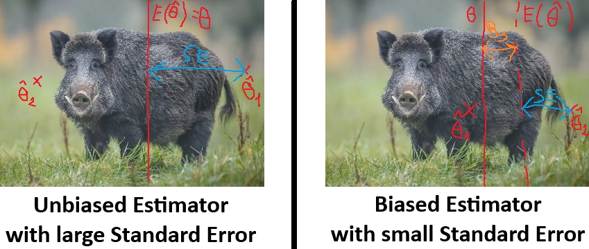
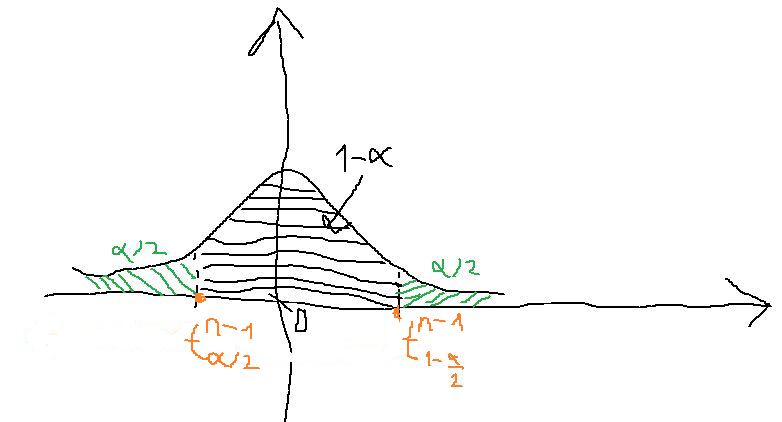

<style>
body {
text-align: justify;
font-size: 12pt}
</style>


```{r setup, include=FALSE}
knitr::opts_chunk$set(echo = TRUE)
```

## 1. Simulating Sampling Distributions

Okay, in the beginning of this chapter, it's time to play God! Let's assume that we have a $Y$ variable that has a true population distribution of $Exp (0.01)$. So, we are Gods now, as we don't try to guess from observed data what kind of theoretical distribution best describes the unobserved population, but we explicitly create a $Y$ variable, where we know that the true distribution is $Exp(0.01)$. So, basically we have $$Y \sim Exp(0.01)$$

Based how an exponential distribution behaves, we also know the true population expected value ($\mu$) and true population standard deviation ($\sigma$) for the variable $Y$. So we have that

- $E(Y)=\mu= 1/0.01=100$
- $D(Y)=\sigma= 1/0.01=100$

Let's save all these information into 3 R objects!

```{r}
rate <- 0.01
mu <- 1/rate
sigma <- 1/rate
```

Then, let's do an IID **resampling** of this $Exp(0.01)$ distribution. Let's have $10000$ IID samples of size $n=120$. The technical solutions in R for this resampling are done exactly the same way we saw in <a href="Chapter02.html" target="_blank">Section 4.1 of Chapter 2</a>. So, in the end we'll have a data frame called `exp_samples`, where we have the $10000$ samples stored in the rows and the $120$ observations are stored in the columns. So it'll be a data frame of $10000 \times 120$.<br>
Let's fix the random seed on $1992$ for reproducability.

```{r}
sample_size <- 120
replication_number <- 10000

set.seed(1992)
exp_samples <- replicate(replication_number, rexp(n = sample_size, rate = rate))
exp_samples <- as.data.frame(t(exp_samples))

rownames(exp_samples) <- paste0("Sample",1:replication_number)
colnames(exp_samples) <- paste0("Element",1:sample_size)
head(exp_samples)
```

Great, we have the data frame we want! Now, let's calculate the sample means and standard deviations with the built-in R function for each of the $10000$ samples.<br>
Using the `mean` and `sd` functions within an `apply` function with the 2nd input parameter of `1`, we compute the sample means, and standard deviations row-wise instead of column-wise. **Be careful** that since the data frame columns are continuously expanding, we must **manually restrict the application of statistical functions to the first 120 columns**!

```{r}
exp_samples$sample_mean <- apply(exp_samples[,1:sample_size], 1, mean)
exp_samples$sample_sd <- apply(exp_samples[,1:sample_size], 1, sd)
head(exp_samples[,(sample_size-1):ncol(exp_samples)]) # look at the last 4 columns
```

Great, so in the 1st sample the mean is $82.9$ and standard deviation is $89.7$. While in the 6th sample, the mean is $92.6$ and standard deviation is $92.4$.<br>
These sample means ($\bar{y}$) are called as **ESTIMATORS** for the true expected value of $\mu=100$. In the same logic, the sample standard deviations ($s$) are **estimators** for the true standard deviation of $\sigma=100$.<br>
In the same logic, the $\hat{\lambda}_{ML}=1/\bar{y}$ maximum likelihood estimation derived for $\lambda$ in <a href="Chapter03.html" target="_blank">Section 2.1 of Chapter 3</a> is the **estimator** for the true $\lambda$ for our exponential distribution.

```{r}
exp_samples$sample_rate <- 1 / exp_samples$sample_mean
head(exp_samples[,(sample_size-1):ncol(exp_samples)])
```

So in the 3rd sample, we would say that our distribution is $Exp(0.0095)$, but in the 5th one we would guess an $Exp(0.0117)$ distribution.

Collectively, we denote every estimator as $\hat{\theta}=\{\bar{y},s,\hat{\lambda}_{ML}\}$, and we say that these are **estimators of the true** population distribution **parameters** denoted as $\theta=\{\mu,\sigma,\lambda\}$.

And like we saw from our simulations, these estimators are not the same for our 10000 samples due to sampling error as we've seen in <a href="Chapter02.html" target="_blank">Chapter 2</a>. So these estimators have distributions along the lots of IID samples and this **distribution of estimators along many samples are called as sampling distributions**.

For example, if we show our 10000 simulated sample means on a histogram, what we see is the sampling distribution of the means. Let's add the true expected value as a red vertical line to the histogram with the help of the `geom_vline` layer in `ggplot`.

```{r}
library(ggplot2)
ggplot(exp_samples, aes(x=sample_mean)) + geom_histogram(aes(y = after_stat(density))) +
  geom_vline(xintercept = mu, color="red", linewidth=1)
```

We can see that it looks like a nice normal distribution with the true $\mu=100$ at the center. So, we can say that the sample means are fluctuating around the true expected value and the proportion of under- and overestimations is equal. Also, estimators being far off (like over a threshold of roughly $\pm 20$) from the true parameter of $\mu=100$ is rather a rare event.

The same things can be said for the sampling distribution of $\hat{\lambda}_{ML}$ estimators. It's not surprising perhaps as this derived as the reciprocal of sample means.

```{r}
ggplot(exp_samples, aes(x=sample_rate)) + geom_histogram(aes(y = after_stat(density))) +
  geom_vline(xintercept = rate, color="red", linewidth=1)
```

Nice plot! We have one pesky little overestimation with one $\hat{\lambda}_{ML} > 0.014$, buit otherwise, we can see rather nice normal bell curve here as well for the sampling distribution.

Now, let's take a look at the sampling distribution of the sample standard deviations ($s$) with true standard deviation of $\sigma=100$ added as a red vertical line here too.

```{r}
ggplot(exp_samples, aes(x=sample_sd)) + geom_histogram(aes(y = after_stat(density))) +
  geom_vline(xintercept = sigma, color="red", linewidth=1)
```

In this case, the sampling distribution deviates a bit more from the normal distribution. It seems that it has a mild right tail: underestimations are a bit more common than overestimations, and we have a bit more outliers on the right tail of the distributions. That is *we are usually underestimating, but in the few times when we overestimate, we overestimate by a lot*!

At this point it's important to note that the $s$ estimator for $\sigma$ calculated by R's `sd` function is the **corrected sample standard deviation formula** that divides by $n-1$ in the end: $$s=\sqrt{\frac{\sum_{i=1}^n{(y_i-\bar{y})^2}}{n-1}}$$

However, we could also try the original, **uncorrected sample standard deviation formula**, denoted as $s^*$, as an estimator for the true $\sigma$. This $s^*$ estimator only differs from $s$ that it divides by $n$ in the end, so it is the actual expected deviation from the mean: $$s^*=\sqrt{\frac{\sum_{i=1}^n{(y_i-\bar{y})^2}}{n}}$$

Due to these definitions, the connection between the two estimators is the following: $$s=\sqrt{\frac{n}{n-1}} \times s^*$$

From this, we can see that $s^*$ is multiplied with a number larger than $1$ to get $s$, so **the corrected sample standard deviation is always bigger than the uncorrected one**.

We should also remember from <a href="Chapter03.html" target="_blank">Section 3.1 of Chapter 3</a>, that for normal distribution $s^*$ is the maximum likelihood estimator for the true population standard deviation $\sigma$: $s^*=\hat{\sigma}_{ML}$.

So, let's create a custom R function for this original standard deviation formula!

```{r}
original_sd <- function(x) sqrt(mean((x-mean(x))^2))
```

Then, using this function combined with `apply`, let's calculate the $s^*$ estimators for $\sigma$ for all the 10000 samples as well.

```{r}
exp_samples$orig_sd <- apply(exp_samples[,1:sample_size], 1, original_sd)
head(exp_samples[,(sample_size-1):ncol(exp_samples)])
```

Note from the results that what we expected based on the formulas is true: `sample_sd > orig_sd`, or with our formal notations: $s > s^*$. However the difference is small since $n=120$ is quite large, that means $\sqrt{n/(n-1)} \approx 1$.

So, **with $\hat{\theta}$ now we have two estimators for the same $\theta=\sigma$ parameter**! So, let's investigate the **sampling distribution of our 2nd estimator**, $s^*$!

```{r}
ggplot(exp_samples, aes(x=orig_sd)) + geom_histogram(aes(y = after_stat(density))) +
  geom_vline(xintercept = sigma, color="red", linewidth=1)
```

Ok, we see a very similar distribution than the one of $s$ as the difference between the two estimators is not large as $\sqrt{n/(n-1)} \approx 1$ due to the large $n$ sample size. However, if we overlay the two sampling distributions on each other, we can notice that the **underestimations are more common for the uncorrected version than for the corrected one**.

```{r}
ggplot(exp_samples) +
  geom_histogram(aes(x=sample_sd, y = after_stat(density), fill="s"), alpha=0.3) +
  geom_histogram(aes(x=orig_sd, y = after_stat(density), fill="s*"), alpha=0.3) +
  geom_vline(xintercept = sigma, color="red", linewidth=1)
```


So, at the end of this section, hopefully we can see how useful these **sampling distributions** can be: they **show how accurate estimators are compared to the true parameter value in case of lots of samples**. They show

- how close most of the estimators are to true parameter
- the proportions of under- and overestimations
- the frequency, magnitude and direction of outlier estimates

> Therefore, knowing sampling distributions are useful because they can describe from several perspectives how accurately our estimators from observed data can capture the true population parameters.

So, we should **find ways to determine the sampling distribution of estimators based on only one observed sample and not based on a simulations**. As in real-world applications we can **only observe one sample and that's it**, as we have seen in the practical examples of of Chapters 1-3 so far. Since in reality, we are not Gods unfortunately, and we don't know the true population distribution of our observed data. That is the point of this whole show. :)

> Be very careful here, and notice that the sampling distribution is NOT the sample as the true distribution of the unobserved population!!<br>
> The sampling distribution is always about how an estimator behaves in many samples.<br>
> The population distribution describes how unobserved individual datapoints of our variable (be it age, income, education, whatever) are behaving.

So, in the following sections, we'll see some **theorems** and rules that **give the theoretical sampling distribution of some special estimators if the data satisfies certain conditions** (like large sample size).

But first, in the next section we examine some general concepts that are tied to the **first two moments of sampling distributions**, so to the **expected value and variance** (squared standard deviation) **of estimators**.

## 2. Bias and (Estimation) Variance

In this section, we investigate the first two moments of sampling distributions in detail. Namely, we introduce two concepts tied to the **first two moments of the sampling distribution of $\hat{\theta}$ estimators**.

1. **Bias** is tied to the expected value of estimators: $M_1(\hat{\theta})=E(\hat{\theta})$
2. **Estimation Variance** is the second moment of estimators: $M_2(\hat{\theta})=Var(\hat{\theta})$

Let's go ahead with the first moment!

### 2.1. Bias

So, the concept of bias concerns the **expected value, or** in other word, the **mean of the estimators**: $E(\hat{\theta})$

Let's calculate this expected value or mean for all our estimators from Section 1.

```{r}
c(mean(exp_samples$sample_mean),
  mean(exp_samples$sample_sd),
  mean(exp_samples$orig_sd),
  mean(exp_samples$sample_rate))
```

We can see that these expected values are close to the true parameter values: $\mu=\sigma=100,\lambda=0.01$. Bias simply examines how close we are. So, the **definition of Bias** is the following: $$Bs=E(\hat{\theta})-\theta$$

Essentially, Bias asks that the question **whether the $\hat{\theta}$ estimator on average under- or overestimates the true $\theta$ parameter**. If on average we hit the true parameter ($E(\hat{\theta})=\theta$), we say that the estimator is **unbiased** as it does not give systematically higher or lower estimates. We have the same chances of mistakes on either side.

So, let's see the **Bias of the means** rounded to 5 digits.

```{r}
round(mean(exp_samples$sample_mean) - mu,5)
```

Looks like it's quite small, very close to $0$. Actually, **theoretically the mean is always an unbiased estimator for the true expected value**. The Bias is not exactly $0$ here as we **do not have every possible IID sample of size 120** from our $Exp(0.01)$ distribution, **"only" 10000 of them**. So, we have a very small amount of bias, which is negligable.<br>
Furthermore it is very easy to see that the sample mean is an unbiased estimator. We need to show for $\theta=\mu=E(Y)$ and $\hat{\theta}=\bar{y}=\sum_{i=1}^n{y_i}/n$ that $E(\hat{\theta})=\theta$.

We now that we have an IID sample which means that every $y_i$ observation has the same exponential distribution now: $y_i \sim Exp(0.01)$. That also means that if we treat every $y_i$ observation as a random variable, then their expected values are the same: $$E(y_i)=\mu=\frac{1}{\lambda}=\frac{1}{0.01}=100$$

So, if we take the expected value of the sample mean, we have: $$E(\bar{y})=E\left(\frac{\sum_{i=1}^n{y_i}}{n}\right)=\frac{1}{n}E\left(\sum_{i=1}^n{y_i}\right)=\frac{1}{n}\sum_{i=1}^n{E(y_i)}=\frac{1}{n}\sum_{i=1}^n{\mu}=\frac{1}{n} \times n \times \mu = \mu$$

We only applied two properties of the expected value for the proof above. Notice that we did not need to take advantage of the fact what is the exact distribution of our $Y$ variable. So, this result is true for every mean and every expected value. No assumption is necessary.

1. If $c$ is a constant and $Y$ is a random variable, then $E(cY)=cE(Y)$
2. If $X,Y$ are random variables, then $E(X+Y)=E(X)+E(Y)$

And in the end we have that the expected value of the $\hat{\theta}=\bar{y}$ estimator is the same as the population parameter $\theta=\mu$

Now let's see the biases of the two estimators $\hat{\theta}=\{s,s^*\}$ for the $\sigma$ parameter. Let's also round the results for 5 digits!

```{r}
c(round(mean(exp_samples$sample_sd) - sigma,5),
  round(mean(exp_samples$orig_sd) - sigma,5))
```

What we can observe is that the corrected version has a smaller bias, but both estimators have a slight downward bias: e.g. underestimations are a bit more common than overestimations. This is exactly what we could observe on the histograms of both sampling distributions in Section 1.

The theoretical results here are a bit more complicated to prove here than in the case of the mean, but for the variances we have a result here that the uncorrected variance has a theoretical downward bias: $$E((s^*)^2)=\frac{n-1}{n}\sigma^2$$

And that is why the corrected version is defined as we've seen in Section 1: $$s^2=\frac{n}{n-1}(s^*)^2$$

Since this way the **corrected version is unbiased estimator for the true variance** $\sigma^2$: $$E(s^2)=\sigma^2$$

However, in the simulation a **small** amount of **bias remains** due to the fact that **again, we do not have every possible IID sample of size 120** from our $Exp(0.01)$ distribution, **"only" 10000 of them**. And **for the standard deviation the square root further distorts the remaining small bias a bit in our simulations**. Because of how sqare root works for number between 0 and 1. E.g. $\sqrt{0.01}=0.1$

Also, it is also important to know that the **uncorrected standard deviation is an asymptotically unbiased estimator**. This means that if the **sample size increases** (it goes to infinity) **, then the bias disappears**: $$\lim_{n\to\infty}{Bs(s^*)}=0$$

This is true because we know that $$E((s^*)^2)=\frac{n-1}{n}\sigma^2$$

And of course it is elementary calculus that the fraction before $\sigma^2$ goes to $1$ if $n \to \infty$: $$\lim_{n\to\infty}{\frac{n-1}{n}}=1$$

Definition of Standard Error: $$SE=\sqrt{Var\left(\hat\theta\right)}=\sqrt{E\left(\left(\hat\theta-E\left(\hat{\theta}\right)\right)^2\right)}$$

### 2.2. Estimation Variance and Standard Error

It’s nice and all that we established that the sample mean, and corrected sample variance + standard deviation are **unbiased estimators** of their corresponding population parameters, $\theta$, but **what good is this to us in practice when we only have a single sample?**

As we experienced, unbiasedness only means that if **we have a very, very large number of samples**, then the estimators **on average hit the true population value**. However, unfortunately, **this definition allows for a lot of variation**, and in reality, it **tells us nothing about the sampling error**!<br>
This problem is well illustrated by the following *bad joke*.

> "An engineer, a physicist, and a statistician go hunting for wild boars together. After taking just a few steps into the forest, they spot a massive boar 150 meters away.<br>
>  The engineer raises his rifle, aims, and shoots, but misses by three meters to the right. The physicist thinks:<br>
>  "A slight wind is blowing from the left, so if I aim a little to the left, I’ll hit it."<br>
>  He takes aim at the boar, fires, and misses by three meters to the left. The statistician jumps up and starts celebrating:<br>
>  "We got it! We got it! We hit it!"
>
> `r tufte::quote_footer('-- Rightfully Unknown Author')`

Our beloved statistician in the joke is celebrating because the two shots that missed by three meters to the right and left, on average, hit the poor boar dead center!<br>
Well, this is what **unbiasedness** is all about:

- We want to hunt down a true population parameter ($\theta$) using *shots*, that is, *samples*.
- The first shot is the estimate $\hat{\theta}_1$ from the first sample
- The second shot is the estimate $\hat{\theta}_2$ from the second sample.
- On average, that is, in expected value, these estimates hit the true value $\theta$: $E(\hat{\theta})=\theta$.
- Voilà! This is the definition of an *unbiased estimate* :)

The **analogy** between statistical "$\hat{\theta}$"-hunting and wild boar hunting can be **illustrated in the following diagram**. **IMPORTANT** :)

<center>
{width=50%}
</center>

<br>In the above diagram, I have marked in **blue** the **distance between an arbitrary $\hat{\theta}_i$ and the true population parameter $\theta$.** In reality, **this is the distance we are interested in: the difference between an estimator from a given IID sample and the true population parameter**! Because in practice, **we only have a single sample, and we need to compute the distance between the one observed $\hat{\theta}$ and the true $\theta$!**

Now, **thanks to unbiasedness**, we have a method to **calculate this distance**! Since, due to unbiasedness, $E(\hat{\theta})=\theta$, this means that the **standard deviation of the estimators $\hat{\theta}_i$ across many samples is precisely the blue distance we are seeking**. After all, what is the **general interpretation of standard deviation**? It tells us **how much a randomly selected value from a dataset is expected to deviate from the mean**. How does this translate to the set of $\hat{\theta}$ values? If we **randomly select one of the many possible samples, the estimator $\hat{\theta}$ from that sample is expected to deviate from the mean of the $\hat{\theta}$s by the standard deviation**. And the **mean of the $\hat{\theta}$s, due to unbiasedness, is precisely the true population value $\theta$.**<br>
From this reasoning, the **standard deviation of the $\hat{\theta}$ values is called the standard error of estimation**, or simply **standard error** (**SE**).

Notice that this is practically the **second moment of the sampling distribution**, the square root of the variance for our $\hat{\theta}$ estimators. $$SE=\sqrt{Var(\hat{\theta})}$$

Since variance of a random variable $Y$ is defined as $E((Y-E(Y))^2)$ (and standard deviation is the square root of this), which is the expected (average) squared deviation from the expected value (mean) we need to apply our `original_sd` function to get the standard errors: no need for correction here, we calculate standard deviation of the estimators the *original way*.

So, using this knowledge, let's have the Standard Error of the means.

```{r}
original_sd(exp_samples$sample_mean)
```

We can get the same Standard Error of the corrected standard deviations.

```{r}
original_sd(exp_samples$sample_sd)
```


Since the **sample mean and corrected standard deviation are unbiased estimators**, the **computed standard error can be interpreted as follows**:

- For 100-element samples, **a specific sample mean is expected to deviate by $9.088$ from the mean of means, that is, from the true population mean of 100**.
- **In a specific 100-element sample, the standard  deviation is expected to deviate by $12.589$ from the true standard deviation** that is also 100 due to the exponential distribution of the data.

We can also get the **Standard Error of uncorrected sample standard deviation**s. But this **cannot be interpreted as nicely** as the two $SE$s from before since it is a **biased estimator** for $\sigma$.

```{r}
original_sd(exp_samples$orig_sd)
```

We can only say here that For 100-element samples, a specific uncorrected sample  standard deviation is expected to deviate by $12.537$ from the mean of these uncorrected standard deviations and that's it. Since the mean of these uncorrected standard deviations is NOT the true $\sigma$ parameter.

For the **sample means**, we have a nice **closed formula** on how to express the **standard error**.

The formula follows from the fact that if I have an IID sample, then the sample observations $y_i$ are considered as random variables with  the same standard deviation of $\sigma$ (for exponential this is always $1/\lambda$ just like we saw for $\mu$ in Section 2.1), then their sum, $\sum_{i=1}^n{y_i}$ has a variance of $$Var(\sum_{i=1}^n{y_i})=\sum_{i=1}^n{Var(y_i)}=n \times \sigma^2$$

**Because the $y_i$ random variables are independent due to the random sampling**, so we don't need to account for $cov(y_i,y_j)$ values. Since the sample means are defined as $\bar{y}=\frac{\sum_{i=1}^n{y_i}}{n}$, their variance follows from the result obtained above: $$Var(\bar{y})=\frac{Var(\sum_{i=1}^n{y_i})}{n^2}=\frac{n\sigma^2}{n^2} = \frac{\sigma^2}{n}$$

And of course the **square root of the sample mean's variance is** the standard deviation of the sample means, so the **standard error of the mean**: $$\sqrt{Var(\bar{y})}=SE(\bar{y})=\frac{\sigma}{\sqrt{n}}$$

Thus, **standard error of the mean can be determined if we know the population standard deviation ($\sigma$) and the sample size ($n$).** Let's test this out!

```{r}
c(original_sd(exp_samples$sample_mean),
  sigma/sqrt(sample_size))
```

It appears that the **two values match quite closely**. :) The slight discrepancy is again due to the fact that we did not examine all possible samples, only 10000 when calculating the $SE$ as the standard deviation of $\hat{\theta}$ values.

Unfortunately, **we do NOT have similar approximation formulas for standard deviations and other estimators like medians**. We will try other tricks to estimate $SE$ for those later in the course. :)

One last important **naming convention: The squared SE value ($SE^2$) is often called the variance of the estimator**. I don’t personally like this term, as it’s easy to confuse it with the variance of the sample or population observations. However, it is widely used, so it's important to know! If you **see something like "the variance of sample means is A" or "the variance of sample proportions is B," the author is referring to $SE^2$.**
This is typically denoted as follows: $SE^2(\hat{\theta})=Var(\hat{\theta})$

To summarize, here are the **different types of standard deviations and variances we have encountered in estimation theory**:

- **Population Standard Deviation**: Expected difference of an observation in the population from the population mean. Denoted as: $\sigma$.
  * Squared: population variance, $\sigma^2$
- **Uncorrected Sample Standard Deviation**: Expected difference of an observation in the sample from the sample mean. Denoted as: $s^*$
  * Squared: uncorrected sample variance, $(s^*)^2$
- **Corrected Sample Standard Deviation**: Same thing as the Uncorrected Sample Standard Deviation, it just provides an *unbiased* estimate for teh true population standard deviation. Denoted as: $s$
  * Squared: corrected sample variance, $s^2$
- **Standard error**: The standard deviation of an estimator, i.e., $\hat{\theta}$, calculated from many-many samples. *In the case of unbiasedness*, the difference of an estimator computed from a single sample from the true population value of the $\theta$ parameter. Denoted as: $SE(\hat{\theta})$
  * Squared: variance of the estimator, $Var(\hat{\theta})$

The formula for the $SE$ of the mean also implies that, the **sample mean** is a so-called **consistent estimator for the true expected value**.

In general, an **estimator $\hat{\theta}$ is consistent if its standard error ($SE$) approaches $0$ as the sample size ($n$) increases**:$$\lim_{n \rightarrow \infty}{SH(\hat{\theta})} = 0$$

That is, as the sample size grows, the value of the standard error gets closer and closer to the true population value of the measure ($\theta$).

It is easy to see that, as a function of the sample size ($n$), standard error of the mean is a hyperbolic function of the form $f(n) \sim \frac{1}{n}$, which approaches $0$ as $n$ tends to infinity:$$\lim_{n \rightarrow \infty}{SE(\bar{y})} = \lim_{n \rightarrow \infty}{\frac{\sigma}{\sqrt{n}}} = 0$$

### 2.3. Mean Squared Error (*MSE*)

So, we have concluded that the standard deviation of an estimator, so the **standard error of the estimator, only gives the expected deviation of a specific sample-based $\hat{\theta}$ from the true population $\theta$ if the estimator is unbiased**, because in this case, $\theta$ matches the mean of the $\hat{\theta}$ values calculated from many samples, i.e., $E(\hat{\theta})$.

If we are dealing with a biased estimator, then we can **manually calculate the expected squared deviation of the $\hat{\theta}$ against the true parameter $\theta$ from many samples. This measure is called the Mean Squared Error (MSE)**. To calculate it, we simply apply the classical variance formula of random variables as follows: $$MSE(\hat{\theta})=E\left(\left(\hat\theta-\theta\right)^2\right)$$


Now, **let's compute the $MSE$ for the only biased estimator we know of: the uncorrected sample standard deviation!** In R, we must use the `mean` function (as a "synonym" for the expected value in the formula above) and *manually* implement the formula, because using the built-in `sd` function or even our `original_sd` function (from Section 1) would compare to $E(\hat{\theta})$ instead of $\theta$, and due to bias, these two values do not coincide!

```{r}
MSE_uncorr_sd <- mean((exp_samples$orig_sd - sigma)^2)
MSE_uncorr_sd
```

Awesome! Now, **this $MSE$ value** is actually the **sum of the squared errors of two types of estimation errors** if we rearrange the formula of $MSE$ o bit. Specifically: $$MSE(\hat{\theta})=E\left(\left(\hat\theta-\theta\right)^2\right)=\left(E\left(\hat{\theta}\right)-\theta\right)^2+E\left(\left(\hat\theta-E\left(\hat{\theta}\right)\right)^2\right)=Bs^2+SE^2$$

Here, the **deviation of an estimator $\hat{\theta}$ from the true $\theta$ can be obtained in two steps**:

1. $SE$: How much does a specific sample’s $\hat{\theta}$ differ from the mean of the estimates, $E(\hat{\theta})$.
2. $Bs$: How much does the mean of the estimates differ from the true $\theta$: $Bs = E(\hat{\theta}) - \theta$

And if we calculate this in practice, we can see that the $MSE$ really is the **sum of these two types of errors**.

```{r}
Bs_uncorr_sd <- mean(exp_samples$orig_sd) - sigma
SE_uncorr_sd <- original_sd(exp_samples$orig_sd)

MSE_uncorr_sd_Sum <- Bs_uncorr_sd^2 + SE_uncorr_sd^2

c(MSE_uncorr_sd, MSE_uncorr_sd_Sum)
```

Wow, our summation logic actually works! :)

Of course, **when the estimation is unbiased, then $Bs=0$, so the identity $MSE = SE^2$ holds**. Let's take the **case of sample means**.

```{r}
MSE_mean <- mean((exp_samples$sample_mean - mu)^2)
SE_mean <- original_sd(exp_samples$sample_mean)

c(MSE_mean, SE_mean^2)
```

ExcellenT! We have the small numerical bias coming from the fact that we don't examine every possible sample, just 10000, but it doesn't really mess with our results, bless the Machine Spirit! :)

The $MSE$ is an excellent metric that can be used as a **measure to choose between multiple possible $\hat{\theta}$ estimator alternatives for a population parameter $\theta$.** A great **example of this is $(s^*)$ and $s$, as two alternative estimators for estimating the population standard deviation**, $\sigma$.

One might instinctively respond to this question by saying, **"but the unbiased estimator must be better"**. Well, not necessarily. Because **what if a biased estimator’s standard error is so much smaller than that of the unbiased estimator that it compensates for the bias**, and in the end, a single "shot" (i.e., an estimate $\hat{\theta}$) from the biased estimator is actually closer to the true $\theta$ than a "shot" from the unbiased estimator?

This can be well illustrated using another perspective on the wild boar hunting example from Section 2.2: **what if the unbiased estimator has such a large standard error that a specific "shot" (i.e., an estimate $\hat{\theta}$) is much farther from the true $\theta$ than an estimate from a biased estimator?**

<center>
{width=90%}
</center>

<br>The figure shows that **estimates $\hat{\theta}_i$ from a slightly "left-biased" estimator with a small standard error still hit the wild boar, while the unbiased estimator, despite working very well on average over many samples, have such a large standard error for a single estimate $\hat{\theta}_i$ that they completely miss the wild boar!**

Thus, due to the above phenomenon, if **we need to choose between multiple estimators for a given $\theta$, we should base our decision on $MSE$**, as it simultaneously accounts for both the bias and the standard error.

The technical term for this is **efficiency**. If for two estimators, $\theta_1$ and $\theta_2$, it holds that $MSE(\theta_1)<MSE(\theta_2)$, then the estimator function $\theta_1$ is **more efficient** than $\theta_2$!!

Let's see this in practice: **What is the better estimator for the population standard deviation? The corrected or the uncorrected sample standard deviation?**

```{r}
# Biased Estimator = Uncorrected SD
MSE_uncorr_sd <- mean((exp_samples$orig_sd - sigma)^2)

# Unbiased Estimator = Corrected SD
MSE_corr_sd <- mean((exp_samples$sample_sd- sigma)^2)

# Result
c(MSE_uncorr_sd, MSE_corr_sd)
```

Oops, it seems that $MSE(s^*) < MSE(s)$, meaning that **in an "average" sample, the uncorrected sample variance is actually closer to the true population parameter $\sigma$ than the corrected version**. In other words, **the uncorrected sample standard deviation is more efficient than the corrected one!!**<br>
However, **systematic underestimation of a variable's dispersion and uncertainty is usually a bigger problem than a slightly higher standard error**. Therefore, **although overall, in terms of $MSE$, the sampling error of $s^*$ is smaller than that of $s$, the direction of the smaller error is "downward" due to bias**, and this is undesirable in this case. Instead, **we prefer to accept a somewhat larger but "symmetric" error**.<br>
As a result, **in the case of variance**, many practical applications "*override*" the $MSE$ decision, and the **corrected sample variance is used in most cases**. Or in other words, we can say that in the case of variance, we place more weight on $Bs^2$ than on $SE^2$ in the $MSE$, and we do not equally prefer their reduction.

On the other hand, at this point this is **not so suspicious** that the **maximum likelihood estimation for $\sigma$ in a normal distribution is the uncorrected standard deviation**! As it looks like the **more efficient estimator** for $\sigma$ in general.

**In the case if we need to choose between two unbiased estimators, we can simply choose the one with the smaller standard error, since in this case, it also means that its $MSE$ is smaller**, as $Bs^2=0$. **Only in this case** can we say that the efficiency criterion means that among two estimators, the one with the smaller $SE$ is the more efficient one.

## 3. Sampling Distribution of the Mean

Okay, let's take a look at the sampling distribution of the mean again, just like we did in Section 1.  See if we can describe this sampling distribution with some theoretical probability distribution!

```{r}
ggplot(exp_samples, aes(x=sample_mean)) + geom_histogram(aes(y = after_stat(density))) +
  geom_vline(xintercept = mu, color="red", linewidth=1)
```

Well, we established back in Section 1 that this distribution looks just like **most beautiful normal distribution ever!**

If we think abou it a bit, this is **completely logical, since the Central Limit Theorem (CLT) is at work here**. If you don’t remember the CLT, go back to <a href="Chapter01.html" target="_blank">Section 2.6 in Chapter 1</a>! :)

According to the **CLT**, if a **variable arises as the sum of random effects**, then the **variable follows a normal distribution**. The **variable of $\bar{y}$ sample means perfectly fits the CLT conditions**! After all, the sample mean is obtained by summing the sample elements and dividing by the sample size. **Since the sampling method is IID, I can be sure that each sample element is a random draw, so a result of a random effect. Then, I sum them up.** Finally, I divide by $n$, but since $n$ is always the same (a constant), it doesn’t change the fundamental logic.

If the **variable of sample means from many samples follows a normal distribution, then we also know its mean and standard deviation!**

- Due to **unbiasedness**, we know that the mean of the sample means is the treue expected value, i.e. $\mu$.
- The standard deviation of the sample means is simply the **standard error**, i.e. $\frac{\sigma}{\sqrt{n}}$

This is exactly the result we would get if we divided the original CLT equation by $n$.

The original formulation of the CLT states that for independent, identically distributed (IID) random variables $X_1,X_2,\dots,X_n$ where $\forall i$: $E(X_i) = \mu$ and $Var(X_i) = \sigma^2$, and as $n \rightarrow \infty$:$$\sum_{i=1}^n{X_i} \sim N(n \mu, \sqrt{n}\sigma)$$

Dividing this by $n$ gives the following result (applying the rule that a constant factor can be factored out linearly from expected value and squared from variance): $$\frac{1}{n} \times \sum_{i=1}^n{X_i} \sim N\left(\mu, \frac{\sigma}{\sqrt{n}}\right)$$

In summary, the **variable of sample means $\bar{y}$ from many samples follows the distribution**: $$\bar{y} \sim N\left(\mu,\frac{\sigma}{\sqrt{n}}\right)$$

We can easily test this fit graphically using the method shown in <a href="Chapter01.html" target="_blank">Section 2.3 of Chapter 1</a>.

First, I calculate theoretical SE of the mean with the formula $\sigma/\sqrt{n}$.

```{r}
se_mean_theor <- sigma/sqrt(sample_size)
se_mean_theor
```

We get the familiar result from Section 2.2, saying that a specific sample mean is expected to deviate by $9.129$ from the mean of means, that is, from the true population mean of 100. As from Chapter 1, we know that in our true $Exp(0.01)$ distribution, the expected value is $\mu=1/\lambda=1/100=100$

So, the specific sampling distribution in our example is $N(100,10.54)$. So, let's finally draw its density function on our sampling dsitribution histogram as a *red* curve!

```{r}
ggplot(data = exp_samples, mapping = aes(x=sample_mean)) + geom_histogram(aes(y = after_stat(density))) +
  stat_function(fun = dnorm, 
                args = list(mean = mu, sd = se_mean_theor),
                col = 'red',
                linewidth = 1)
```

A beautiful fit indeed! :)

What's also important from this result that the sample means follow a normal distribution is that if we **get z-scores of the sample means**, we are to receive a **standard normal distribution**. So, if from every sample mean we subtract the true expected value (mean of the sampling distribution due to unbiasedness) and divide the result with the standard error (standard deviation of the sampling distribution), we have a $N(0,1)$ distribution. More formally it looks something like this: $$\frac{\bar{y}-\mu}{\frac{\sigma}{\sqrt{n}}} \sim N(0,1)$$

We can easily check this graphically too by calculating the z-scores for all the 10000 samples, and plot their distribution on a histogram with the $N(0,1)$ density function added as a *red* line.

```{r}
exp_samples$z_score <- (exp_samples$sample_mean - mu)/se_mean_theor

ggplot(data = exp_samples, mapping = aes(x=z_score)) + geom_histogram(aes(y = after_stat(density))) +
  stat_function(fun = dnorm, 
                args = list(mean = 0, sd = 1),
                col = 'red',
                linewidth = 1)
```

Nice, looks like a prefect fit again! :)

We can check the mean and standard deviation of the z-scores as well. We can say that uo to 2 digits, they are $0$ and $1$ respectively as they should be. Praise the machine spirit!

```{r}
round(c(mean(exp_samples$z_score),
        sd(exp_samples$z_score)), 2)
```

Praise the machine spirit!

## 4. Confidence Interval of the Mean

Now, the **benefit of knowing** what that the **sampling distribution of the means is exactly, is that it is the same always and forever, and it is not dependent on the true distribution of the data**. This knowledge can be applied to **construct so called confidence intervals** that can describe **how accurately our sample means as estimators can capture the true expected value as a population parameter**. Furthermore, due to the fact that this sampling distribution is always the same, we can **do this from one sample alone, and no need to have lots of samples from the same distribution**!

More **specifically**, a **confidence interval of $[a,b]$** for a true population parameter $\theta$ with **confidence level of $1-\alpha$** (e.g. a confidence level of $95\%$ means that $\alpha=0.05$, while a level of $99\%$ means that $\alpha=0.01$) means the following: **the probability that the true $\theta$ parameter is between $a$ and $b$ is the desired $1-\alpha$**.<br>
We can **construct an interval like this for the expected value from just one sample alone by knowing the sampling distributions of the means**.

However, there is just **one major hiccup**: we know that $\bar{y} \sim N(\mu,\sigma/\sqrt{n}$...which implies that in order **to know the exact sampling distribution of the means, we need to know the true population standard deviation, $\sigma$ already!!** Which is quite impossible if the thing we are looking for right know is the true expected value and the true standard deviation is the expected deviation from it...Hmm, <a href="https://www.youtube.com/watch?v=NYvwLLxKqhM" target="_blank">f\*\*\*k</a>.

So, actually **we don't have much use** for the fact that we know the distribution of the sample mean's z-scores: $$\frac{\bar{y}-\mu}{\frac{\sigma}{\sqrt{n}}} \sim N(0,1)$$

**Actually, we need to know the distribution** of the fraction **where we calculate the standard error with the sample standard deviation** $s$ (it's preferable to use the unbiased version that does not underestimate in expected value) instead of calculating it with $\sigma$: $$\frac{\bar{y}-\mu}{\frac{s}{\sqrt{n}}} \sim ?$$

This is where the chief quality assurance engineer of the Guiness Beer Factories, William Gosset, a.k.a. Student comes to the stage! Student proved that the **fraction above follows a t-distribution with $n-1$ degrees of freedom instead of a normal distribution**. $$\frac{\bar{y}-\mu}{\frac{s}{\sqrt{n}}} \sim t(n-1)$$

If we remember from <a href="Chapter01.html" target="_blank">Section 4.3 of Chapter 1</a>, the idea of the t-distribution is that it is **flattened standard normal distribution**. The flattening means that extreme values are more likely to occur at the tails of the distribution (because the density function runs higher at these points), making our data more dispersed.<br>
However, as we increase the degrees of freedom ($v$), we gradually "*sharpen*" the distribution back into the standard normal distribution. This makes sense because we are substituting a population standard deviation with an estimated value from a sample when calculating the standard error. This **introduces greater uncertainty and increased dispersion into the distribution, but this disappears as sample size $n$** (i.e. the degrees of freedom now) **increases as if we estimate the standard deviation from more observations, we become more confident in our estimate**.

Ok, so let's calculate the so-called **t-scores** of $t=(\bar{y}-\mu)/(s/\sqrt{n})$ for all the 10000 samples and see their distribution on a histogram with the $N(0,1)$ density function added as a *red* line and the $t(n-1)$ density function as a *blue* line.

```{r}
exp_samples$t_score <- (exp_samples$sample_mean - mu)/(exp_samples$sample_sd/sqrt(sample_size))

ggplot(data = exp_samples, mapping = aes(x=t_score)) + geom_histogram(aes(y = after_stat(density))) +
  stat_function(fun = dnorm, 
                args = list(mean = 0, sd = 1),
                col = 'red',
                linewidth = 1) +
  stat_function(fun = dt, 
                args = list(df = sample_size-1),
                col = 'blue',
                linewidth = 1)
```

Great! We can see the more heavy tails (i.e. extremely low/high values have a bit larger probability to occur) of the t-distribution on the histogram, but the differences between the $N(0,1)$ and $t(n-1)$ densities is not so large since $n=120$, that is high enough for the **differences of the two densities to mostly disappear due to the large degrees of freedom of the t-distribution**.

Now, let's denote the $q$-th quantile of the $t(n-1)$ distribution as $t_{q}^{n-1}$. Remember from <a href="Chapter01.html" target="_blank">Section 2.4 of Chapter 1</a> that this is the value below which $q$ percent of the distribution lies. With these quantiles we can get the range between which a given $1-\alpha$ percent of the $t(n-1)$ distribution is found. See the figure below for an illustration.

<center>
{width=60%}
</center>

Now, let's apply this to our t-score of $t=(\bar{y}-\mu)/(s/\sqrt{n})$. This way, we get that: $$P\left(t_{\alpha/2}^{n-1}<\frac{\bar{y}-\mu}{\frac{s}{\sqrt{n}}}<t_{1-\alpha/2}^{n-1}\right)=1-\alpha$$

Due to the symmetry of the t-distribution around $0$, we actually know that $t_{\alpha/2}^{n-1}=-t_{1-\alpha/2}^{n-1}$. so, we actually have the following inequality: $$P\left(-t_{1-\alpha/2}^{n-1}<\frac{\bar{y}-\mu}{\frac{s}{\sqrt{n}}}<t_{1-\alpha/2}^{n-1}\right)=1-\alpha$$

If we solve this inequality above for $\mu$ being in the middle, we **get the $1-\alpha$ confidence Interval formula for the expected value**: $$P\left(\bar{y}-t_{1-\frac{\alpha}{2}}^{n-1} \times \frac{s}{\sqrt{n}}< \mu <\bar{y}+t_{1-\frac{\alpha}{2}}^{n-1} \times \frac{s}{\sqrt{n}}\right) = 1- \alpha$$

So, the result is that if we have an observed sample, and calculate its sample mean of $\bar{y}$ and its standard error as $s/\sqrt{n}$, then using the $t(n-1)$ distribution's $1-\alpha/2$-th quantile, we get an interval that **contains our true expected value ($\mu$) with a probability of $1-\alpha$, which is exactly what we were looking for**. 

Let's calculate this Confidence Interval (or CI for short) for $98\%$ confidence level,, so $\alpha=0.02$, which is **our allowed probability for making an error with the CI*, i.e. it not containing the true expected value.

```{r}
t_mult <- qt(1-0.02/2, df = sample_size-1)
exp_samples$ci_mean_low_t <- exp_samples$sample_mean - exp_samples$sample_sd/sqrt(sample_size) * t_mult
exp_samples$ci_mean_upp_t <- exp_samples$sample_mean + exp_samples$sample_sd/sqrt(sample_size) * t_mult
head(exp_samples[,c("ci_mean_low_t", "ci_mean_upp_t")])
```

We can see in the first 6 samples, every confidence interval "hits" the true expected value of $\mu=100$. But how good is this hit rate exactly?

```{r}
mean((exp_samples$ci_mean_low_t <= mu) & (exp_samples$ci_mean_upp_t >= mu))
```

It's $97.28%$. Well, theoretically this should match our confidence level of $98\%$, but this small difference is attributed to the fact that in our simulation we only examine 10000 samples instead of every possible IID sample of size 120 from our $Exp(0.01)$ distribution.

In practice, we simplify this confidence interval a bit further. As for **large sample sizes, $t(n-1)$ and $N(0,1)$ distributions are roughly similar as we have discussed before**. So, the $t_{1-\alpha/2}^{n-1}$ quantile can be approximated with the same quantile from the $N(0,1)$ distribution denoted as $z_{1-\alpha/2}$.

So, in **large sample sizes, usually $n>100$, where the $t(n-1) \approx N(0,1)$ works**, we apply the following formula as the **CI for the expected value**: $$P\left(\bar{y}-z_{1-\frac{\alpha}{2}} \times \frac{s}{\sqrt{n}}< \mu <\bar{y}+z_{1-\frac{\alpha}{2}} \times \frac{s}{\sqrt{n}}\right) = 1- \alpha$$

Let's see this formula's hit rate also for the $98\%$ confidence level, so $\alpha=0.02$.

```{r}
z_mult <- qnorm(1-0.02/2)
exp_samples$ci_mean_low_z <- exp_samples$sample_mean - exp_samples$sample_sd/sqrt(sample_size) * z_mult
exp_samples$ci_mean_upp_z <- exp_samples$sample_mean + exp_samples$sample_sd/sqrt(sample_size) * z_mult
mean((exp_samples$ci_mean_low_z <= mu) & (exp_samples$ci_mean_upp_z >= mu))
```

We can be calm that it's not substantially different from the one where we applied the $t(n-1)$ quantiles.

"*Fun Fact*": As I referred to it earlier, the t-distribution itself was actually the creation of an English statistician named *William Gosset*. Mr. Gosset worked as the head of quality control at the *Guinness* brewery, tasked with ensuring that the quality of bottled beer could be maintained using small sample sizes. Since quality control required opening bottles to measure their ingredients, the tested beer could no longer be sold. Unfortunate.<br>
Thus, the brewery wanted to use as few bottles as possible for quality testing. To solve this problem, Gosset developed the t-distribution, since the chemical properties of beer ingredients follow a normal distribution.

However, Gosset wanted to show off his discovery to the world, so he published his findings under the pen name "Student" —hence the name *Student’s t-distribution*. :) Unfortunately, he wasn’t very strategic, because at the time, only Guinness knew how to perform reliable quality control with small samples. Mr. Gosset got caught.

So, as the figure below shows, all Gosset wanted to do was optimize beer production—but in the end, he ruined the lives of everyone studying statistical estimation theory. :)

<center>
{width=30%}
</center>


### 4.1. Two Important Properties of Confidence Intervals

Now, we can observe that the confidence interval of the expected value can be expressed as the $\bar{y}$ sample mean $\pm$ a $\triangle$ interval that is the product of the standard error, $SE$ and a $q$ quantile of a theroetical distribution, setting the confidence level. Let's call this latter quantile as *confidence multiplier* for simplicity's sake. $\triangle$ is usually called as the **length of the confidence interval**, or just simply the **sampling error**, as it is the closest thing we get as a measure of the sampling error introduced in <a href="Chapter02.html" target="_blank">Chapter 2</a>. $$\bar{y} \pm SE \times q = \bar{y} \pm \triangle$$

An **important practical advice** is that one must **be careful with the confidence level** of the confidence interval. If we look at our previous calculations, we can see that

- for $95%$ confidence, $z_{1-\alpha/2}=1.96$
- for $98%$ confidence, however, $z_{1-\alpha/2}=2.33$

is the corresponding confidence multiplier.

We can check this easily.

```{r}
c(qnorm(1-0.05/2),
  qnorm(1-0.02/2))
```

Due to the relationship $\triangle = q \times SE$, it is easy to see that **increasing the confidence level increases the sampling error, meaning that the confidence interval widens**. This makes complete sense: if I **want a higher probability of capturing the true expected value, I need to "widen the net," increasing the chances of catching it**.<br>
A $100%$ confidence level is only possible if the confidence interval spans $\pm \infty$, which, of course, is not a very useful estimate... :)

It is worth testing this further on the sample of size $n=120$ created back in *Section 1*, using a `for` loop with error probabilities $\alpha = {0.2,0.1,0.05,0.01,0.001}$.<br>
For the calculations, I will use the $666$th simulated sample.

```{r}
alpha_vector = c(0.2, 0.1, 0.05, 0.01, 0.001)
selected_sample <- 666

for (current_alpha in alpha_vector) {
  lower <- exp_samples$sample_mean[selected_sample] -
    (exp_samples$sample_sd[selected_sample]/sqrt(sample_size))*
    qnorm(1-current_alpha/2)
  upper <- exp_samples$sample_mean[selected_sample] +
    (exp_samples$sample_sd[selected_sample]/sqrt(sample_size))*
    qnorm(1-current_alpha/2)
  print(paste0("Confidence: ",(1-current_alpha)*100,"% - Conf. Int.: [",
               round(lower,2), ", ",round(upper,2),"]"))
}
```

This phenomenon is clearly observable: as **confidence increases, the confidence interval expands, meaning the margin of error continues to grow**.

- at $90%$ confidence, the estimated expected value falls somewhere between $85$ and $114$
- at $99%$ confidence, however, it already extends between $70$ and $129$!!

The way to mitigate this effect is by **increasing the sample size**! **Let’s rerun the previous `for` loop on a sample of size $n=20$ instead of $n=120$!** We compute the sample mean $\bar{y}$ using the first $20$ columns. Since the sample selection was IID, it behaves as if we had only chosen $20$ elements during sampling, rather than $120$. The standard error formula $SE=s/\sqrt{n}$ can also be easily recalculated for $n=20$.

```{r}
alpha_vector <- c(0.2, 0.1, 0.05, 0.01, 0.001)
new_sample_size <- 20
sample_666_size20 <- as.numeric(exp_samples[666,1:new_sample_size])

for (current_alpha in alpha_vector) {
  lower <- mean(sample_666_size20) - (sd(sample_666_size20)/sqrt(new_sample_size))*qnorm(1-current_alpha/2)
  upper <- mean(sample_666_size20) + (sd(sample_666_size20)/sqrt(new_sample_size))*qnorm(1-current_alpha/2)
  print(paste0("Confidence: ",(1-current_alpha)*100,"% - Conf. Int.: [",
               round(lower,2), ", ",round(upper,2),"]"))
}
```

Clearly, **at $99%$ confidence level, the estimated mean crossing times are**

- between $49$ and $160$ minutes for $n=20$
- and ranging from $77$ to $123$ minutes for $n=120$
  * as we saw earlier, this estimate is more precise (with a smaller $\triangle$ margin of error), 

This result is unsurprising. Since the **standard error formula** $\frac{\sigma}{\sqrt{n}}$ has the **sample size $n$ in the denominator, increasing $n$ reduces the standard error, thereby decreasing the total $\triangle$ margin of error**. As we established in  Section 2.2, the **sample mean is a consistent estimator of the true expected value**: as sample size increases, its standard error ($SE$) decreases and approaches $0$.

Thus, the **chosen $1-\alpha$ confidence level depends on the sample size**:

- With a larger $n$, a $99\%$ confidence level can still provide a precise interval estimate,
- With a smaller sample size, one may need to settle for a more moderate confidence level (e.g., $90\%-95\%$)

Now, we have seen that after establishing **what theoretical distribution can describe the sampling distribution of the means**, it can be **utilized to construct confidence intervals** for the expected value **from just one sample alone**.<br>
This result does **not need any assumptions on the data, just that sample size is large** enough ($n>100$). This nice **result is specific for the mean as an estimator for expected value** and is discussed in most bachelor level courses in Inferential Statistics. On bachelor courses, sometimes the sampling distribution and confidence interval for the $\sigma$ parameter in a normal distribution is discussed, but that result is limited due to the fact it assumes that the true population distribution is $N(\mu,\sigma)$. This assumption is not so realistic with real-world socio-economic variables with long-right-tailed distributions.

So, in the next Sections, we are going to discuss **how to construct confidence intervals for any parameters of any theoretical probability distributions** (e.g. $\mu,\sigma$ for lognormal distribution, or $r,p$ for negative binomial distribution) **using maximum likelihood estimators** (MLEs).

## 5. Sampling Distribution and Confidence Interval of MLEs

Next to the sample mean, we have constant **properties that are the same in every case** (regardless of the true population distribution) **for the sampling distribution of Maximum Likelihood Estimators** (MLEs).

Specifically, we can say that **maximum likelihood estimators**, i.e. the $\hat{\theta}_{ML}$ estimators calculated from lots of samples, **follow a normal distribution** for **large enough $n$ sample sizes**. Specifically, we have that: $$\sqrt{n}\left(\hat{\theta}_{ML} - \theta \right) \sim N\left(0,\sqrt{I^{-1}}\right)$$

We'll discuss what exactly is this $I^{-1}$ expression that is the standard deviation of this sampling distribution (this is the standard error of MLEs basically) in just a bit. But first, let's think through what this $N\left(0,\sqrt{I^{-1}}\right)$ sampling distribution means the following for MLEs if we "*divide*" the expression above by $\sqrt{n}$:

1. The $\hat{\theta}_{ML}$ estimators are **asymptotically unbiased** as the $E(\hat{\theta}_{ML})-\theta$ difference is practically $0$ up to the order of $1/\sqrt{n}$. Meaning that if sample size $n$ is large enough, the bias is $1/\sqrt{n} \approx 0$.
2. The $\hat{\theta}_{ML}$ estimators are **consistent** as their standard error is $SE\left(\hat{\theta}_{ML}\right)=I^{-1}/\sqrt{n}$. In this formula what's important is that we have $\sqrt{n}$ in the denominator, just like in the standard error of the sample mean. So if the $n$ sample size increases, the standard error decreases, so  a specific $\hat{\theta}_{ML}$ estimator from a random sample gets closer and closer to $E(\hat{\theta}_{ML})$, which is very close to the true population $\theta$ since $n$ grows.

Based on these two considerations, in practice, for large $n$ sample sizes we treat the sampling distribution of MLEs as the following: $$\hat{\theta}_{ML} \to N\left(\theta,\sqrt{I^{-1}/n}\right)$$

Here the $\to$ sign expresses that this $N\left(\theta,\sqrt{I^{-1}/n}\right)$ sampling distribution only works for large $n$ sample sizes, so in cases when $n \to \infty$.

Now, let's examine what is this $I^{-1}$ that is in the standard error formula for MLEs: $$SE\left(\hat{\theta}_{ML}\right)=I^{-1}/\sqrt{n}$$

The $I$ here is the so-called **Fisher information** of the estimator, which is nothing else than the **second derivative of the log-likelihood function**. So, using the $l(\theta)=\sum_{i=1}^{n}{\ln(f(y_i,\theta)})$ notation from <a href="Chapter03.html" target="_blank">Chapter 3</a>, we have the following definition for $I$: $$I=\frac{\partial^2 l(\theta)}{\partial^2 \theta}$$

If we have **more than one $\theta$ parameter to estimate**, then the log-likelihood function becomes a multivariate function like $l(\theta_1,\theta_2,...,\theta_p)$, if we have a distribution with $p$ parameters. In this case the **2nd derivative becomes a $p \times p$ matrix** as we take the partial second derivatives $\partial^2 l(\theta) / (\partial \theta_i \partial \theta_j)$ for every $i,j$ combination. This matrix is the **Hessian matrix** of the log-likelihood function. So, in general terms Fisher information is called the **Fisher information matrix, and it is nothing else than the Hessian of the log-likelihood function of the observed sample**. Of course, this Hessian is evaluated at the $\hat{\theta}_{ML}$ values, where the first partial derivatives of the log-likelihood are all equal to $0$, just like we saw in  <a href="Chapter03.html" target="_blank">Chapter 3</a>.

So, the **standard error of any maximum likelihood estimator** is given as the reciprocal of the log-likelihood function's 2nd derivative (or in case of more parameters the inverse of the log-likelihood function's Hessian) divided by sample size ($n$) and the whole thing is under the square root. For this reason we **introduce the following expression for simplicity's sake and we'll call it as the log-likelihood Hessian for SIMPLICITY's sake**: $$\mathcal{I}=\frac{I}{n}$$

> This notation is important, because this $\mathcal{I}$ is the value that can be obtained by the `hessian = TRUE` parameter setting in > the `optim` function!

Hence, the **standard error of any MLE** can be calculated in R simply as: $$SE\left(\hat{\theta}_{ML}\right)=\sqrt{\mathcal{I}^{-1}}$$

Now, let's **check that this $\sqrt{\mathcal{I}^{-1}}$ formula works** on the good old $666$th sample of our simulations! In this case our MLE is for the Exponential distribution's $\lambda$ parameter. That is $\hat{\lambda}_{ML}=1/\bar{y}$.

First, we get the empirical standard error for $\hat{\lambda}_{ML}$ from all the 10000 simulated IID samples. In this calculation we ignore the bias since $n=120$ is a large enough sample size, so the bias is negligable: $Bs_{ML}=1/\sqrt{n}=1/\sqrt{120}=0.09$.<br>
So, we calculate **the empirical standard error** as $$SE\left(\hat{\lambda}_{ML}\right)=\sqrt{E\left(\left(\hat{\theta}-\theta\right)^2\right)}$$

As before, empirically we calculate the expected values ($E(.)$) as means in R.

```{r}
se_lambda_empir <- sqrt(mean((exp_samples$sample_rate - rate)^2))
se_lambda_empir
```

So, we can say that we expect a specific sample's $\hat{\lambda}_{ML}$ to differ from the true population's $\lambda$ by $\pm 0.00093$.

Now, let's see for the $666$th sample that the $\sqrt{I^{-1}}$ approximation works for this MLE standard error.

First, we get the $\hat{\lambda}_{ML}$ numerically like in <a href="Chapter03.html" target="_blank">Chapter 3</a>. But now, we include the Hessian in the results of the `optim` function. As discussed, this gives our $\mathcal{I}$, evaluated at the $\hat{\lambda}_{ML}$ value.

```{r warning=FALSE}
sample_666 <- as.numeric(t(exp_samples[666,1:sample_size]))

# function definition
neg_log_likelihood_expon <- function(theta_expon){
  log_lik_observations <- log(dexp(x = sample_666,
                                   rate = theta_expon))
  return(-sum(log_lik_observations))
}

# do the MLE with optim
expon_ml <- optim(0.001, neg_log_likelihood_expon, hessian = TRUE)
c(expon_ml$par, exp_samples$sample_rate[666]) # check estimate
```

Great, the numerical MLE provided the same result as the $1/\bar{y}$ solution, with only some minor rounding errors.

Now, we get the $SE\left(\hat{\lambda}_{ML}\right)$ from Hessian $\mathcal{I}$ with the $\sqrt{\mathcal{I}^{-1}}$ formula, and see if its truly a good approximation of the standard error obtained from the simulations empirically.<br>
We need to notice that the `optim` result contains the Hessian in matrix format, no matter that it is simply a number now as the exponential distribution has only 1 parameter. It will be represented in R's memory as a $1 \times 1$ matrix. This means that in R we need to take its inverse with the `solve` function to get $\mathcal{I}^{-1}$. This also means that we need to **select the inversion result in R as the element of the 1st row in the 1st column** in a matrix.

```{r}
se_lambda_approx <- sqrt(solve(expon_ml$hessian)[1,1])
c(se_lambda_approx, se_lambda_empir)
```

Difference is practically $0$ until 4 digits! Praise the machine spirit, our approximation formula works! This is important, as this formula can be used to **calculate the standard error of any MLE from just one sample alone, if the sample size is large** ($n>100$). Just like for the sample mean!

Now, if we consider that the **sampling distribution of MLEs is a normal distribution for large sample sizes**, then this way

> We can get confidence intervals for $\lambda$ form just one sample exactly the same way as we did for the sample mean!

So, using the fact that $\hat{\theta}_{ML} \to N\left(\theta,\sqrt{\mathcal{I}^{-1}}\right)$, and following the same principles we used in the case of the sample mean and expected value in Section 4, we can calculate **the $1-\alpha$ confidence interval for any $\hat{\theta}_{ML}$ from just one observed sample** (provided it's size is large enough) with the following formula: $$\hat{\theta}_{ML} \pm \mathcal{I}^{-1} \times z_{1-\alpha/2}$$

Where of course, $z_{1-\alpha/2}$ is the $1-\alpha/2$-th quantile of the $N(0,1)$ distribution.

Now, let's see this in action for a $97\%$ confidence interval for the Exponential distribution's $\lambda$ based on the $666$th sample! Since the confidence level is $97\%$, our $\alpha=0.03$.

```{r}
c(expon_ml$par - se_lambda_approx*qnorm(1-0.03/2),
  expon_ml$par + se_lambda_approx*qnorm(1-0.03/2))
```

So, the result states that based on the $666$th sample, we can say with a confidence of $97\%$ that our Exponential distribution's true $\lambda$ is somewhere between $0.008$ and $0.012$.<br>
This is a "good guess" as we know that in our simulations $\lambda=0.01$.

This result is not a big surprise as in the case of the Exponential distribution, $\lambda$ is just the reciprocal of the expected value.

> However, the true importance of this result is that for any parameter of any distribution, we can get a confidence interval like this if the estimator for the parameter is a maximum likelihood estimetor (MLE)!!

> Furthermore, these confidence intervals have the same propeties as the one for the expected value discussed in Section 4.1. That is if $\alpha$ decreases, it gets wider (more confidence = bigger "net" analogy), but if sample size increases, then the length of the confidence intervals decreases duw to lower standard error.

Also, it is an important property of MLEs that they reach the so-called **Cramér–Rao bound**. The Cramér–Rao bound says that for any asymptotically unbiased estimator $\hat{\theta}$, the reciprocal of the Fisher information is a lower bound on its (estimation) variance. So, since $SE(\hat{\theta})=\sqrt{Var(\hat{\theta})}$, it also means that: $$SE\left(\hat{\theta}\right) \geq \sqrt{\mathcal{I}^{-1}}$$

And since we just saw that $SE\left(\hat{\theta}_{ML}\right)=\sqrt{\mathcal{I}^{-1}}$, there **cannot be any other asymptotically unbiased estimator that has lower standard error than maximum likelihood estimators**. This means that the method of moments (MM) estimators of distribution parameters are worse or at best on the same SE level than MLEs. We saw the shortcomings of MM estimators in <a href="Chapter01.html" target="_blank">Section 4.2 of Chapter 1</a> in the case of the lognormal distribution.

This Cramér–Rao bound means that **among the asymptotically unbiased estimators, MLEs are always efficient**, that is You **cannot find any alternative estimators** for the population parameters in question **that have lower $MSE=Bs^2+SE^2$ values** than MLEs! This is due to the fact that

1. They are asymptotically unbiased, so $Bs \approx 0$ for large sample sizes.
2. And their $SE$ the theoretical minimum of $\sqrt{\mathcal{I}^{-1}}$.

However, it is not impossible to find valid alternative truly *biased* estimators with lower standard errors than $\sqrt{\mathcal{I}^{-1}}$, resulting in smaller $MSE$ than that of MLEs. But this is usually a very hard task, so **in practice MLEs are preferred** due to this nice property that **they are always efficient among the asymptotically unbiased estimators**, and **due to their normal sampling distributions**, it is easy to **get confidence intervals** for them from just one sample alone. This latter property is something that MM estimators do NOT have for example!

Furthermore, **MLEs are functional invariant**. If $\hat{\theta}$ is MLE for $\theta$, then by definition $g\left(\hat{\theta}\right)$ is MLE for $g(\theta)$.<br>
We already saw **an example for this as for the Exponential distribution, where $g(x)=1/x$.** Since we know that if $Y \sim Exp(\lambda)$, then $E(Y)=1/\lambda$. And we know that the reciprocal of the sample mean $\bar{y}$ is MLE for $\lambda$: $\hat{\lambda}_{ML}=1/\bar{y}$. And due to the fact that MLEs are functional invariant, we also know that $\bar{y}$ is MLE for the true expected value $E(Y)$ in the case of the Exponential distributions.

## 6. Covariance of Estimators

Ok, now let's see how this standard error approximation with the Hessian a.k.a Fisher Information works for MLEs when we have a **theoretical distribution with more than one parameters**!

The most straightforward example for this case would be a simple $N(\mu,\sigma)$ distribution as it has two parameters. So, let's go ahead and simulate an IID sample of say $n=180$ from a $N(60,20)$ distribution.

```{r}
n <- 180
mu <- 60
sigma <- 20

set.seed(1992)
just_a_normal_sample <- rnorm(n = n, mean = mu, sd = sigma)
hist(just_a_normal_sample)
```

Great, the observed histogram looks "bell curvish" enough. :)

Now, let's do the MLE for $\theta=\{\mu,\sigma\}$ numerically just like in <a href="Chapter03.html" target="_blank">Section 3 of Chapter 3</a>. We only add the `hessian = TRUE` parameter setting in `optim`.

```{r warning=FALSE}
# negative log-likelihood function definition
neg_log_likelihood_norm <- function(theta_norm){
  log_lik_observations <- log(dnorm(x = just_a_normal_sample,
                                    mean = theta_norm[1],
                                    sd = theta_norm[2]))
  return(-sum(log_lik_observations))
}

# numerical MLE
norm_ml <- optim(c(250, 250), neg_log_likelihood_norm, hessian = TRUE)
c(norm_ml$par) # see the estimators
```

Great, so our MLEs are the following: $\hat{\mu}_{ML}=59.31$ and $\hat{\sigma}_{ML}=18.65$. So, the MLEs expressed in **vector format** are: $$\hat{\theta}_{ML}=\{59.31,18.65\}$$

Let's see that Hessian a.k.a **Fisher Information** now! As now with the normal distribution, we have $p=2$ parameters to estimate, we expect the Hessian to be a $2 \times 2$ matrix.

```{r}
norm_ml$hessian
```

And we are correct, this Hessian truly is a $2 \times 2$ matrix. Furthermore, this matrix is *symmetric* as well. This is because the second derivatives of the log-likelihood function look like this: $$\mathcal{I}=\begin{bmatrix}
    \frac{\partial^2l(\mu,\sigma)}{\partial^2\mu}       & \frac{\partial^2l(\mu,\sigma)}{\partial\mu\partial\sigma}  \\
    \frac{\partial^2l(\mu,\sigma)}{\partial\sigma\partial\mu}       & \frac{\partial^2l(\mu,\sigma)}{\partial^2\sigma}
\end{bmatrix}$$

And of course, $\frac{\partial^2l(\mu,\sigma)}{\partial\mu\partial\sigma}=\frac{\partial^2l(\mu,\sigma)}{\partial\sigma\partial\mu}$, so the Hessian = Fisher Information matrix is always symmetric!

Now, let's apply the $Var(\hat{\theta}_{ML})=\mathcal{I}^{-1}$ formula from the previous chapter! What we'll get is the **variance-covariance matrix of the maximum likelihood estimators**.

```{r}
varcov_ml <- solve(norm_ml$hessian)
varcov_ml
```

So, why is this result is called the variance-covariance matrix of our MLEs? Because in the **main diagonal**, we have the **squared standard errors** a.k.a the variances of our estimators. We can easily check this as the sample mean is MLE for the true expected value $\mu$ in a normal distribution (see <a href="Chapter03.html" target="_blank">Section 3.1 of Chapter 3</a>), and we know from the CLT that $SE(\bar{y})=\sigma/\sqrt{n}$, so $Var(\bar{y})=\sigma^2/n$. And this variance is approximated from the sample as $s^2/n$. This approximation should match with the first row of the first column in our variance-covariance matrix as that should be variance of the first parameter for our $N(\mu,\sigma)$ distribution.

```{r}
c(sd(just_a_normal_sample)^2/n,
  varcov_ml[1,1])
```

Great, despite some very minor rounding errors, they are the same! :)

With the same logic, the 2nd row of the 2nd column is the variance of the second parameter for our $N(\mu,\sigma)$ distribution $Var(\hat{\sigma}_{ML})=0.966$.

And that $-0.0002906$ in the off-diagonal of our matrix is the **estimation covariance for the estimators of $\mu$ and $\sigma$**. This can be **interpreted as any other covariance**. So, what's important here is the sign of the covariance that is **negative**. This means that if **we examine lots of samples, then if the estimator for expected value** ($\hat{\mu}_{ML}$) **is higher, then we can expect the estimator for standard deviation** ($\hat{\sigma}_{ML}$) **to be lower**. So the **two estimators have an opposite-directional relationship** if we examine it through lots of samples.<br>
However, since the **covariance is very close to $0$, this relationship is probably weak**. But we cannot know for certain as the absolute value of covariance is influenced by the unit of measurement of the data, so there are no clear boundaries here on when we can call a relationship weak/moderate/strong. But this is easy to fix, if we **convert covariance to correlation, as correlation is within the range of $\pm1$**, so relationship strength is determined by the $0.3$ and $0.7$ cut-off points as revised in <a href="Prelude02.html" target="_blank">Section 5 of Prelude 2</a>. From our bachelor studies hopefully we know that correlation of two variables $X$ and $Y$ is derived from their covariance by dividing it with the product of the two variable's standard deviations: $$cor(X,Y)=\frac{cov(X,Y)}{\sigma_X\sigma_Y}$$

Let's apply it on the variance-covariance matrix of our two estimators and produce their correlation! Remember that the standard deviation of the estimators is actually their standard errors, so the $\sigma$ values in the correlation formula are square roots of the variance-covariance matrix's main diagonal elements.

```{r}
varcov_ml[2,1]/(sqrt(varcov_ml[1,1])*sqrt(varcov_ml[2,2]))
```

There, we have that $cor(\hat{\mu}_{ML},\hat{\sigma}_{ML})=-0.000213$. The absolute value of this correlation is way below $0.3$, so we can safely say that the correlation of the two estimators is weak. In fact, it's so close to $0$ that can say that the **two parameters can be independently estimated from each other**.

The **covariance of two estimators** is not so important in this example as it is practically $0$, but it is **going to be important when we cover the maximum likelihood estimation for the parameters of more complex models. Like multivariate regression and generalized linear models** covered in <a href="Chapter07.html" target="_blank">Chapter 7</a> and <a href="Chapter09.html" target="_blank">Chapter 9</a>.

## 7. Case Study - Is Party Preference Influenced by Internet Usage Time?

Now, let's apply our knowledge on the sampling distribution and confidence interval of maximum likelihood estimators (MLEs) in practice!

We'll apply MLE confidence intervals to answer the following question based on the 2024 European Social Survey data: *Is Party Preference Influenced by Internet Usage Time?*

Let' get to it: load the ESS dataset into an R data frame!

```{r}
ess <- readxl::read_excel("ess_hun_2024.xlsx")
str(ess)
```

Ok, looks like we have all the necessary variables covered in <a href="Chapter01.html" target="_blank">Chapter 1</a> and all the $2048$ observations.

As a next step, we filter to valid internet usage time values. These are the ones that are not missing and positive. Discarding the $0$ values has two reasons discussed in <a href="Chapter04.html" target="_blank">Section 5 of Chapter 3</a>: on the one hand, there is only $6$ of them, so they don't bother much, and we've established that a lognormal distribution is what best describes the population behavior of the net usage time variable, and that can only take positive values.<br>
In this new, filtered data frame, we preserve the `PartyPreference` column as well, next to the `DailyNetUse` column so we can investigate the net usage time distribution broken down to political party preferences.

```{r}
ess_small <- ess[!is.na(ess$DailyNetUse) & (ess$DailyNetUse > 0),
                 c("idno", "DailyNetUse", "PartyPreference")]
str(ess_small)
```

Great, looks like we'll work with $n=1391$ observations! Now, to continue, we need to phrase our research question "*Is Party Preference Influenced by Internet Usage Time?*" a bit more explicitly. In fact, we are interested in whether the net usage time is generally higher/lower for supporters of certain political parties in the whole Hungarian population. So, we want to know if the **location** (or in other words central tendency) **of the net usage time distribution is higher/lower for supporters of certain political parties**. We can consider 3 measures of location for this: mean, mode and median. **Due to the long right tail** of the net usage time distribution we saw in <a href="Chapter01.html" target="_blank">Section 4.2 of Chapter 1</a>, the **median would be the most appropriate measure of location to examine** based on <a href="Prelude03.html" target="_blank">Section 5 of Prelude 3</a>.<br>
However, we are in a bit of a pickle as we only know confidence interval formula for one measure of location: the mean. This is problematic as the mean is the worst choice for distributions with a long right tail due to its sensitivity to outliers. But **if we use the median, looks like we have no confidence interval**, so we cannot account for the sampling error, hence **we have no way to describe the behavior of median for unobserved data**, we only see the observed sample!<br>
On the other hand, we also know from <a href="Chapter01.html" target="_blank">Section 4.2 of Chapter 1</a> that the **net usage time in the population can be described with a lognormal distribution**, $LN(\mu,\sigma)$. And we also know from this chapter that in a $LN(\mu,\sigma)$ distribution, $Me = \exp(\mu)$. So, basically the **median of the $LN(\mu,\sigma)$ distribution is represented by its $\mu$ parameter**! And we've just learnt that if we **give an MLE for $\mu$, then we can also calculate the confidence-interval for it**! So, let's do just that! :) 

First, we get familiar with the `fitdistrplus` R package that has a nice built-in function called `fitdist` for fitting theoretical distributions on observed sample data. The function can estimate the parameters of the theoretical distributions both with method of moments (MM) or with maximum likelihood (MLE).

let's install and load the package to our R environment.

```{r eval=FALSE}
install.packages("fitdistrplus")
library(fitdistrplus) # possible warnings can be ignored
```
```{r echo=FALSE}
library(fitdistrplus)
```

The `fitdist` function in the package has 3 parameters.

- First parameter of the function is the observed data in `vector` format (so select columns in your data frame with the `$` sign).
- Second parameter is the name of the distribution we want to fit on the data in `character` format. Use the **distribution name that R uses in the `d`, `p` and `q` prefixed functions**! Like `norm` for the Normal distribution and `exp` for the Exponeential distribution and so on.
- Third parameter is the method to use for distribution fitting. The `mle` code is for the maximum likelihood estimation, while the `mm` code is for method of moments.

Let's try this function by fitting a lognormal distribution on all the $n=1391$ observed net usage times.

```{r}
fit_lnorm <- fitdist(ess_small$DailyNetUse, "lnorm", method = "mle")
```

We can see from the results that we have $\hat{\mu}_{ML}=4.986$ and $\hat{\sigma}_{ML}=0.706$. We can check that these are the same values that we got as MLEs back in <a href="Chapter03.html" target="_blank">Section 5 of Chapter 3</a>.

This function is nice as we can **get the standard errors and even the correlations for the MLEs** by running the `summary` function on the R object storing the results from the `fitdist` function.

```{r}
summary(fit_lnorm)
```

From this output, we can see that $SE\left(\hat{\mu}_{ML}\right)=0.0189$ and $SE\left(\hat{\sigma}_{ML}\right)=0.0134$. If we observe the output more closely, we can notice that even the two information criterion, $AIC$ and $BIC$ are provided! And from the correlation matrix of the estimates, we can see that the two parameters of this lognormal distribution can be estimated almost independently (close to $0$ correlation in the off-diagonal). Just like the parameters of the normal distribution as seen in Section 6.

The standard errors provided in the R object storing the results from the `fitdist` function can be used to construct confidence intervals for the MLEs as we saw it back in Section 5.<br>
The results from `fitdist` are stored as a `list` in R, and the `estimate` element contains the specific MLEs and the `sd` element contains their standard errors. Both of these elements are a `vector` and the values for specific parameters can be selected from them by indexing them with the name of the parameter in R. So, for lognormal distribution in R, we need to use the term `meanlog` for $\mu$ and `sdlog` for $\sigma$.<br>
This way, we can easily get a say a $96\%$ confidence interval for $\mu$ ($\alpha=0.04$). The $z_{1-\alpha/2}$ quantile can be safely used in the confidence interval formula as the sample size is large enough: $n=1391$.

```{r}
c(fit_lnorm$estimate["meanlog"] - fit_lnorm$sd["meanlog"] * qnorm(1-0.04/2),
  fit_lnorm$estimate["meanlog"] + fit_lnorm$sd["meanlog"] * qnorm(1-0.04/2))
```

Based on these results we can say with a $96\%$ probability that the $\mu$ parameter of the net usage time lognormal distribution can be between $4.95$ and $5.02$ in the unobserved Hungarian population.

Furthermore, if we apply an `exp` function on the results, we get a confidence interval for the median of net usage times (since we discussed that for a lognormal distribution: $Me=\exp(\mu)$), and say that the median daily net usage time in the unobserved Hungarian population is between $141$ and $152$ minutes with $96\%$ certainty.

```{r}
exp(c(fit_lnorm$estimate["meanlog"] - fit_lnorm$sd["meanlog"] * qnorm(1-0.04/2),
      fit_lnorm$estimate["meanlog"] + fit_lnorm$sd["meanlog"] * qnorm(1-0.04/2)))
```

Now the, only thing left to answer our original question is do this confidence interval calculation separately for each party in the `PartyPreference`. This is quite easy to do: just filter the data frame to supporters of each party and run `fitdist` on this subset of net usage data, and save the results to a new data frame with as many rows as parties in the `PartyPreference` variable.<br>
To avoid copy-paste, a `for` loop is quite practical to apply here. :)

```{r warning=FALSE, results='hide'}
lnorm_byparty <- data.frame(Party=unique(ess_small$PartyPreference),
                            sample_size = NA,
                            meanlog = NA,
                            se = NA)

for (party in lnorm_byparty$Party) {
  lnorm_byparty$sample_size[lnorm_byparty$Party==party] = sum(ess_small$PartyPreference==party)
  fit_temp <- fitdist(ess_small$DailyNetUse[ess_small$PartyPreference==party],
                      "lnorm", method = "mle")
  lnorm_byparty$meanlog[lnorm_byparty$Party==party] = fit_temp$estimate["meanlog"]
  lnorm_byparty$se[lnorm_byparty$Party==party] = fit_temp$sd["meanlog"]
}
```

Great, looks like we have the data frame, we need. Let's see it!

```{r}
lnorm_byparty
```

From these results, it looks like that generally supporters of other parties have the longest daily net usage times, but this group also has the largest standard error, due to their small sample size (remember that MLEs are consistent: if sample size increases, standard error goes down). It also looks like that Fidesz supporters have the lowest median net usage time, but still it also has a not negligible standard error. So, these conclusions are only true in the observed sample, and NOT for the whole unobserved Hungarian population! To get conclusions for the whole Hungarian population, we need to get the confidence intervals for the median net usage times. Due to the relatively smaller sample sizes ($n_{\max}=890$), let's use a confidence level of $95\%$, so $\alpha=0.05$.

```{r}
lnorm_byparty$median <- exp(lnorm_byparty$meanlog)
lnorm_byparty$ci_low <- exp(lnorm_byparty$meanlog - lnorm_byparty$se * qnorm(1-0.05/2))
lnorm_byparty$ci_upp <- exp(lnorm_byparty$meanlog + lnorm_byparty$se * qnorm(1-0.05/2))
lnorm_byparty
```

Now, we have a lot of confidence interval overlaps. These cases mean that we cannot say that one median is higher than the other in the observed population. Let's take the example of Fidesz and the Far Right. In the sample the median net usage time for the Far Right supporters is higher than that of Fidesz supporters ($152>139$). But in the unobserved population it can very well happen that Fidesz supporters have a median time of $151$ minutes and the Far Right supporters ha a median of only $124$ minutes with a $95\%$ probability. This is mainly due to the fact that we have so few Far Right supporters in the observed sample, that we cannot say much from their behavior in the unobserved population.<br>
The **only thing we can say with a $95\%$ confidence is that the Opposition supporters spend more median time a day on the internet than those who prefer Fidesz or whose preference is unknown**. These are the only two cases where the confidence intervals do NOT overlap, so these are the differences that remain in the unobserved population as well with $95\%$ confidence. In other words, only **these differences are statistically significant** on a confidence level of $95\%$.

We can also show the confidence intervals as error bars on a barplot in `ggplot` to visually communicate the results discussed above.

```{r}
ggplot(lnorm_byparty, aes(x = reorder(Party, meanlog), y=exp(meanlog), fill = Party)) +
  geom_bar(stat = "identity") +
  geom_errorbar(aes(ymin=ci_low, ymax=ci_upp)) +
  coord_flip()
```