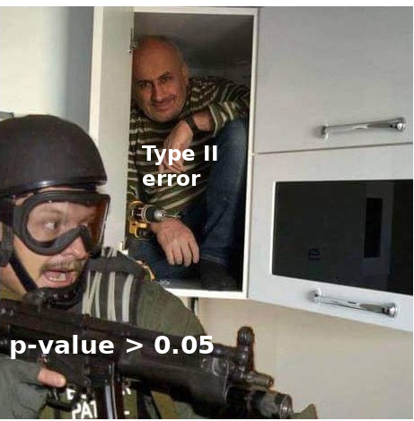

<style>
body {
text-align: justify;
font-size: 12pt}
</style>


```{r setup, include=FALSE}
knitr::opts_chunk$set(echo = TRUE)
```

## 1. Fundamentals of Hypothesis Testing 

In essence, **hypothesis testing** is simply an **alternative method, alongside confidence intervals, for accounting for the sampling error of a statistical parameter**, when we aim to infer its true population value from its estimator calculated from a sample. However, the **concept of hypothesis testing approaches the problem somewhat differently compared to the confidence intervals we have studied in** <a href="Chapter04.html" target="_blank">Chapter 4</a>.

In hypothesis testing, we formulate a **statement (or, more formally, a hypothesis) about the true population value of a statistical parameter** (mean, standard deviation, $\lambda$, etc.), **and then we attempt to determine whether the observed sample data support or contradict this hypothesis**. At first glance, we focus specifically on parametric hypothesis tests, or in short, **parametric tests**, because the **hypothesis we formulate will always concern the true population value of a statistical parameter**.

Let's once again **examine an IID sample of size $n=120$ from the population with $Exp(0.01)$ distribution**. Let’s set the value in `set.seed` to $1992$ so that we all get the same random sample of $120$ elements!

```{r}
n <- 120
rate <- 0.01

set.seed(1992)
sample_from_exp <- rexp(n = n, rate = rate)
hist(sample_from_exp)
```

Great, the histogram looks like a good old fashioned Exponential distribution with a long right tail.

Now then. Regarding the **true expected value of the unobserved population, I can formulate $6$ different statements** in relation to a specific value, e.g., $90$. As before, we denote the true population expected value of $1/\lambda=1/0.01=100$ by $\mu$:

1. I’m pessimistic and say that the true expected value in the unobserved population is less than $90$: $\mu < 90$
2. As an optimist, I could say that the true expected value is greater than $90$: $\mu > 90$
3. I can also imagine that the true expected value is exactly $90$ $\mu = 90$
4. Or I might believe that the unobserved population’s expected value is anything but $90$: $\mu \neq 90$
5. A semi-pessimist might say that the unobserved population’s expected value is at most $90$: $\mu \leq 90$
6. By elimination, the semi-optimist would think that the unobserved population’s expected value is at least $90$: $\mu \geq 90$

Alright, so I have 6 theories... or rather, *hypotheses*. Now, let’s check the **average in the observed $120$-element sample**.

```{r}
mean(sample_from_exp)
```

Based on the observed $120$ values, the sample mean is approximately $82.9$. At first glance, statement 1, the pessimistic one, seems true, as the **average is smaller than $90$**. BUT! **What we see here is only the average of $120$ obsrvations; the population’s true expected value could be different!**<br>
To put it more precisely, the **difference between $82.9$ and $90$ could simply be due to sampling error**!!<br>
**That’s why we perform hypothesis testing**: To determine whether the hypothesis $\mu < 90$ can be considered as valid, even considering sampling error.

In reality, if we think about it, all 6 statements boil down to the same fundamental question: Does the true population expecte value $\mu$ differ enough from $90$ that the **difference exceeds sampling error**? In statistical terms, we **test whether the difference between the true $\mu$ and $90$ is SIGNIFICANT**.

Here, we actually have the true population distribution that is $Y \sim Exp(0.01)$, so we actually know that in the unobserved population $\mu = 1/0.001 = 100$ minutes, which is **actually higher than** $90$!! So, in reality statement 2 is true!

However, **in practice, we DO NOT know this, because we only have the $n=120$ element sample!** So, our **only option is to use hypothesis testing to check whether the observed sample mean $\bar{y} = 82.9$ significantly differs from $90$**.

Following this logic, we define a **null hypothesis** $H_0$ and an **alternative hypothesis** $H_1$ **from our original statement**.

The key principle is the following. The null hypothesis $H_0$ always **allows equality for the examined statistical parameter**. The alternative hypothesis $H_1$ **depends on the original statement**:

- If the **original statement allows equality**, then it becomes $H_0$, and we **negate it in $H_1$**. In this case, we **expect $H_0$ to be true**, meaning that **the true population expected value does not significantly differ from $90$ minutes**.
- If the **original statement does not allow equality**, then it moves to $H_1$, and we **negate it in $H_0$**. Here, we **expect $H_1$ to be true**, meaning that **the true population expected value significantly differs from $90$ minutes**.

Using these principles, we can construct the following $H_0$ and $H_1$ pairs for our $6$ original statements:

1. Statement: $\mu < 90$ || $H_0:\mu \geq 90$ || $H_1:\mu < 90$ || Statement is in $H_1$
2. Statement: $\mu > 90$ || $H_0:\mu \leq 90$ || $H_1:\mu > 90$ || Statement is in $H_1$
3. Statement: $\mu = 90$ || $H_0:\mu = 90$ || $H_1:\mu \neq 90$ || Statement is in $H_0$
4. Statement: $\mu \neq 90$ || $H_0:\mu = 90$ || $H_1:\mu \neq 90$ || Statement is in $H_1$
5. Statement: $\mu \leq 90$ || $H_0:\mu \leq 90$ || $H_1:\mu > 90$ || Statement is in $H_0$
6. Statement: $\mu \geq 90$ || $H_0:\mu \geq 90$ || $H_1:\mu < 90$ || Statement is in $H_0$

In statements 1, 2, 5, and 6, where **$H_0$ does not have a strict equality sign, we often define a technical null hypothesis $H_0^T$**. This simply means that we **rewrite $H_0$ using a strict equality sign**.<br>
For example, **for statements 1 and 5, the technical null hypothesis is**:

1. Statement: $\mu < 90$ || $H_0^T:\mu = 90$ || $H_1:\mu < 90$ || Statement is in $H_1$
5. Statement: $\mu \leq 90$ || $H_0^T:\mu = 90$ || $H_1:\mu > 90$ || Statement is in $H_0$

Statistical **tests** (also called hypothesis tests) **are categorized based on the relational sign in $H_1$**:

- If $H_1$ contains $\neq$, then it is a **two-tailed test**
- If $H_1$ contains $<$, then it is a **left-tailed test**
- If $H_1$ contains $>$, then it is a **right-tailed test**

### 1.1. The concept of p-value

If we have properly written down the corresponding $H_0$ and $H_1$ pairs, we then determine which one is considered true based on our observed sample. For this purpose, we use a **statistical measure called the p-value**.  

The **p-value tells us the probability that, assuming $H_0$ is TRUE, we obtain a deviation from $H_0$ that is GREATER than what we observed in our sample data**. Clearly, the value of the statistical measure calculated from the sample (estimator) will never be exactly equal to what we stated in $H_0$. The question is, **what is the probability that a random new sample will produce a larger deviation from $H_0$ than what we observed in the current sample?** This probability is expressed by the so-called **p-value**: $$P(OtherRandomDifference>MyDifference|H_0)$$

So, if we obtain, for example, **p-value = 30%**, then we can say that **there is a 30% probability that another sample will show a greater deviation from $H_0$ than what we observed in our own data**. Based on this, we tend to accept $H_0$, because if we assume it to be true, then we would expect to see even greater deviations from $H_0$ in other random samples with a fairly high probability. Thus, **the deviation we observed is not large enough compared to $H_0$ (not significant), so we do not reject it, because our data does not provide enough evidence for such a decision**.  

However, if we obtain, for example, **p-value = 0.1%**, then we can say that **there is only a 0.1% probability that another sample will show a greater deviation from $H_0$ than what we observed in our own data**. Based on this, we tend to reject $H_0$, because in this case, assuming $H_0$ to be true, we would very rarely see a greater deviation from $H_0$ than what we actually observed. Therefore, **the deviation we observed compared to $H_0$ is large enough (significant), so we confidently reject it, as our data provides sufficient evidence for this decision**.  

Based on all this, the **decision rule** between $H_0$ and $H_1$ is as follows.

If the **p-value is too high, we accept** $H_0$, because we do not have enough evidence from the observed sample for rejecting it. Conversely, if the **p-value is too low, we reject** $H_0$ and **accept** $H_1$. 

The question is: how do we decide whether a p-value is too high or too low? For this, we use the so-called **significance level, denoted by** $\alpha$. The significance level represents the **maximum accepted probability of error when rejecting $H_0$**.  

So, if we say that $\alpha = 5\%$, then for a p-value below $5\%$, we **reject $H_0$, because the observed data shows a large enough deviation from $H_0$ that we can ensure a maximum error probability of $5\%$.** On the other hand, if our p-value is above $5\%$, we **accept $H_0$, because the observed data does NOT show a large enough deviation from $H_0$ to justify rejection with at most a $5\%$ error probability.**  

At this point, we might **believe the following**:  

- **p-value** $> \alpha \rightarrow H_0$  
- **p-value** $\leq \alpha \rightarrow H_1$ 

But of course, **LIFE IS NEVER THAT SIMPLE!!** The main problem here is that **our decision could heavily depend on what exact value we set for $\alpha$!** For example, say we set our maximum allowed error probability to $\alpha = 5\%$. If we then obtain a p-value of $4.8\%$, we would reject $H_0$ under $\alpha = 5\%$, but under $\alpha = 3\%$, we would accept $H_0$.<br>
Because of this, we typically apply a **range of common significance levels, which fall between $1\%$ and $10\%$**. We do not want to allow an error probability above $10\%$, as that would be unreasonably high. On the other hand, an error probability of **$0\%$ is only possible if we observe the entire population and know the true population value of the examined statistical parameter**. At that point, however, we lose the whole point of sampling — namely, that we do not have to observe every past and future data point to determine the true population value of our statistic. This $ \alpha = 0\%$ case is similar to why a $100\%$ confidence interval is meaningless — because it would say that based on our sample, the parameter could be anywhere between $\pm \infty$... :)<br>
Furthermore, we will later see from **simulations that both true and false $H_0$ statements can easily produce p-values between $1\%$ and $10\%$ in reality!**  

So, based on this long-winded explanation, a more reasonable solution seems to be to **not make a decision between $H_0$ and $H_1$ when the p-value is between $1\%$ and $10\%$, because the decision would be too sensitive to the exact choice of $\alpha$**.<br>
If our sample data produces a p-value in the range $1\%$ to $10\%$, the best thing to do is **increase the sample size ($n$) until the p-value clearly falls below $1\%$ or rises above $10\%$**. This method is called <a href="https://en.wikipedia.org/wiki/Sequential_analysis" target="_blank">sequential analysis</a>, and it is widely used in clinical drug trials and industrial quality control. The method was originally developed by a Hungarian statistician, <a href="https://en.wikipedia.org/wiki/Abraham_Wald" target="_blank">Abraham Wald</a>, for the U.S. Air Force during World War II (since he was Jewish, he was not "needed" in Hungary at the time). So, like everything important in the world, this too was invented by Hungarians. :)  

Thus, the **more correct decision rules in hypothesis testing** are:  

- **p-value** $>10\% \rightarrow H_0$
- $1\% <$ **p-value** $\leq 10\% \rightarrow$ **no decision**
- **p-value** $\leq1\% \rightarrow H_1$ 

Another headache is that we must be very cautious with p-values between $1\%$ and $10\%$, because **p-values and $\alpha$ only describe one type of decision error in hypothesis testing!**  The **p-value and $\alpha$ only provide information about the so-called TYPE I ERROR: the probability of rejecting a true $H_0$.**<br>
BUT we also have a **TYPE II ERROR**, which is **the probability of mistakenly accepting a false $H_0$.** The bad news is that **we cannot estimate or control the probability of Type II error based on our observed sample!**<br>
This is the major downside of hypothesis testing: if **we accept $H_0$, we do not actually know how likely we are to be wrong — we only know the maximum probability of rejecting a true $H_0$, because that is the significance level ($\alpha$).**<br>
For this reason, many statisticians phrase it carefully, saying that we do not "accept" $H_0$, but rather, **we "fail to reject" $H_0$.**  

For a better understanding of the problem, I think the following meme will be of great help. :)

<center>
{width=40%}
</center>

<br>Now, let’s see **how to calculate the p-value based on an observed sample when the statistical parameter of interest is the expected value**, i.e., $\mu$, and the **estimator is the sample mean**, i.e. $\bar{y}$!

## 2. The *t-test* for the Expected Value

The calculation of the p-value **always requires a statistical measure called a test statistic, which we can always compute solely from the observed sample data**. Then, **the p-value is calculated from the test statistic based on a probability distribution (standard normal, t-distribution, chi-square, etc.)**.

Let us denote the **HYPOTHETICAL value of the expected value** as $\mu_0$. This is the value that I **assume** in the statement about the true population expected value. In Section 1, this was $90$ minutes. With this notation, the test statistic for the mean appears as follows: $$\frac{\bar{y}-\mu_0}{\frac{s}{\sqrt{n}}}$$

Thus, our test statistic is **simply the difference between the sample mean and the hypothetical expected value, divided by the standard error of the mean**.

If our reasoning in $H_0$ is correct, and **we truly managed to take the real population expected value $\mu$ as the theoretical** (hypothetical) **expected value $\mu_0$, then with lots of repeated samples, our test statistic follows a t-distribution with $n-1$ degrees of freedom**: $$\frac{\bar{y}-\mu}{\frac{s}{\sqrt{n}}} \sim t(n-1)$$

The principle behind this formula is that **we apply the technical null hypothesis $\mu = \mu_0$ ($H_0^T$) in all six different types of $H_0$ and $H_1$ pairs, so we can determine the distribution of the test statistic across many samples**.

We can quickly verify this by **drawing $10000$ samples of size $n=120$ from the $Y \sim Exp(0.01)$ distribution**, as we did in <a href="Chapter04.html" target="_blank">Chapter 4</a>.

```{r}
rate <- 0.01
mu <- 1/rate
sample_size <- 120
replication_number <- 10000

set.seed(1992)
exp_samples <- replicate(replication_number, rexp(n = sample_size, rate = rate))
exp_samples <- as.data.frame(t(exp_samples))

rownames(exp_samples) <- paste0("Sample",1:replication_number)
colnames(exp_samples) <- paste0("Element",1:sample_size)
head(exp_samples)
```

Okay, from the results, we see that the data frame is structured such that **each row contains one sample of 120 observations, and the observations are stored in columns**.

We compute the sample mean and corrected standard deviation for each sample. Be sure that the second parameter of the `sapply` function is `1`, so that we take means and standard deviations row-wise instead of column-wise. Also, ensure that the functions are applied only to the first $120$ columns, as those contain the actual sample observations. Basically, do everything exactly as we did in <a href="Chapter04.html" target="_blank">Section 1 of Chapter 4</a>.

```{r}
exp_samples$sample_mean <- apply(exp_samples[,1:sample_size], 1, mean)
exp_samples$sample_sd <- apply(exp_samples[,1:sample_size], 1, sd) # corrected -> unbiased

head(exp_samples[,(sample_size-1):ncol(exp_samples)]) # look at the last 4 columns
```

Then, we can **compute our test statistic for two pairs of $H_0$ and $H_1$, where we know that $H_0$ is true in one case and false in another**:

- Case of **TRUE** $H_0$: $H_0:\mu=100$ and $H_1: \mu < 100$
- Case of **FALSE** $H_0$: $H_0^T:\mu=70$ and $H_1: \mu > 70$

```{r}
mu_0_true <- mu # true population mean
mu_0_false <- 70 # arbitrary value

exp_samples$test_stat_H0true <- (exp_samples$sample_mean - mu_0_true)/(exp_samples$sample_sd/sqrt(sample_size))
exp_samples$test_stat_H0false <- (exp_samples$sample_mean - mu_0_false)/(exp_samples$sample_sd/sqrt(sample_size))

head(exp_samples[,(sample_size-1):ncol(exp_samples)])
```

Alright! Now that we have the test statistics for both scenarios, **let's examine how the histograms of these test statistics from $10000$ samples compare to the density function of the $t(n-1)$, i.e., $t(100-1)$, distribution**.<br>  
The code for visualizing the fit of the density function to the histogram follows the exact logic of the code used to visualize sampling distributions in <a href="Chapter04.html" target="_blank">Section 1 of Chapter 4</a>. Basically, what we are going to see here are the **sampling distributions for the two test statistics**.

```{r warning=FALSE}
library(ggplot2)

# general ggplot function without defining any axes
ggplot(exp_samples) +
  # histogram of test statistic when H0 is TRUE (x axis)
  geom_histogram(aes(x = test_stat_H0true, y = after_stat(density), fill="H0 TRUE"), alpha=0.6) +
  # histogram of test statistic when H0 is FALSE (x axis)
  geom_histogram(aes(x = test_stat_H0false, y = after_stat(density), fill="H0 FALSE"), alpha=0.3) +
  # adding the density function of the t(n-1) distribution
  stat_function(fun = dt, 
                args = list(df = (n-1)),
                col = 'blue', linewidth = 1)
```

Great! So **when $H_0$ is true, the test statistic does indeed follow a t-distribution in our repeated sampling experiment**. When $H_0$ is false, the histogram forms some other symmetric distribution that is most definitely NOT a t-distribution as the mode is not at $0$. However, we are not particularly concerned with what this distribution is. :)

From the fact that the test statistic follows a t-distribution under repeated sampling when $H_0$ is true, **we can compute the p-value**. Essentially, we calculate areas under the *t-distribution* density function. To do this, we must consider **what the best-case scenario for $H_0$ is regarding the test statistic**:

- **Two-tailed** tests ($H_0: \mu=\mu_0$ and $H_1: \mu \neq \mu_0$): If the **test statistic is exactly** $0 \rightarrow$ this theoretical case suggests that the hypothetical expected value and the true population expected value are identical, so with probability $1$, I would obtain greater deviations from $H_0$ in other samples.
- **Left-tailed** tests ($H_0: \mu\geq\mu_0$ and $H_1: \mu < \mu_0$): If the **test statistic =** $+\infty \rightarrow$ this theoretical case suggests that the population expected value ($\mu$) is exactly $+\infty$, making every $\mu_0$ smaller, so with probability $1$, I would obtain greater deviations from $H_0$ than what's observed.
- **Right-tailed** tests ($H_0: \mu=\mu_0$ and $H_1: \mu > \mu_0$): If the **test statistic =** $-\infty \rightarrow$ this theoretical case suggests that the population expected value ($\mu$) is exactly $-\infty$, making every $\mu_0$ larger, so with probability $1$, I would obtain greater deviations from $H_0$ than what's observed.

Based on this, if **we have a known test statistic value denoted as $t$, then the p-value is calculated from the $t(n-1)$ distribution as shown in the following figure**:

<center>
{width=90%}
</center>

<br>As seen, **in all three cases, the p-value is computed such that the further the specific test statistic $t$ moves away from the best case for $H_0$, the smaller the p-value becomes $\rightarrow$ it becomes less and less likely to obtain greater deviations from $H_0$ than observed!!**

Based on all this, let's **calculate the p-value** using the `pt` function **for all $10000$ samples for the two previously examined pairs of $H_0$ and $H_1$, where $H_0$ was true in one case and false in the other**:

- **TRUE** $H_0$ case: $H_0:\mu=100$ and $H_1: \mu < 100$
- **FALSE** $H_0$ case: $H_0:\mu=70$ and $H_1: \mu > 70$

Note that the `1-` part before the `pt` function is included for the false $H_0$ case because it is a **right-tailed test**.

```{r}
exp_samples$p_value_H0true <- pt(exp_samples$test_stat_H0true, df = (sample_size-1))
exp_samples$p_value_H0false <- 1-pt(exp_samples$test_stat_H0false, df = (sample_size-1))

head(exp_samples[,sample_size:ncol(exp_samples)])
```

Great! Based on the first six samples, the expected p-value results were obtained: high values when $H_0$ is true, low values when $H_0$ is false. To interpret more precisely, let's examine the **4th sample**:

- **When $H_0$ is true, there is a 30.79% probability of obtaining greater deviations from $H_0$ than observed in sample 4**.
- **When $H_0$ is false, there is only a 0.07% probability of obtaining greater deviations from $H_0$ than observed in sample 4**.

At the same time, in sample $1.$, we see that the p-value is only $1.9\%$ when $H_0$ is true. So, the rule **"we do not make a decision if the p-value is between $1\%$ and $10\%$" seems quite reasonable**! :)

Similarly, the caution taken for p-values in the range of $1\%$ to $10\%$ is reinforced when we examine the p-values for true and false $H_0$ using a box plot.

```{r}
boxplot(exp_samples[,c("p_value_H0true", "p_value_H0false")])
```

As expected, when $H_0$ is true, the middle $50\%$ of p-values, that is, the interquartile range ($IQR$), is substantially higher than in the case of false $H_0$. However, it is also very important to observe in the plot that **large p-values are considered outliers when $H_0$ is false, but small p-values are not outliers when $H_0$ is true!** Thus, sometimes it may be worth using a stricter $\alpha$ than $1\%$. Many people reject $H_0$ only if the p-value is smaller than $0.1\%=0.001$, meaning they work with $\alpha=0.001$.

Based on our results, we can calculate the proportion of decision errors when $\alpha=5\%$ and $H_0$ is true. That is, the **empirical probability of a Type I error**: how often did we reject a true $H_0$? According to the definition of the significance level, this proportion should be around $5\%$.

```{r}
mean(exp_samples$p_value_H0true<0.05)
```

Well, the result is $7.55\%$, which is 2.55 percentage point higher than $5\%$, but not by much. It looks like the system is working properly. If we examined even more samples than 10000, this proportion would get closer and closer to $5\%$.

Moreover, since in this simulation case, we know when $H_0$ is true or false, we can now also calculate the **empirical probability of a Type II error** at $\alpha=5\%$: the proportion of times we accept a false $H_0$.

```{r}
mean(exp_samples$p_value_H0false>=0.05)
```

Not bad, $2.22\%$!

Let us observe the completely logical relationship that if the **probability of a Type I error (significance level) decreases, then the probability of a Type II error increases**. Now, let's calculate the two empirical error probabilities at $\alpha=1\%$. That is, we lowered the expected probability of a Type I error to $1\%$.

```{r}
mean(exp_samples$p_value_H0true<0.01) # empirical probability of Type I error
mean(exp_samples$p_value_H0false>=0.01) # empirical probability of Type II error
```

### 2.1. The *t-test* with a bulit-in R function

Luckily, we have an advantage because the **p-value of the t-test for the mean can be nicely computed using a built-in R function**!

For example, let’s take the $n=120$ sample taken at the beginning of Section 1, which we stored in the R object `sample_from_exp`, which is a vector of size 120.

```{r}
str(sample_from_exp)
```

Examine the following $H_0$ + $H_1$ pair for this specific sample:

- $H_0^T:\mu=60$
- $H_1 > 60$

Since the $H_1$ hypothesis contains the $>$ relational sign, the hypothesis test will be **right-tailed**.<br>
We know that here **$H_1$ is true, as we have previously seen that the true population expected value is $100$**. Therefore, we expect **a very low p-value**!

This result can be nicely obtained manually! First, we calculate the **test statistic** $\frac{\bar{y}-\mu_0}{\frac{s}{\sqrt{n}}}$ assuming $\mu_0=60$, since in hypothesis testing we examine whether the true population expected value is significantly greater than this assumed (hypothetical) $60$.

```{r}
hypothetical_exp_value <- 60
sample_mean <- mean(sample_from_exp)
s <- sd(sample_from_exp)
n <- length(sample_from_exp)

test_stat <- (sample_mean - hypothetical_exp_value) / (s/sqrt(n))
test_stat
```

Great! From this, we can quickly obtain the p-value from the $t(n-1)$ distribution using the `pt` function. Here, we are calculating **the probability of falling above the test statistic, since this is a right-tailed test**.

```{r}
p_val_t_distr = 1 - pt(test_stat, df = n-1)
p_val_t_distr * 100 # in percentage format
```

**Based on the p-value, we can state that for the examined sample of size $100$, there is only a $0.302\%$ probability that another random sample would show a greater deviation from $H_0$ than what we observed here**. This **is even smaller than the smallest common significance level of $\alpha=1\%$, so we make the decision to reject $H_0$**.<br>
Based on this, $H_1$ is acceptable, meaning that the **true expected value is significantly** (beyond sampling error) **greater than $60$**.<br>
Now we know that **we made the correct decision**, as we have seen that the population expected value is $100$.

Fortunately, all of this can also be handled using the `t.test` function. If the function is provided with:

- the column containing the observations of our current sample from a data frame as its first parameter,
- the theoretical expected value, i.e., $\mu_0$, in the `mu` parameter,
- the test direction in the `alternative` parameter based on the relational sign in $H_1$
  * possible values: `'two.sided'`, `'less'`, `'greater'`, corresponding to the relational signs $\neq$, $<$, and $>$ in $H_1$

Then the **function provides the p-value of the t-test and the test statistic as well**.

```{r}
t.test(sample_from_exp, mu = 60, alternative = "greater")
```

Awesome, we get the same test statistic ($2.7954$) and the p-value of $0.302\%$! :)

### 2.2. Assumptions of the *t-test*

Of course, this t-test-based hypothesis test also has prerequisites, just as different confidence interval formulas do. **If these conditions are not met, then no matter what the p-value is, it cannot be used to make a decision about $H_0$ and $H_1$**, because the underlying assumptions of the applied formulas are NOT met by the data.

The t-test essentially has **two conditions** to be considered:

1. If we have a **small sample** ($n<100$), we assume that **the data from which the sample was drawn follows a normal distribution**.
2. If the **sample size is large** ($n\geq100$), then **no additional assumptions need to be considered**.

Now, our sample of $n=120$ from and $Exp(0.01)$ population is already a large sample, since $120\geq100$, so the long right tail of the exponential distribution does not bother us much. :)

## 3. The *z-test* for the Population Mean

Of course, in the case of confidence intervals for the mean, we observed that **for a large degree of freedom ($df \geq 100$), the t-distribution is essentially the same as the standard normal distribution**.

That is, to put it a bit more mathematically: **if $n \geq 100$, then under the true null hypothesis ($H_0$)** (i.e., when we substitute the true population expected value: $\mu$, for $\mu_0$), our **test statistic follows a standard normal ($N(0,1)$) distribution**: $$\frac{\bar{y}-\mu}{\frac{s}{\sqrt{n}}} \sim N(0,1)$$

Based on this, we can **compute the p-value from the test statistic using exactly the same principle we applied in Section 2 for the t-distribution**. Since the null and alternative hypotheses remain unchanged ($H_0^T: \mu = 60$ and $H_1 > 60$), we still have a right-tailed test, and since the sample elements remain the same in our 100-element sample, the **test statistic is also the same as the one used in Section 2.1**.<br>
**Since this remains a right-tailed test**, we must **determine the probability of falling above the test statistic in the standard normal distribution** using the `pnorm` function with the $1-$ version.

```{r}
p_val_norm_distr <- 1 - pnorm(test_stat)
c(p_val_norm_distr * 100,
  p_val_t_distr * 100)
```

Both p-values are around $0.3\%$, so there really is no noticeable difference between the standard normal and t-distribution when calculating the p-value.

## 4. Relationship of Type I & II Errors with Sample Size

Our p-values have a nasty property that they always decrease with increasing sample size. This phenomena is due to technical null hypothesis stating that our hypothetical parameter value is equal to the true population parameter value and the statistical hypothesis tests like the t-test are examining if the difference between observed parameter and theoretical parameter are large enough compared to the standard error of the estimation. This is the logic behind the test statistic of the t-test as seen in *Section 2*. **This logic is the same for any other test than the t-test!** And now consider the fact that our **estimators are consistent**, so the standard error decreases as simple size increases. This results in that **one unit of difference between the $H_0$ hypothetical parameter value and observed in-sample parameter value becomes more and more significant as the sample size increases**. This phenomena is **reflected in the fact that our p-values decrease when sample size increases** as smaller p-value means that we are more likely to reject $H_0$ and accept $H_1$ which states that the equality claimed in $H_0^T$ is actually false.

We can nicely see this behavior for the p-values of the t-test if we calculate them for sample sizes ranging from $10$ to $120$ by steps of $5$ and show the result on a line chart. Since our vector, `sample_from_exp` is an IID sample of $n=120$, we can restrict the vector for the first $x$ elements to decrease the sample size from the $120$, and can obtain a p-value for a case where $H_0$ is clearly false like the $H_0^T:\mu=60$ plus $H_1 > 60$ case used in Section 2.1.<br>
Technically this is achieved by using `sapply` on the sequence of the examined sample sizes in combination with the `t.test` function applied only the first $x$ elements of `sample_from_exp` as defined by the current value taken from the sample size sequence.<br>
In `ggplot`, we can add the $\alpha=5\%$ and $\alpha=1\%$ significance levels with dashed and dotted horizontal lines respectively by applying the `geom_hline` layer.

```{r}
p_values <- sapply(seq(10,120, by = 5), function(x) t.test(sample_from_exp[1:x], mu = 60, alternative = "greater")$p.value)
df_pvals <- data.frame(sample_size = seq(10,120, by = 5),
                       p_val = p_values)

ggplot(df_pvals, aes(x=sample_size, y=p_val)) + geom_line(linewidth=1) +
  geom_hline(yintercept = 0.05, linetype="dashed") +
  geom_hline(yintercept = 0.01, linetype="dotted")
```

We can nicely see that our p-value starts from around $20\%$ (which is not a so nice p-value if $H_0$ is false) in small sample sizes of $10,20$, and decreases to around $0\%$ (where we can correctly reject $H_0$ even with $\alpha=1\%$). 

This phenomena of decreasing p-value with sample size means that Type II error rates are decreasing with increasing sample size (with a fixed $\alpha$ level of course) while Type I error rates are converging to the significance level defined by our chosen $\alpha$.

We can nicely illustrate this by using the previous trick with `seq`, `sapply` and `t.test` on $10000$ samples of different sizes in a `for` loop. Here, sample sizes are ranging from $n=50$ to as great as $n=2000$ and in order to calculate Type I and II error rates from the $10000$ samples, we fix $\alpha=5\%$. On the line chart plotted in the end, we use `geom_hline` again to show $\alpha=5\%$ as a dashed line.

```{r eval=FALSE}
sample_size_list <- c(10,20,30,40,50,60,70,80,90,100,110,120,200,500,1000,2000)
replication_number <- 10000
rate <- 0.01
mu_0_true <- 1/rate
mu_0_false <- 70 # arbitrary value

set.seed(1956)
exp_samples_big <- replicate(replication_number, rexp(n = max(sample_size_list), rate = rate))
exp_samples_big <- as.data.frame(t(exp_samples_big))

alpha <- 0.05
type1_list <- c()
type2_list <- c()

for (current_size in sample_size_list) {
  p_values_H0true <- sapply(1:nrow(exp_samples_big),
                            function(x) t.test(exp_samples_big[x, 1:current_size], mu = mu_0_true, alternative = "less")$p.value)
  p_values_H0false <- sapply(1:nrow(exp_samples_big),
                            function(x) t.test(exp_samples_big[x, 1:current_size], mu = mu_0_false, alternative = "greater")$p.value)
  type1_list <- c(type1_list,
                  mean(p_values_H0true<alpha)) # empirical probability of Type I error
  type2_list <- c(type2_list,
                  mean(p_values_H0false>=alpha)) # empirical probability of Type II error
}

error_rate_df <- data.frame("sample_size"=sample_size_list,
                            "Type1" = type1_list,
                            "Type2" = type2_list)

ggplot(error_rate_df, aes(x=sample_size)) +
  geom_line(aes(y=Type1, color="Type I Rate"), linewidth=1) +
  geom_line(aes(y=Type2, color="Type II Rate"), linewidth=1) +
  geom_hline(yintercept = 0.05, linetype="dashed")
```

```{r echo=FALSE, warning=FALSE}
error_rate_df <- readxl::read_excel("error_rates.xlsx")
ggplot(error_rate_df, aes(x=sample_size)) +
  geom_line(aes(y=Type1, color="Type I Rate"), linewidth=1) +
  geom_line(aes(y=Type2, color="Type II Rate"), linewidth=1) +
  geom_hline(yintercept = 0.05, linetype="dashed")
```

Great, the behavior of Type I and II error rates is just as we described based on the behavior of p-values when sample size increases.

## 5. Generalised Likelihood Ratio Tests (GLRTs)

Now, in this next section, we are going to combine the world of Hypothesis Testing with the world of Maximum Likelihood theory (covered in <a href="Chapter03.html" target="_blank">Chapter 3</a>) to form the Generalised Likelihood Ratio Tests or just simply Likelihood Ratio Tests. They are abbreviated as GLRTs or simply as LR tests.

In the context of maximum likelihood theory, we assume that our observed sample of size $n$ given as $Y=\{y_1,y_2,...,y_n\}$ follows a probability distribution in the unobserved population (lets denote it as $D$ here) defined with $\theta_1, \theta_2, ...,\theta_p$ parameters. Like in case the $N(\mu,\sigma)$ distribution, $D=N$ and $\theta_1=\mu,\theta_2=\sigma$. So, generally we can say that in maximum likelihood theory we assume that $Y \sim D(\theta_1, \theta_2, ...,\theta_p)$.

When we **form a null hypothesis $H_0$, maximum likelihood theory says that we restrict some parameter values of the fitted distribution to be equal to some specific values** denoted as $\theta_{i0}$ for the $i$-th parameter of the distribution. Formally a $H_0$ with these restrictions are denoted as follows if we restrict $r$ parameters, where $r\leq p$ of course: $$H_0:Y \sim D(\theta_1=\theta_{10}, \theta_2=\theta_{20}, ...,\theta_r=\theta_{r0},\theta_{r+1},...,\theta_p)$$

So this kind of $H_0$ is basically saying that our variable $Y$ follows not just any $D$ probability distribution in the unobserved population, but it is saying that it follows a specific form of $D$ where $r$ parameters have specific $\theta_{10},...,\theta_{r0}$ values.<br>
If we assume that our variable $Y$ follows a normal distribution, a restriction would be making its expected value $\mu$ equal to $10$ for example. In this case we would have $H_0: Y \sim N(10,\sigma)$. This would naturally mean $r=1$ restrictions.

The **alternative hypothesis ($H_1$) in GLRTs is simply just saying that every parameter can move freely and can take any values**. So, we simply have that: $$H_1: Y \sim D(\theta_1, \theta_2, ...,\theta_p)$$

In case of a normal distribution this would just mean that $H_1: Y \sim N(\mu,\sigma)$, without any restrictions on expected value or standard deviation.

For the **test statistic of GLRTs**, we need to do the maximum likelihood estimations with and without the parameter restrictions and save the optimized log-likelihood values. Let's denote the maximized log-likelihood under the restrictions of $H_0$ as $l_{H_0}$ and the  maximized log-likelihood of $H_1$ when every parameter can move freely as $l_{H_1}$. With this the test statistic of GLRT is simply as follows: $$\lambda_{LR}=-2(l_{H_0}-l_{H_1})$$

The test statistic operates under an idea that is similar to that of the Information Criterias covered in <a href="Chapter03.html" target="_blank">Section 5 of Chapter 3</a>: **when we fit a distribution with less parameters** (that is what we have in $H_0$ as the restricted parameters are not fitted but fixed to specific $\theta_{i0}$ values), **then the maximized log-likelihood will definitely decrease**, as the distribution's density function has less room to fit on the observed histogram. And basically **the $\lambda_{LR}$ test statistic investigates whether this decrease is significant in the unobserved population (can it be attributed to just sampling error alone)**.

It can be proven that this $\lambda_{LR}$ test statistic follows a $\chi^2$ distribution with $r$ degrees of freedom if $H_0$ is true in the unobserved population. $$\lambda_{LR}=-2(l_{H_0}-l_{H_1}) \sim \chi^2(r)$$

Because of the $-2$ multiplier in the beginning of $\lambda_{LR}$, the **test statistic can only be positive**, as we have established before that $l_{H_0} \leq l_{H_1}$, so $(l_{H_0}-l_{H_1}) \leq 0$ and in the end we get that $-2(l_{H_0}-l_{H_1}) \geq 0$. Since in the best case for $H_0$, the restrictions of $H_0$ don't cause any decrease in the maximized log-likelihood, we have that we should set our p-value as $100\%$ when $l_{H_0} = l_{H_1}$, so when $\lambda_{LR}=0$ and continuously decrease it from this state as we are entering the $l_{H_0} < l_{H_1}$ (i.e. $\lambda_{LR}>0$) ranges. Due to the long-right-tail of the $\chi^2(r)$ distribution and the logic described before, we **always need to calculate the p-value of a GLRT in a right-tailed way** as described in Section 2.

So, with the p-value calculation method in our hands, we now know everything to try out GLRTs in practice! :)

### 5.1. The t-test for the mean as a GLRT

Let's load the <a href="https://github.com/KoLa992/Computational-Statistics-Lecture-Notes/blob/main/ess_hun_2024.xlsx" target="_blank">ess_hun_2024.xlsx</a> file to an R data frame. Let's also calculate BMI and omit the missing BMI values just like we did in <a href="Chapter01.html" target="_blank">Chapter 1</a>.

```{r}
ess <- readxl::read_excel("ess_hun_2024.xlsx")
ess$BMI <- ess$Weight/(ess$Height/100)^2
ess_small <- ess[!is.na(ess$BMI),c("idno", "BMI")]
str(ess_small)
```

Great, we have all the $n=2009$ respondents and their BMI values! Now, if we remember, we established in <a href="Chapter01.html" target="_blank">Chapter 1</a> that the BMI distribution of Hungary can be assumed to be a normal one, so we have that $BMI \sim N(\mu,\sigma)$. If we don't believe our memories, we can always check our normality assumption on a histogram. :)

```{r}
hist(ess_small$BMI)
```

Amazing, one of the nicest bell curve shaped histograms of all times! :)

Our hypothesis is that in the Hungarian population the average person's Body Mass Index is $\mu=25 kg/m^2$. So we have a statement for the true population expected value. With the assumption of normal distribution on the BMI variable, we can phrase $H_0$ and $H_1$ according to the principles of a likelihood ratio test and have the following null and alternative hypotheses.

- $H_0: BMI \sim N(25,\sigma)$
- $H_1: BMI \sim N(\mu,\sigma)$

According to the likelihood ratio test statistic we have that $$\lambda_{LR}=-2[l(25,\sigma)-l(\mu,\sigma)]$$

So, first we need to calculate the maximized log-likelihood under the restrictions of $H_0$. That is let's calculate $l(25,\sigma)$ with `optim`. It is exactly the same process that we've seen in <a href="Chapter03.html" target="_blank">Section 3 of Chapter 3</a>. The only difference is that the `mean` parameter in `dnorm` is fixed at $25$, the only thing we can change freely during optimization is `sd`.<br>
What we need to be careful about is that `optim` returns the negative log-likelihood in the `val` element of its result `list`, so we need to add a $-1$ multiplier to get the actual optimized log-likelihood.

```{r warning=FALSE}
# function definition
neg_log_likelihood_norm_H0 <- function(sd_norm){
  log_lik_observations <- log(dnorm(x = ess_small$BMI,
                                    mean = 25,
                                    sd = sd_norm))
  return(-sum(log_lik_observations))
}

# do MLE
norm_ml_H0 <- optim(20, neg_log_likelihood_norm_H0)
log_likelihood_H0 <- -norm_ml_H0$val # the '-' is to get the actual log-likelihood
log_likelihood_H0
```

And now go for $l(\mu,\sigma)$ the same way, the difference is that $\mu$ is not restricted to $25$. So, everything is the same here as we've seen in <a href="Chapter03.html" target="_blank">Section 3 of Chapter 3</a>.

```{r warning=FALSE}
# function definition
neg_log_likelihood_norm_H1 <- function(theta_norm){
  log_lik_observations <- log(dnorm(x = ess_small$BMI,
                                    mean = theta_norm[1],
                                    sd = theta_norm[2]))
  return(-sum(log_lik_observations))
}

# do MLE
norm_ml_H1 <- optim(c(20,20), neg_log_likelihood_norm_H1)
log_likelihood_H1 <- -norm_ml_H1$val # the '-' is to get the actual log-likelihood
log_likelihood_H1
```

And the likelihood ratio (LR) test statistic is simply calculated as the difference times $-2$ at this point.

```{r}
test_stat_LR <- -2*(log_likelihood_H0 - log_likelihood_H1)
test_stat_LR
```

In case of a true $H_0$, this LR test statistic follows a $\chi^2(1)$ distribution (for many samples) as the number of restrictions in $H_0$ is only $r=1$ as we only gave a restriction for the $\mu$ parameter of the normal distribution. So, we can get the p-value from the $\chi^2(1)$ distribution in a right-tailed way.

```{r}
p_val_LR <- 1 - pchisq(test_stat_LR, df = 1)
p_val_LR
```

This is a hard $H_0$ reject on every common $\alpha$s as $p-value<0.01$.

If we remember <a href="Chapter01.html" target="_blank">Chapter 1</a>, we know that unfortunately the Hungarian population is a bit obese, so we might need to try something higher as the population expected value for BMI in Hungary.  Like, let's see the $\mu=26.1$ statement.<br>
So we have the following null and alternative hypotheses:

- $H_0: BMI \sim N(26.1,\sigma)$
- $H_1: BMI \sim N(\mu,\sigma)$

This means we can get the GLRT p-value exactly the same way as before, we just need to replace the hypothetical mean of $25$ to $26.1$.

```{r warning=FALSE}
neg_log_likelihood_norm_H0 <- function(sd_norm){
  log_lik_observations <- log(dnorm(x = ess_small$BMI,
                                    mean = 26.1,
                                    sd = sd_norm))
  return(-sum(log_lik_observations))
}

norm_ml_H0 <- optim(20, neg_log_likelihood_norm_H0)
log_likelihood_H0 <- -norm_ml_H0$val

test_stat_LR <- -2*(log_likelihood_H0 - log_likelihood_H1)
p_val_LR <- 1 - pchisq(test_stat_LR, df = 1)
p_val_LR
```

So, we have a p-value of $5.9%$, that means we need to reject $H_0$ at $\alpha=10\%$, but at $\alpha=5\%$, we fail to reject a null. So, our decision is sensitive to the choice of significance level, i.e. it is inconclusive.

Now, we can calculate this same p-value via a two-sided t-test as well. Since the $\mu=26.1$ statement can be rephrased into $H_0$ and $H_1$ such that it is suitable for a t-test for the population mean as seen in Section 2.

- $H_0: \mu = 26.1$
- $H_1: \mu \neq 26.1$

With this $H_0$ + $H_1$ pair, we can obtain the p-value with the proper use of the built-in `t.test` function.

```{r}
t.test(ess_small$BMI, mu = 26.1, alternative = "two.sided")
```

Wow, this is **truly the same p-value**! As $t(\infty)=N(0,1)$ and by the definition $\chi^2(k)=\sum_{i=1}^k{N(0,1)}$, so for $k=1$ we have that $$t(\infty)=N(0,1)=\chi^2(1)$$

So no surprise that the two p-values are the same as $5.9\%$. Since the degrees of freedom in this case is always $1$ as the t-test is for just $1$ parameter, the $\mu$, we can state that the **t-test for the expected value is a likelihood ratio test as well**!

### 5.2. GLRTs to Compare Distribution Fits 

GLRTs can be also applied to to decide **if an $Exp(\lambda)$ or a $LN(\mu,\sigma)$ is a better fit on the daily net usage time variable** of the ESS 2024 data. Our hypotheses here, according to the GLRT logic, are the following.

- $H_0: Time \sim Exp(\lambda)$
- $H_1: Time \sim LN(\mu,\sigma)$

Note that the simpler distribution (that has fewer parameters) has to be in $H_0$ as that is the restricted solution.

To calculate the test statistic, we need to filter the valid Net Usage Time values (not missing and positive, as seen in <a href="Chapter03.html" target="_blank">Section 5 of Chapter 3</a>) into a separate data frame.

```{r}
ess_small <- ess[!is.na(ess$DailyNetUse),c("idno", "DailyNetUse")]
ess_small <- ess_small[ess_small$DailyNetUse > 0,]
hist(ess_small$DailyNetUse)
```

Nice, we have the familiar long-right-tailed histogram of the observed $n=1391$ internet usage times as seen in <a href="Chapter03.html" target="_blank">Section 5 of Chapter 3</a> for example.

We can construct the LR test statistic by doing MLE for the two distributions, then subtract the maximized $l(\mu,\sigma)$ of the normal distribution from the maximized $l(\lambda)$ of the exponential distribution, and multiply the result by -2.

```{r warning=FALSE}
neg_log_likelihood_lnorm <- function(theta_lnorm){
  log_lik_observations <- log(dlnorm(x = ess_small$DailyNetUse,
                                     meanlog = theta_lnorm[1],
                                     sdlog = theta_lnorm[2]))
  return(-sum(log_lik_observations))
}

lnorm_ml <- optim(c(2,2), neg_log_likelihood_lnorm)
log_likelihood_H1 <- -lnorm_ml$val

neg_log_likelihood_expon <- function(theta_expon){
  log_lik_observations <- log(dexp(x = ess_small$DailyNetUse,
                                   rate = theta_expon))
  return(-sum(log_lik_observations))
}

expon_ml <- optim(0.001, neg_log_likelihood_expon)
log_likelihood_H0 <- -expon_ml$val

test_stat_LR <- -2*(log_likelihood_H0 - log_likelihood_H1)
test_stat_LR
```

And p-value is again coming from a $\chi^2(1)$ distribution in a right-tailed way as the number of restriction is again $r=1$, since the simpler (restricted) exponential distribution has $1$ less parameter than the lognormal distribution with $2$ parameters.

```{r}
1 - pchisq(test_stat_LR, df = 1)
```

That's a hard $H_0$ reject on every common significance levels. So, the unrestricted lognormal distribution is a significantly better fit on the data when considering the unobserved population according to our LR test.

### 5.3. The Neyman - Pearson lemma

The **reason that GLRTs** are so important and **preferred over other kinds of hypothesis tests** is the **Neyman-Pearson lemma**.

This lemma states that **for a given significance level**, the likelihood ratio test is the **uniformly most powerful** test for a **given $H_0$ and $H_1$ pair**. This means it has the highest probability of correctly rejecting a truly false null hypothesis (1 - Type II error rate $\rightarrow$ see Sections 1 and 2 for details) while the Type I error rate is maximized as the significance level $\alpha$.

So, if You have several tests to calculate p-value for a specific $H_0$ + $H_1$ pair, always use the one that was constructed using LR principles as that will produce the lowest probability for Type II error with a fixed $\alpha$.

## 6. Other Important Parametric Tests

The hypothesis tests we have learned **so far** (t-test and GLRTs) were so-called **one-sample hypothesis tests**. This meant that we examined the relationship of a single statistical parameter (a single mean, a single proportion, or a single standard deviation) compared to some theoretical value. Based on this, we formulated our assumptions, i.e., our hypotheses.

**In this next subsection**, however, we will deal with a so-called **two-sample hypothesis test**, or in other words, **two-sample test**. This means that in our **hypotheses** (assumptions), we always **examine the relationship between statistical parameters of two groups** (two means, two proportions, etc.) **compared to each other**.

### 6.1. The General Principle of Two-Sample Hypothesis Tests

The hypothesis tests we have learned **so far** for the mean, proportion, and standard deviation were so-called **one-sample hypothesis tests**. This meant that we examined the relationship of a single statistical parameter (a single mean, a single proportion, or a single standard deviation) compared to some theoretical value. Based on this, we formulated our assumptions, i.e., our hypotheses.  

**From now on**, however, we will deal with so-called **two-sample hypothesis tests**, or in other words, **two-sample tests**. This means that in our **hypotheses** (assumptions), we will always **examine the relationship between statistical parameters of two groups** (two means, two proportions, etc.) **compared to each other**.  

So, if I **take the mean as an example** of a statistical parameter, I can state a **two-sample statement** such as **"the average salary of men is higher than the average salary of women in Hungary"**.<br>
Written in a slightly more mathematical form: **MeanSalary(Men) > MeanSalary(Women)**  

**These hypothesis tests will be two-sample tests because the logic is that we have one sample for the male average and one sample for the female average**. So, in total, we are working with two samples. :)  

The question is how to formulate the null and alternative hypotheses from these two-sample claims. The **trick** is to **rearrange the inequality** describing the claim **so that we examine the relations of the difference between the statistical parameters of two groups to a theoretical difference value**. This theoretical value will be the expected difference, usually denoted as $\delta_0$. In the case of proportions, $\epsilon_0$ is used as the notation for the expected difference.  

In the previous example of average salary, if I continue to denote population means with $\mu$, as in previous chapters, the **rearranged statement** is as follows: $$\mu_{Male} - \mu_{Female} > 0$$

And here we have the case where $\delta_0 = 0$. Based on our **previous principles, we can write $H_0$ and $H_1$ for the difference**:  

1. If the **statement allows equality, it becomes $H_0$; otherwise, it goes to $H_1$**.  
2. **$H_0$ and $H_1$ must be mutually exclusive, opposing statements**.  

Thus, for our male-female average salary example, the $H_0$ and $H_1$ statements are as follows:  

- $H_0:\mu_{Male} - \mu_{Fmale} \leq 0$
- $H_1:\mu_{Male} - \mu_{Female} > 0$
- Statement: $H_1$

Now, let’s look at an example where $\delta_0 \neq 0$! Suppose our statement is that **"the average male salary is at least 100000 HUF higher than the female salary"**. In this case, the first step is to write the statement as if it only said *"the male average salary is at least as much as the female"*—that is, as if the 100000 HUF difference was not even there. Because of the *"at least"* phrase, this becomes a $\geq$ statement: $$\mu_{Male} \geq  \mu_{Female}$$

Now, let’s adjust this inequality by incorporating the 100000 HUF difference. The phrase *"the male average salary is at least 100000 HUF higher than the female"* means, in another way, that **if I add 100000 HUF to the female average salary, the male average salary should still be greater than or equal to that**. This formulation appears in the inequality as follows: $$\mu_{Male} \geq  \mu_{Female} + 100$$

From here, we have our statement, which is now easy to **rearrange** so that **the inequality examines how the difference between the means compares to some theoretical $\delta_0$ value**, which in this case is 100: $$\mu_{Male} -  \mu_{Female} \geq 100$$

So, in this statement, $\delta_0 = 100$. Applying our usual two fundamental principles, we can now quickly divide this into $H_0$ and $H_1$. Since the statement allows equality, it becomes our null hypothesis, while the alternative hypothesis is its negation. Finally, we root for $H_0$, because that’s where our original claim resides:  

- $H_0:\mu_{Male} - \mu_{Female} \geq 100$
- $H_1:\mu_{Male} - \mu_{Female} < 100$
- Statement: $H_0$

Now, let's see how we calculate the p-value for these two-sample $H_0$ and $H_1$ pairs in some practical examples! :)

### 6.2. Two-Sample Welch t-test

The ESS database allows us to verify a claim about the entire Hungarian population (i.e., the population) using the columns `Sex` and `BMI`. The claim states that, **on average, males are more obese than females** (males have higher average BMI).

We can express this claim as a mathematical inequality: $\mu_{\text{Male}} > \mu_{\text{Female}}$. If we rearrange this statement in terms of the difference of means, we get the inequality $H_1:\mu_{\text{Male}} - \mu_{\text{Female}} > 0$. From this, we see that the theoretical difference in the population is $\delta_0=0$.<br>
Following our usual two fundamental principles, we can now quickly divide this into $H_0$ and $H_1$. Since the statement does *not* allow equality, it becomes our alternative hypothesis ($H_1$), while the null hypothesis ($H_0$) is its negation. Finally, we root for $H_1$, as it contains our original statement:

- $H_0:\mu_{\text{Male}} - \mu_{\text{Female}} \leq 0$
- $H_1:\mu_{\text{Male}} - \mu_{\text{Female}} > 0$
- Statement: $H_1$

According to the second step of hypothesis testing, we now examine our observed sample data. In this case, the difference in average BMI between the two groups (males and females) can be easily calculated using the `aggregate` function. Meanwhile, I also store the theoretical difference ($\delta_0$) of $0$ in a separate R object.<br>
In the first parameter of the `aggregate` function, I provide a `formula` that describes that I want to aggregate the `BMI` numeric column to the levels of the `Sex` nominal column. Notice that the numeric and nominal columns here are separated with a `~` sign. The second parameter is the data frame these columns reside in. The `FUN` parameter specifies the statistical function used for the aggregation: right now I take the `mean` of of the numerical values according to the groups defined by the nominal variable. 

```{r}
hypothetical_diff_means <- 0

# the two sample means
aggregate(BMI ~ Sex, data = ess, FUN = mean)
```

We can see that in the sample, males have a slightly higher average BMI compared to females. However, we **cannot automatically accept $H_1$ as true, since this phenomenon could just be due to sampling error!** This is precisely why we need to **calculate a p-value—to determine the probability that this phenomenon** (i.e., the higher average BMI for males) **is merely due to sampling error**.

So, let’s calculate that nasty test statistic! :)

The formula for our test statistic is shown below, and from the following equation, we can observe that the probability distribution for p-value calculation is the Student’s t-distribution ($t(v)$): $$\frac{(\bar{y_1}-\bar{y_2})-\delta_0}{\sqrt{\frac{s_1^2}{n_1}+\frac{s_2^2}{n_2}}} \sim t(v)$$

We see that the formula for the test statistic is not overly complicated. We take the difference between the two sample means ($\bar{y_1}-\bar{y_2}$) and compare how much it deviates from the theoretical difference ($\delta_0$), then scale this by the sum of the squared standard errors of the two means under the square root. Notice that since we just add up the two squared standard errors in the denominator, we assume that the correlation between the two samples is $0$. As $Var(X+Y)=Var(X)+Var(Y)$ is only true if $Cov(X,Y)=0$, as we have learnt in probability theory. So we **assume** that the **two samples are independent of each other, meaning that there cannot be an overlap between the observation of the two groups**. Practically, this means that there cannot be anyone who is male and female at the same time. It's an easy thing to assume though not very PC. :)<br>
However, the degrees of freedom for the t-distribution are derived using a somewhat complex formula, where $v_i=n_i-1$, which represents the "one-sample" t-distribution degrees of freedom for the $i$-th sample (naturally, $i={1,2}$). Specifically: $$v=\frac{\left(\frac{s_1^2}{n_1}+\frac{s_2^2}{n_2}\right)^2}{\frac{s_1^4}{n_1^2v_1}+\frac{s_2^4}{n_2^2v_2}}$$

This complex degrees of freedom formula is known as the **Welch correction**, which ensures that we **do NOT need to assume equal variances in the two populations for the test to be valid**!

Fortunately, R provides a **built-in function for this so-called two-sample t-test** (specifically, the already familiar `t.test`), which calculates both the test statistic and the p-value, so we **don’t have to compute it manually**. :)<br>
The reason this is called a *t-test* is that the test statistic follows a Student’s $t$-distribution, which is used to compute the p-value.

However, we must **recognize that since the reference distribution for p-value calculation is Student’s t, both samples** (*male* and *female*) **must be large** ($n>100$) for the test to be performed! **If the large sample condition is not met** (i.e., at least one $n_i<100$), then **we must assume normality of the data in both groups** to perform the test!<br>
The easiest way to check this for the `Sex` column is by using the `table` function to get its frequency table.

```{r}
table(ess$Sex)
```

Since $1239>100$ and $809>100$, the **large sample condition is satisfied**.

Now, let’s **calculate the p-value** using the built-in `t.test` function.<br>
The **following parameters** must be provided to the function:

- `formula`: A special syntax where we specify the name of the numerical variable first (whose mean we are testing), followed by a tilde and then the nominal variable that distinguishes the two groups: `NumericalVariable ~ Nominalvariable`.
- `data`: The name of the data frame containing the two variables specified in the formula. Fortunately, the function is smart enough to automatically ignore missing values, so we don’t need to handle them separately.
- `mu`: The theoretical difference in means as per our hypotheses. Here, we have $\delta_0=0$.
- `alternative`: The relational operator in the alternative hypothesis, provided as text.
  * possible values: `‘two.sided’, ‘less’, ‘greater’`, which correspond to $\neq$, $<$, and $>$ relational operators in $H_1$
  * be careful that the **choice here needs to follow the alphabetical order of the two groups**. So, we need to choose the `‘less’` option here, because the function takes the $\mu_{\text{Female}} - \mu_{\text{Male}}$ difference since *Female* is earlier in alphabetical order than *Male*. And we assume $\mu_{\text{Female}} - \mu_{\text{Male}}<0$ in $H_1$

And let's see how this works in practice.

```{r}
t.test(BMI ~ Sex, data = ess, mu = 0, alternative = "less")
```

The first element in the result is the test statistic, second is the Welch-corrected degrees of freedom and the third is the p-value. Thus, our **p-value is $0.000101\%$**. This means that rejecting $H_0$ would come with a $0.000101\%$ error probability. So, we **can reject** $H_0$ even if our allowed error probability (significance level, $\alpha$) is $1\%$, as the error probability is within the allowed range.<br>
Thus, we **can say that the average BMI is significantly higher for males** than for females **on all common levels** (i.e., that the difference is not just due to sampling error).

### 6.3. Analysis of Variances (ANOVA)

The Analysis of Variances is basically an extension of the two-sample Welch t-test to more than 2 samples. In our notations we assume that our numeric variable $Y$ can be partitioned into $M$ groups based on some other nominal variable, and the true population expected value for the $j$-th group is denoted as $\mu_j$.

With these notations we can only phrase one specific $H_0$ + $H_1$ pair that satisfies the general principles of forming $H_0$ and $H_1$ pairs defined in Section 1. Notably that

1. $H_0$ must allows equality for the examined statistical parameter
2. $H_0$ and $H_1$ must be mutually exclusive, i.e. if one is true, then the other must be false

With the first principle in mind, **the $H_0$ can only state** for more than 2 samples that **all of our group means** ($\mu_j$) **must be equal** in the unobserved population. And from the second principle, **$H_1$ can only negate this $H_0$**, which is stating that **at least one group mean is significantly different from the others** in the unobserved population.

- $H_0:\mu_1=\mu_2=...=\mu_M=\mu$
- $H_1: \exists j \rightarrow \mu_j \neq \mu$

So, the next step is constructing a test statistic for this specific $H_0$ and $H_1$ pair and give its distribution. For this, we need to get the between group and within group variances like in the "*normal*" version of the ANOVA (Analysis of Variances), but the groups are weighted not just according to their frequency ($n_j$) but according to their variances ($s^2_j$) as well. This way, the Welch version of ANOVA does not assume equal variances of the groups like the classical ANOVA. It only assumes larges sample size for each group.

For this modified version of the ANOVA test statistic, we need the following from the observed sample:

- $n_j$ = sample size in group $j$.
- $\bar{y}_j$ = observed sample mean of group $j$.
- $s_j^2$ = corrected sample variance (unbiased) of group $j$.

The specialty of Welch's F test that it does not use the simple sample mean $\bar{y}$ as the global mean of the numerical variable $Y$, but a weighed average of the $\bar{y}_j$ values where the weights $w_j$ are proportional to the variance of group $j$.

$$w_j=\frac{n_j}{s^2_j}$$

Let's introduce the sum of the weights as follows.

$$W=\sum_{j=1}^M{w_j}$$

And the new weighted global mean is given as a simple weighted average with the definitions given above:

$$\bar{y}_W=\frac{\sum_{j=1}^M{w_j}\bar{y}_j}{W}$$

The intuition here is that groups with larger sample size and smaller variance get more weight in the pooled estimate of the global mean.

Nest, we can compute a between-group variance using these new $w_j$ weights, as the weighted variance of the group means around the new global mean $\bar{y}_W$.

$$s^2_B=\frac{\sum_{j=1}^M{w_j}(\bar{y}_j-\bar{y}_W)^2}{M-1}$$

Because each $w_j$ itself depends on the sample variance $s_j^2$, we need to account for the extra uncertainty. We can do that by defining the following term $T$: $$T = \sum_{j=1}^{M} \frac{1}{n_j - 1} \left( 1 - \frac{w_j}{W} \right)^2$$

And with that we can have a correction factor $c$ accounting for the extra uncertainty caused by $w_j$ weights depending on the sample variances of the groups $s_j^2$: $$c = 1 + \frac{2 (M - 2)}{M^2 - 1} \; T$$

In the Welch version of the $F$ test statistic, this correction factor $c$ inflates the denominator to reflect variability in the estimated variances $s^2_j$: $$F=\frac{s^2_B}{c}$$

This test statistic follows an $F\left(M-1, \frac{M^2 - 1}{3T} \right)$ distribution in case $H_0$ is true. We can **calculate the p-value a right-tailed way**, as the best case for $H_0$ in the $F$ statistic is when it is $0$. Since this can only happen, if we do not have any between-group variability in the numerical variable $Y$, so $s^2_B=0$. This is when we want the p-value to have $100\%$ and decrease it as $s^2_j$, i.e. $F$ grows since the $H_0$ of equal group means becomes less and less plausible when between-group variance (the expected difference of a group mean from the global mean) increases. So, a right-tailed p-value calculation from the F distribution seems appropriate.

Thankfully, we do not need to implement these calculations manually, we have the R function `oneway.test` to calculate the $F$ test statistic and the p-value for us.

So, let's examine Welch's F-test in practice by examining the **null hypothesis** ($H_0$) that the **average BMI values of different Hungarian NUTS 2 regions are equal** in the unobserved population. I.e. **can we say that we have some regions that are more obese than others?**

In the `oneway.test` function, You simply need to provide the **numerical variable and nominal variable that defines the $M$ groups, separated by tildes**: `numerical variable ~ nominal variable` → the order matters! The name of the numerical variable is always first, and the name of the nominal variable comes second! It is not necessary here to reference the variable names with a `$` sign through the `data frame`. You can specify the name of the `data frame` object containing the two variables in the function's data parameter.<br>
Additionally, we must set a `var.equal = FALSE` parameter. This "switches on" the *Welch correction* in the test function, modifying the calculation appropriately. Without this correction, the test would assume equal variances across groups in the population, which we avoid by enabling *Welch correction*. :)

```{r}
oneway.test(BMI ~ Region, data = ess, var.equal = FALSE)
```

Based on the result, the **p-value is $0.0019\%$**. This is smaller even than the smallest typical significance level, $\alpha=1%$, so we can safely and confidently accept $H_1$, meaning that we have **at least 1 region, where the average BMI is significantly different from the others in the unobserved population**.<br>
This phrasing is the key here! Notice that **$H_1$ is an extremely strong statement in this Welch's $F$ test!** It is enough that only 1 region out of $M=8$ Hungarian regions have a difference in mean population BMI, then the test immediately rejects $H_0$, it **does not matter if the averages in the remaining $7$ regions are the same**.<br>
So, be careful when saying thing like "*region significantly influences BMI values in Hungary*" based on the fact that the Welch ANOVA $F$ test's $H_0$ is rejected. Since this result only states that we have at least one region with significantly different population mean BMI. Nothing more. It can very well be the case that for example the median BMIs of the regions are the same in the unobserved population.<br>
This strong $H_1$ also means that **chances of rejecting $H_0$ and making a Type I error increase as the number of groups, $M$ increase**. We'll directly address this issue in <a href="Chapter08.html" target="_blank">Chapter 8</a>.

This behavior of the ANOVA $F$ test is confirmed when examining the average BMIs of different regions with the `aggregate` function.

```{r}
aggregate(BMI ~ Region, data = ess, FUN = mean)
```

From these group means, we can see that $H_0$ is most likely only rejected due to the fact that the average BMI of Western Transdanubia closer to $27$ and the average BMI of Northern Hungary is closer to $25$, but otherwise the regions have a similar BMI around $26.2$.

The **ANOVA $F$ test assumes that all groups have large sample sizes**, specifically that $n_j \geq 100, \; \forall j$. So, we should check this in our regions just in case with the table function.

```{r}
table(ess$Region)
```

Great, every region has at least $100$ observations, so the assumption of the test is satisfied.<br>
However, we still need to be careful with the conclusion due to the strong $H_1$ of the test: we can only say that we have at least 1 region where the average BMI is not the same as in the others in the unobserved population.

## 7. Non-Parametric Tests

UP UNTIL NOW, we examined the case of so-called **parametric tests**. In those, we made statements — hypotheses — about possible population values of statistical parameters (e.g., mean, standard deviation, proportion, etc.).

NOW, we begin exploring the case of so-called **non-parametric tests**. In this case, we **make statements — hypotheses about the population distribution of variables**. A variable’s distribution basically means specifying what proportion each possible value of the variable occurs with. So really, in these hypotheses, we are making statements about **many proportion values at once**.

However, the **four fundamental steps remain unchanged** compared to before!

1. Writing $H_0$ and $H_1$
2. Computing the test statistic from the observed sample
3. Calculating the p-value based on the test statistic and a probability distribution
4. Decision based on the p-value $\rightarrow$ Can $H_0$ or $H_1$ be accepted as true for the population?

### 7.1. $\chi^2$ Goodness-of-Fit Tests

One major subtype of non-parametric tests is the case of goodness-of-fit tests. In these, we always examine whether the **distribution of the observed sample elements fits a theoretical distribution specified by us** (e.g., uniform distribution, exponential distribution, normal distribution, things like that).

For example, way back in <a href="Chapter01.html" target="_blank">Chapter 1</a>, we've established that the BMI variable follows a $N(26.27,4.03)$ distribution via *method of moments*.

```{r}
ess_small <- ess[!is.na(ess$BMI),c("idno", "BMI")]

# method of moments estimation of mu and sigma
est_mu <- mean(ess_small$BMI)
est_sigma <- sd(ess_small$BMI)

# visual check of distribution fit on histogram
ggplot(ess_small, aes(x=BMI)) +
  geom_histogram(aes(y = after_stat(density))) +
  stat_function(
                fun = dnorm, 
                args = list(mean = est_mu, sd = est_sigma),
                col = 'red',
                linewidth = 1)
```

Based on the observed histogram and the $N(26.27,4.03)$ density function, we could say that the $N(26.27,4.03)$ distribution mostly fits the observed BMI data, but perhaps the observed histogram has a mild right tail compared to the normal density function. And so the question arises: **Is this slight right-skew due to sampling error alone or is it something significant?** $\rightarrow$ Hypothesis test! :) The null and alternative hypothesis of this goodness-of-fit test for normality are as follows.

- $H_0:$ The true population distribution is **normal**
- $H_1:$ The true population distribution is **NOT normal**

Now, **if we apply $\chi^2$ goodness-of-fit test, then we need to bin our continuous numerical variable** (now the BMI) **into $k$ distinct categories**. Once we did that, then our test statistic and the distribution used to compute the p-value under the assumption that $H_0$ is true is the following: $$\sum_{j=1}^{k}{\frac{(f_j-f^*_j)^2}{f^*_j}} \sim \chi^2(k-b-1)$$

Meaning of the symbols in the formula:

- $k$: the number of possible values of the variable under examination (or the number of bins if our variable is continuous)
- $b$: the number of parameters that needed to be estimated when fitting the distribution on observed data (for normal distribution $b=2$ as we need to estimate $(\mu,\sigma)$ to fit the distribution)
- $f_j$: observed frequencies of each variable value or bin
- $f^*_j$: theoretical frequencies of the examined variable values or bins in the sample if it were truly normally distributed

We need to note here that technically the $H_0$ and $H_1$ pairs of these non-parametric tests state the following:

- $H_0: f_j=f^*_j ,\forall j$
- $H_1: \exists j: f_j \neq f^*_j$

So, even if in one category $j$ we have a significant difference in the observed frequency $f_j$ and the theoretical frequency $f^*_j$ under $H_0$, then $H_0$ is rejected, no matter that in the rest of the categories the observed frequencies fit to the theoretical distribution assumed in $H_0$.<br>
That is why **these $\chi^2$ non-parametric tests very much favor $H_1$, as it is a very strong statement**. This technical $H_0$ and $H_1$ pair remains in all subsequent $\chi^2$ non-parametric test of this chapter, so **this behavior of $H_1$ being a strong statement remains in all further $\chi^2$ non-parametric tests that we are covering in this chapter**.

The **p-value** is **always** calculated from the $\chi^2(k - b - 1)$ distribution in a **right-tailed** manner. For more details on calculating right-tailed p-values, see Section 2.

A key **assumption** of the $\chi^2$ test is that we have a **minimum theoretical frequency of $5$ for every variable value or bin**. That is we need to have $f^*_j \geq 5, \; \forall j$.

Due to this assumption of the $\chi^2$ test, **we'll use a trick when forming the $k$ bins for the continuous BMI variable**.  We calculate the quintiles (i.e., 5-part dividing points) of the normal distribution that best fits the `BMI` variable. For example, $K_2$ is the value below which 40% (i.e., $2/5$) of the data fall, and above which 60% ($3/5$) lie.<br>
The best-fitting normal distribution for the `BMI` variable is the one that has the same mean and standard deviation as the observed `BMI` values. Have already have these in the `est_mu` and `est_sigma` R objects.

The quintiles of the normal distribution can be calculated using the `qnorm` function. The quintile values must be passed as a vector to the function. For technical reasons, we also need the $0$ and $1 = 100\%$ cut points in addition to the $0.2$ increments = quintiles = five-part points.

```{r}
norm_quintiles <- qnorm(seq(0,1,0.2), mean = est_mu, sd = est_sigma)
norm_quintiles
```

Next, we create a frequency table of the $f_j$ values corresponding to the normal distribution quintiles. First, we use the `cut` function to split the variable according to the quintile values given in the `breaks` parameter. Then we use the `table` function to count the frequencies within these intervals.

```{r}
observed_freq <- table(cut(ess_small$BMI, breaks = norm_quintiles))
observed_freq
```

If $H_0$ (i.e., normal distribution) were true, then these quintiles would split the sample perfectly into five equal parts. So, the expected frequencies would be: $f^*_j = \frac{n}{5} = \frac{2009}{5} = 401.8 \approx 402$. Notice that **by binning the variable with quintiles, we automatically satisfied the every expected frequency must be at least $5$ assumption of the test**!

At this point, we have everything to calculate the test statistic: we know the $f_j$ and the $f^*_j$ values. We can calculate the test statistic using a built-in R function called `chisq.test`. The function only needs the empirical frequencies of the $k$ bins, so the $f_j$ values as an input parameter. It automatically assumes that $f^*_j = 1/k$. We can override this if we want in the `p` parameter of the function, but it is not needed as we binned with deciles. :)<br>
The result of the `chisq.test` function is a `list`, and its `statistic` element is our $\chi^2$ test statistic we were looking for.

```{r}
chi2_result <- chisq.test(observed_freq)
chi2_result$statistic
```

However, for the p-value, the appropriate distribution is $\chi^2(k - 1 - b)$, where $b$ is the number of estimated parameters. We must override the default degrees of freedom (`df`) in `chisq.test` using this $b = 2$ value for the normal distribution as discussed above. We do this by manually computing the p-value based on the test statistic returned from `chisq.test`, using the $\chi^2(k - b - 1)$ distribution. So, Degrees of freedom = $k - 1 - b$. Here, $k = 5$ (due to quintiles) and $b = 2$ (mean + standard deviation estimated from sample).

```{r}
p_value_chi2 <- 1-pchisq(chi2_result$statistic, df = 5-2-1)
p_value_chi2*100 # in percentage format
```

Our p-value is $1.08\%$, which is higher than $1\%$, but lower than $5\%$. Thus, $H_0$ cannot be rejected on an $\alpha=1\%$ significance level, but it can be at the $\alpha=5\%$ level. So, technically we should gather more data to have a conclusive decision since the p-value is in the range of common significance levels. However, due to the very large sample size of $n=2009$, I can go with $\alpha=1\%$ and say that the **distribution can be considered normal at the $1\%$ significance level**. In this high sample size, the chances of making Type II error with this decision is probably close to $0$ (see Section 4 for details). Hurrah and Hallelujah: everything we did with this variable assuming it is normally distributed makes sense at least on $\alpha=1\%$.

So, the slight right-tail observed in the histogram compared to the normal distribution is probably due to just sampling error — it’s *not* a significant deviation that would persist even outside the observed sample!

From the results of the `chisq.test` function, we can check the if the expected frequencies, the $f^*_j$ values truly are $200.9$ by selecting the `expected` element from the returned list.

```{r}
chi2_result$expected
```

Naturally, this whole method works with other quantiles too — e.g., deciles! Just make sure your chosen quantiles satisfy the condition $\forall f^*_j \geq 5$. In our case, deciles (10-part division points) would work too, because $2009 / 10 = 200.9 > 5$. Furthermore, it is beneficial to use more cut points like deciles, as this lets us more accurately assess the distribution in the test statistic. After all, a decision based on 10 frequency counts is better than one based on 5.

Furthermore, this quantile-based trick is not only usable for checking normality — it works for fitting any probability distribution (exponential, Poisson, log-normal, etc.)!

#### Lognormal Example

We can see this for example on the **case of the daily internet usage time and the lognormal distribution**. We've estimated the lognormal $\mu,\sigma$ parameters with maximum likelihood in <a href="Chapter03.html" target="_blank">Section 5 of Chapter 3</a>.<br>
Let's quickly repeat those calculations.

```{r}
ess_small <- ess[!is.na(ess$DailyNetUse),c("idno", "DailyNetUse")]
ess_small <- ess_small[ess_small$DailyNetUse > 0,]

# function definition
neg_log_likelihood_lnorm <- function(theta_lnorm){
  log_lik_observations <- log(dlnorm(x = ess_small$DailyNetUse,
                                     meanlog = theta_lnorm[1],
                                     sdlog = theta_lnorm[2]))
  return(-sum(log_lik_observations))
}

# Do the MLE with 'optim'
lnorm_ml <- optim(c(2,2), neg_log_likelihood_lnorm)

# See fitted lognormal density fit on observed histogram
ggplot(data = ess_small, mapping = aes(x=DailyNetUse)) + geom_histogram(aes(y = after_stat(density))) +
  stat_function(fun = dlnorm, 
                args = list(meanlog = lnorm_ml$par[1], sdlog = lnorm_ml$par[2]),
                col = 'blue',
                linewidth = 1)
```

So, the lognormal distribution seems a nice fit on the observed histogram, but we have some bins, around 400-600 minutes, where the relative frequencies of observed internet usage times are higher than they should be based on the lognormal density function. So are these differences significant or are they just caused by sampling error alone? Let's see the following hypotheses!

- $H_0:$ The true population distribution is **lognormal**
- $H_1:$ The true population distribution is **NOT lognormal**

So, let's apply the $\chi^2$ goodness-of-fit test with deciles ($k=10$) now. Due to the deciles, we have $f^*_j=n/10$, that is $f^*_j = 1391/10=139.1>5$, so the assumptions of the test are satisfied. We have $b=2$ again as we estimated $2$ parameters for the lognormal distribution with MLE: $(\mu,\sigma)$.

```{r}
lnorm_deciles <- qlnorm(seq(0,1,0.1), meanlog = lnorm_ml$par[1], sdlog = lnorm_ml$par[2])
observed_freq <- table(cut(ess_small$DailyNetUse, breaks = lnorm_deciles))
chi2_result <- chisq.test(observed_freq)
p_value_chi2 <- 1-pchisq(chi2_result$statistic, df = 10-2-1)
p_value_chi2*100 # in percentage format
```

Now, this p-value is quite a fail,as it is practically $0$, so it is smaller even than $1\%$. This means that $H_0$ is rejected on every common significance levels. So the **internet usage time distribution is significantly different from lognormal**.

If we compare the differences between observed ($f_j$) and theoretical ($f^*_j$) frequencies, we can see that this significant difference is mainly coming from the fact that we should have about 118 less people with 101-122 minutes of internet usage than we should have in case of a true lognormal distribution, and we should have about 107 more people in the observed sample with 122-146 minutes of internet usage time.

```{r}
chi2_result$observed-chi2_result$expected
```

#### Poisson Example

The **$\chi^2$ goodness-of-fit test can be applied without binning directly on testing the goodness of fit for discrete probability distributions**.

We've used the *CarInsurance_NumberOfClaims* sheet of the <a href="https://github.com/KoLa992/Computational-Statistics-Lecture-Notes/blob/main/insurance_examples.xlsx" target="_blank">insurance_examples.xlsx</a> file as an example for the Poisson distribution in <a href="Chapter01.html" target="_blank">Section 5.3 of Chapter 1</a>. Here, we have $n=400$ observation of insured cars and the `NumClaims` variable contains the number of accidents (or claims) reported in a year. In <a href="Chapter01.html" target="_blank">Chapter 1</a>, we fitted a $Poi(\lambda)$ distribution on the `NumClaims` variable with method of moments. Let's repeat this process!

```{r}
num_claims <- readxl::read_excel("insurance_examples.xlsx", sheet = "CarInsurance_NumberOfClaims")
est_lambda <- mean(num_claims$NumClaims)
est_lambda
```

So, at this point, we *assume* that the number of claims a year follows a $Poi(0.71)$ distribution. In <a href="Chapter01.html" target="_blank">Chapter 1</a>, we've checked the goodness of fit for our $Poi(0.71)$ distribution by comparing theoretical $P(y_i=x)$ probabilities and the relative frequencies for every observed value of the variable in our sample.

```{r}
empirical_probs <- prop.table(table(num_claims$NumClaims))
variable_values <- as.numeric(names(empirical_probs))
freq_table <- data.frame("variable_values"=variable_values,
                         "empirical_probs" = as.numeric(empirical_probs))
freq_table$theoretical_probs <- dpois(freq_table$variable_values, lambda = est_lambda)
freq_table
```

Looks like the empirical and theoretical probabilities are quite close to each other, but we have minor differences. So are these differences significant in the true in the unobserved population of cars? Let's check it with the following hypothesis test.

- $H_0:$ The true population distribution is **Poisson**
- $H_1:$ The true population distribution is **NOT Poisson**

If we apply the $\chi^2$ goodness-of-fit test, there is no need for binning, as we only have $k=5$ unique values in our discrete variable as seen in the frequency table given above. The $f_j$ observed and $f^*_j$ theoretical frequencies in the sample can be easily calculated by multiplying the  `empirical_probs` and `theoretical_probs` columns of our `freq_table` with sample size $n$ respectively.

```{r}
observed_freq <- freq_table$empirical_probs * nrow(num_claims)
theoretical_freq <- freq_table$theoretical_probs * nrow(num_claims)
```

We should check if the $f^*_j \geq5$ condition of the test is met.

```{r}
theoretical_freq
```

Looks like we wouldn't have at least $5$ observation in case of $H_0$ with the value of $4$, so we merge this category with the $3$ values to create the minimum of $5$ theoretical observations in the last category. Logically we consider this last category as $3+$, i.e. it contains every value $\geq3$.

```{r}
observed_freq[4] <- observed_freq[4] + observed_freq[5]
observed_freq <- observed_freq[1:4]

theoretical_freq[4] <- theoretical_freq[4] + theoretical_freq[5]
theoretical_freq <- theoretical_freq[1:4]

cbind(values=0:3, observed=observed_freq, theoretical=theoretical_freq)
```

Great, all is set to apply the `chisq.test` function to calculate the test statistic. We just need to provide the observed $f_j$ frequencies as usual, and provide the **theoretical relative frequencies** (so $f^*_j/n=f^*_j/\sum_j{f^*_j}$) through the second, `p` parameter of the function.<br>
The p-value needs to be calculated manually here as well to account for the fact that we estimated $b=1$ parameter for fitting the Poisson distribution on our observed data, the $\lambda$. In this case $k=4$, as we have examined $f_j$ and $f^*_j$ values for $4$ values after the merge: $j=0,1,2,\geq3$.

```{r}
chi2_result <- chisq.test(observed_freq, p = theoretical_freq/sum(theoretical_freq))
p_value_chi2 <- 1-pchisq(chi2_result$statistic, df = 4-1-1)
p_value_chi2*100 # in percentage format
```

The p-value is $47.3\%$, which is higher than even the highest significance level of $10\%$, so $H_0$ cannot be rejected on the common $\alpha$ levels, so we can say that the **observed claim distribution is NOT significantly different from $Poi(0.71)$.** Which is nice, as we can confidently use the Poisson distribution to estimate the occurrence of claim numbers that are higher than the maximum of what's observed in our sample.

### 7.2. Kolmogorov-Smirnov Goodness-of-Fit Tests

TODO

### 7.3. $\chi^2$ Test of Homogeneity

Let’s examine the statement that, in the entire Hungarian population, **males and females have the same BMI distribution**. In other words, the distribution of BMI between males and females is **homogeneous**.

We describe this base assumption using the following null and alternative hypothesis pair:

- $H_0:$ The two groups (males and females) have **identical distributions** in the population
- $H_1:$ The two groups (males and females) have **different distributions** in the population

To compute this, we first need to bin the BMI values according to some quantiles. Let's use the deciles here. First, we calculate the empirical deciles of BMI for the entire sample.

```{r}
ess_small <- ess[!is.na(ess$BMI),c("idno", "BMI", "Sex")]
BMI_deciles <- quantile(ess_small$BMI, probs=seq(0,1,0.1))
BMI_deciles
```

Next, we use the `cut` function to split the variable according to the decile values given in the `breaks` parameter. Then we use the `table` function to count the frequencies within these intervals.

```{r}
ess_small$binned_BMI <- cut(ess_small$BMI, breaks = BMI_deciles)
table(ess_small$binned_BMI)
```

Great, we truly have roughly $10\%$ of the $n=2009$ observations in the new bins of BMI variable.

To compute the test statistic, we need a contingency frequency table (crosstab) — just like the one we created for stacked bar plots in <a href="Prelude02.html" target="_blank">Section 4.4 of Prelude 2</a>.

This table shows the frequencies of each BMI decile (`binned_BMI`) for both the male and female groups.

```{r}
crosstab <- table(ess_small[, c("binned_BMI", "Sex")])
crosstab
```

So for example, we observe that $34$ males in our sample with BMI lower than $21.3$.

Now let’s look at the proportions of BMI deciles within each gender!
We use the prop.table function with the second parameter set to 2, because we want to calculate proportions within the columns (2nd dimension) of the contingency table (i.e., percentage by column total).

```{r}
prop.table(crosstab,2)
```

So for instance, $12\%$ of females have a BMI in the range of $(21.3,22.8]$, while only $6.8\%$ of males have the same healthy level of BMI.

But are these **differences in BMI proportions between genders just due to sampling error**? $\rightarrow$ Hypothesis test! :)

Our test statistic is the following: $$\sum_{i=1}^{r}\sum_{j=1}^{c}\frac{(f_{ij}-f^*_{ij})^2}{f^*_{ij}}\sim\chi^2((r-1)(c-1))$$

Under $H_0$, the distribution of this test statistic — based on many samples — follows the $\chi^2((r-1)(c-1))$ distribution, where $r$ is the number of rows (BMI bins), and $c$ is the number of columns (genders) in the contingency table.<br>
Here, $f^*_{ij}$ is the expected frequency — it tells us how many observations of BMI level $i$ we’d expect in gender $j$ if the distribution of $i$ were identical across all $j$ groups. In other words, **the homogeneity $H_0$ states also means that BMI and gender are INDEPENDENT as random variables** $\rightarrow$ the grouping variable $j$ does not influence the distribution of $i$, and hence it is the same (homogeneous) in all groups.

Thus, the expected frequencies can be computed using the multiplication rule for independent probabilities, which states in case of independent $i$ and $j$ the probability of the $ij$ pair occurring together is the multiplication of the probabilities that $i$ and $j$ occurs separately: $$f^*_{ij}=\frac{f_{i.}f_{.j}}{n}$$

Where $f_{i.}$ and $f_{.j}$ are the total counts of the values $i$ and $j$ in the sample respectively — also known as the **marginal frequencies**.

We need to note here too that technically the $H_0$ and $H_1$ pairs of this test of homogeneity state the following:

- $H_0: f_{ij}=f^*_{ij} ,\forall i,j$
- $H_1: \exists i,j: f_{ij} \neq f^*_{ij}$

So, even if in one $i$ and $j$ pairing, we have a significant difference in the observed frequency $f_{ij}$ and the theoretical frequency $f^*_{ij}$ under $H_0$, then $H_0$ is rejected, no matter that in the rest of the pairs, the observed frequencies fit to the homogeneous distribution assumed in $H_0$.<br>
That is why **this $\chi^2$ test of homogeneity also very much favors $H_1$, as it is a very strong statement here as well**.

After calculating the test statistic, the **p-value** is computed in a **right-tailed** manner — just like in goodness-of-fit tests.

We can calculate the test statistic and p-value using the built-in `chisq.test` function. We only need the contingency table (frequency crosstab) as input — the function can calculate the degrees of freedom automatically.

```{r}
chisq.test(crosstab)
```

In our case, the p-value is $7.503e-16$, which is smaller than even the lowest typical significance level of $1\%$.
So **in the population** (i.e., outside of our sample), **the BMI distribution of males and females can be considered DIFFERENT**.<br>
In other words, the observed difference in BMI proportions between males and females in our sample is likely *not* due to sampling error alone — i.e. **statistically significant**.

The `expected` element in the result list returned by `chisq.test` is the contingency table that would occur if $H_0$ were true (i.e., if the two groups were to have the same BMI distribution). We can verify using `prop.table` that in this theoretical contingency table, the proportions within columns = genders are indeed roughly equal — just as $H_0$ states.

```{r}
homogenity_result <- chisq.test(crosstab)
prop.table(homogenity_result$expected,2)
```

As $H_0$ is rejected, it would be interesting to see where the observed values $f_{ij}$ differ most from the expected $f^*_{ij}$.

By examining the differences $f_{ij} - f^*_{ij}$, we can clearly see, for example, that there are about $47$ fewer males in the lowest BMI category of the sample than we would expect under independence ($H_0$), and there are about $33$ more males with BMI in the range of 26.1-27 (the obese category) than expected under $H_0$. So, no way to sugarcoat it: Hungarian males are way more obese than females. Time to hit the gym or go for a run. :)

```{r}
homogenity_result$observed - homogenity_result$expected
```

The **assumption for performing this test of homogeneity** is that all expected frequencies $f^*_{ij} \geq 5$. Fortunately, this condition is met.

```{r}
homogenity_result$expected>=5
```

If this condition were not met in our sample, we could resolve it by **merging logically related categories**. For example, we could merge the two lowest BMI deciles into a new *lowest 20%, i.e. below 22.8* category. We can use `ifelse` to perform this grouping. Notice that we need to apply `as.character` on the `binned_BMI` variable if we want to extract the category labels from it and not just their integer code in their `factor` data type.

```{r}
ess_small$binned_BMI_v2 <- ifelse(ess_small$BMI <= 22.8, "(16,22.8]", as.character(ess_small$binned_BMI))

crosstab_v2 <- table(ess_small[, c("binned_BMI_v2", "Sex")])
crosstab_v2
```

We can then repeat the test of homogeneity on this new contingency table.

```{r}
chisq.test(crosstab_v2)
```

We see that the result does not change meaningfully: our p-value is $1.643e-15$, still way below the lowest common significance level of $1\%$, so we can again reject $H_0$.

### 7.4. Kolmogorov-Smirnov Test of Homogeneity

TODO