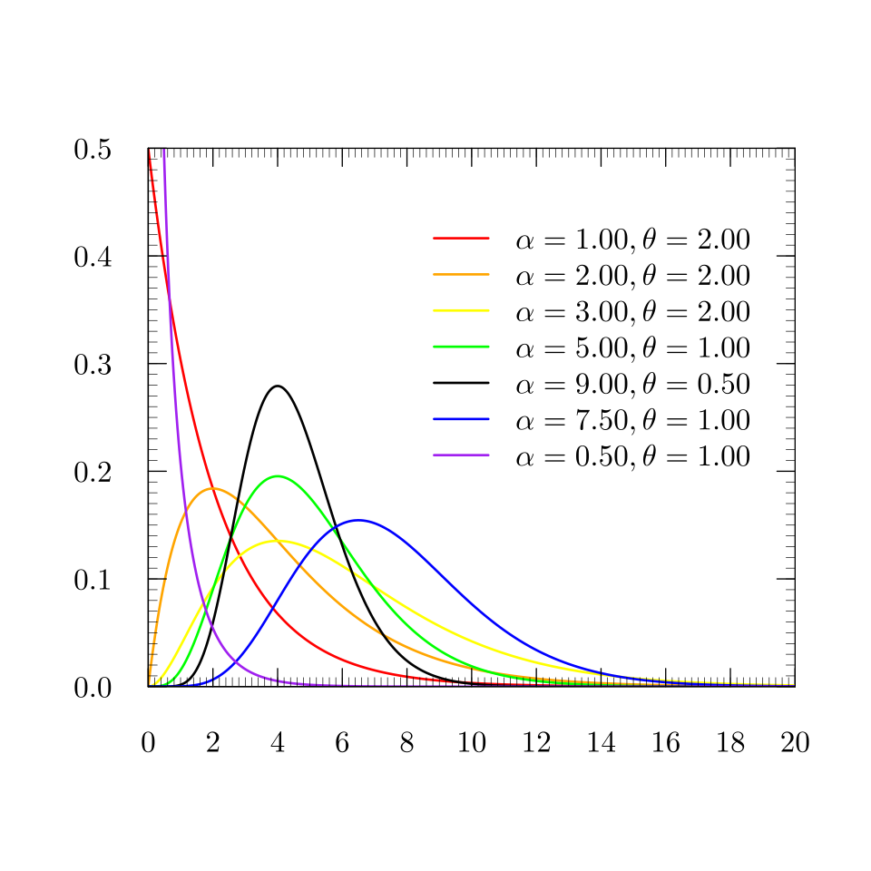

<style>
body {
text-align: justify;
font-size: 12pt}
</style>


```{r setup, include=FALSE}
knitr::opts_chunk$set(echo = TRUE)
```

## 1. Poisson Regression

Consider the dataset <a href="https://github.com/KoLa992/Computational-Statistics-Lecture-Notes/blob/main/car.csv" target="_blank">car.csv</a>. It contains $n=67856$ contracts in force between 2004 and 2005 in the portfolio of an Australian insurance company providing compulsory motor third-party liability insurance (MTPL insurance). We have $10$ variables available.

- **veh_value**:	Vehicle value in ten-thousand Australian dollars
- **exposure**:	Percentage of the period during which the policy was active
- **clm**:	Whether a claim occurred during the observation period (0 = no, 1 = yes)
- **numclaims**:	Number of claims during the observation period
- **claimcst0**:	Claim amount in Australian dollars (0 if no claim occurred)
- **veh_body**:	Vehicle body type (bus, truck, passenger car, etc.)
- **veh_age**:	Categorized vehicle age: 1 (newest), 2, 3, 4
- **gender**:	Driver’s gender: M (male), F (female)
- **area**:	Driver’s residential region: A, B, C, D, E, F
- **agecat**:	Categorized age of driver: 1 (youngest), 2, 3, 4, 5, 6

So, let's load the file to an R data frame!

```{r}
cars <- read.csv("car.csv")
str(cars)
```

Great, we have all the $67856$ observations and the $10$ variables. Before, we investigate further, let's set all the categorical variables (`veh_age`, `area`, `agecat`, etc.) to `factor` data type.

```{r}
cars$clm <- as.factor(cars$clm)
cars$veh_body <- as.factor(cars$veh_body)
cars$veh_age <- as.factor(cars$veh_age)
cars$gender <- as.factor(cars$gender)
cars$area <- as.factor(cars$area)
cars$agecat <- as.factor(cars$agecat)
str(cars)
```

All is set! Now, let's examine the distribution for the number of claims (`numclaims` variable) in these two years examined.

```{r}
barplot(table(cars$numclaims))
var(cars$numclaims) > mean(cars$numclaims)
```

Looks like a discrete variable with higher variance than mean. Which could mean one thing, the number of claims (let's denote it with $Y$) follows a *negative binomial distribution*. That is... for every observation $i$, the number of claims follows a Poisson distribution, but the $\lambda$ expected value is specific for every $i$-th observation. See <a href="Chapter01.html" target="_blank">Secion 5.4 of Chapter 1</a> for details. $$y_i \sim Poi(\lambda_i)$$

So, we could build a linear regression model on these individual expected values. Let's first use two predictor variables: $x_1$ the vehicle value and $x_2$ if the driver is female. $$\lambda_i = \beta_0 + \beta_1x_{1i} + \beta_2x_{2i}$$

Only problem is that we know that Poisson expected value is always positive $\lambda_i>0$, but the regression predictions $\beta_0 + \beta_1x_{1i} + \beta_2x_{2i}$ can be anywhere between $\pm\infty$. However, a logarithm quickly solves this problem. $$\log(\lambda_i) = \beta_0 + \beta_1x_{1i} + \beta_2x_{2i}$$

So, the model for $\lambda_i$ is **multiplicative**. $$\lambda_i=\exp(\beta_0) \times \exp(\beta_1)^{x_{1i}} \times \exp(\beta_2)^{x_{2i}}$$

### 1.1. Maximum Likelihood for Poisson Regression

Once we have this model setup, it is easy to **estimate the $\beta_j$ coefficients via maximum likelihood** (MLE). We apply the same thing as with the simple linear regression in <a href="Chapter07.html" target="_blank">Section 7 of Chapter 7</a>: we use the density function of the Poisson distribution, but the logarithm of $\lambda$ is generated by the $\beta_0 + \beta_1x_{1i} + \beta_2x_{2i}$ regression equation.

Let's define the negative log-likelihood function of the model in R.

```{r}
cars$female <- ifelse(cars$gender=="F", 1, 0) # create dummy for females

neg_ll_poi <- function(Betas) {
  log_lambdas <- Betas[1] + Betas[2]*cars$veh_value + Betas[3]*cars$female
  return(-sum(log(dpois(x = cars$numclaims,
                        lambda = exp(log_lambdas)))))
}

# try the function with some random Betas
neg_ll_poi(c(-2, 0.1, 0.1))
```

Looks like the function works. Awesome, now let's make `optim` work. Let's ask for the Hessian matrix of the log-likelihood function as well to have standard errors on the coefficients.

```{r}
poi_reg_mle <- optim(c(-2, 0.1, 0.1), neg_ll_poi, hessian = TRUE)
poi_reg_mle$value # optimized negative log-likelihood
poi_reg_mle$par # estimated Betas
```

Great, we have the model estimated: $$\log(\lambda_i) = -2.7 + 0.05x_{1i} + 0.03x_{2i}$$

Because of the log transform, regression coefficients are interpreted exponentially: $$\lambda_i=\exp(-2.7) \times \exp(0.05)^{x_{1i}} \times \exp(0.03)^{x_{2i}}$$

Furthermore, due to the exponential the interpretation is multiplicative.

```{r}
exp(poi_reg_mle$par)
```

So, after applying the `exp` on the coefficients we have that:

- $\exp(\beta_{\text{value}})=1.054$: If the vehicle value increases by 1 thousand Australian dollars, while the gender of the driver remains unchanged, the expected (or average) number of claims increases **to** $1.054$ or **by** $5.4\%$.
- $\exp(\beta_{\text{female}})=1.034$: The expected (or average) number of claims is $1.034$ times that of males (or higher by $3.4\%$) while the vehicle value remains unchanged.

But are these effects significant? Like are poor female drivers really $3.4\%$ worse than males or is it just sampling error? Let's construct the coefficient table of the model like we did for simple regression in <a href="Chapter07.html" target="_blank">Section 7 of Chapter 7</a>.

```{r}
varcov_betas <- solve(poi_reg_mle$hessian)
se_betas <- sqrt(diag(varcov_betas))

coef_table <- data.frame(coef=poi_reg_mle$par,
                         se = se_betas)
rownames(coef_table) <- c("Intercept", "veh_value", "female")
coef_table$z_value <- coef_table$coef/coef_table$se
coef_table$p_value <- round(2*pnorm(-abs(coef_table$z_value)),5)
coef_table
```

Oh well, looks like the gender stereotypes are really just that: stereotypes. The $+3.4\%$ for the expected claim number of female drivers is not a significant coefficient on any of the common $\alpha$ significance levels!

We can also calculate $AIC$ and $BIC$ with the formulas defined in <a href="Chapter03.html" target="_blank">Section 5 of Chapter 3</a> to decide whether this model has a better fit on our target variable $Y$ than a Poission regression with some other predictor variables.<br>
Note that the **number of estimated parameters is $p=3$ here** since we estimated the $\lambda_i$ with $3$ $\beta_j$ coefficients.

```{r}
p <- length(poi_reg_mle$par)
n <- nrow(cars)

aic <- 2*p + 2*poi_reg_mle$value
bic <- log(n)*p + 2*poi_reg_mle$value
```

### 1.2. The built-in R Function

Of course, everything we did here can be obtained with a built-in R function as well. It is called `glm` (an abbrevaiation for generalized linear models), and it works just like `lm` for simple linear regression models. It has 1 extra parameter compared to `lm`, the `family` parameter where we define that the target variable has a $Poi(\lambda_i)$ distribution and we transform the $\lambda_i$ values with a $\log$ function before applying the regression equation on it.<br>
Not that `glm` generates a `male` dummy variable from the original `gender` variable, so the coefficient will of course have a different sign, and it'll show that males have an average claim number that is lower by $3.3\%$ ($\exp(\beta_{\text{male}})-1=-0.033$) than that of females while the vehicle value remains unchanged.

```{r}
poi_reg_fun <- glm(numclaims~veh_value+gender, family = poisson(link = "log"), data = cars)
summary(poi_reg_fun)
```

Great, about the same results, they are probably bit more accurate as in `glm`, You have a more finetuned version of `optim` applied, so the estimated coefficients are a bit more accurate here, but there is no substantial difference.

You can get the model log-likelihood as well. Compared to our version, it's basically the same. Same is true if You compare the $AIC$ values.

```{r}
c(logLik(poi_reg_fun), poi_reg_mle$value)
c(AIC(poi_reg_fun), aic)
```

However, note that the `summary` does not show the log-likelihood itself, instead it shows so called **deviances**. Now, what the hell are these? First, we need to introduce three concepts:

- **Full (or saturated) model**: A model that contains as many parameters as observations, and therefore fits every observation perfectly.
- **Null model**: A model that contains only an intercept. So $\lambda_i = \beta_0$. This is what we've been fitting with maximum likelihood in <a href="Chapter03.html" target="_blank">Chapter 3</a> or with method of moments in <a href="Chapter01.html" target="_blank">Chapter 1</a>.

The fit of the actual model will fall somewhere between these two extremes. With these concepts the deviances can be defined:

- Model **Residual Deviance**: Twice the increase in log-likelihood when the full model is used instead of the actual model defined with the $\beta$ parameters: $D=2(\log[L(\text{full})]-\log[L(\beta)])$
- **Null Deviance** ($D_0$): The total deviance of the null model.

Note that **Residual Deviance has the same role here as the $SSE$ in the OLS regression**, as it is decreases if the model error decreases (i.e. model fit on the observed data improves). And **Null Deviance has the same role here as the $SST$ in the OLS regression**, as it shows the model fit error when we don't use any $x$ predictor variables. So it is the "error" around the simple sample mean since that is the MLE for $E(Y)$ if we have no predictors to use.

With these in mind we can introduce **McFadden's pseudo $R^2$ measure** as $R^2 = 1-D/D_0$ with the same logic as $R^2=1-SSE/SST$. It shows by what percentage is our model better than the null model. But be careful, it's just a **pseudo** $R^2$, so it **not as nicely scaled between $0$ and $1$ as the original** $R^2$. Practically, this means that **it can be around $0$ even if we have significant variables in our model** on all common $\alpha$ levels. This is the case now.

```{r}
1 - poi_reg_fun$deviance/poi_reg_fun$null.deviance
```

So, this is **not as great of a measure than the original** $R^2$, therefore use it **with caution**.

### 1.3. Further options with the `glm` function

We can handle the fact that not all cars are observed for the full 2 years for 2004-2005. Like because the car insurance was cancelled as the car was sold. Like for the 1st car, we could only see the claim history for $30.4\%$ of these two years.

```{r}
cars$exposure[1]
```

So, we want to consider that this car was only observed for $0.304$ times of the total period, so its true expected claim number for the total 2-year-period is actually $\lambda_1/0.304$. We can inlcude this for all cars in the regression equation. Let's denote the exposure of the $i$-th observation as $N_i$. With this, we'll have the following model: $$\lambda_i/N_i = \exp(\beta_0) \times \exp(\beta_1)^{x_{1i}} \times \exp(\beta_2)^{x_{2i}}$$

By transforming this so that $lambda_i$ is expressed, we find that we just need to add $\log(N_i)$ as an extra term in the regression equation without any coefficients: $$\log(\lambda_i) = \beta_0 + \beta_1x_{1i} + \beta_2x_{2i} + \log(N_i)$$

We can do this through the `offset` parameter in `glm`.

```{r}
poi_reg_fun <- glm(numclaims~veh_value+gender,
                   family = poisson(link = "log"),
                   data = cars,
                   offset = log(cars$exposure))
summary(poi_reg_fun)
```

The results have changed a bit, now the negative coefficient of male drivers increased by roughly $0.02$, and it is significant at $\alpha=10\%$, but still not at $\alpha=5\%$.

Let's see if this mildly significant effect on male claim number being lower on average is just confounding effect from some other variable: extend the model with the other potential predictor variables.

```{r}
poi_reg_extended <- glm(numclaims~veh_value+gender+veh_body+veh_age+area+agecat,
                        family = poisson(link = "log"),
                        data = cars,
                        offset = log(cars$exposure))
AIC(poi_reg_extended, poi_reg_fun)
BIC(poi_reg_extended, poi_reg_fun)
```

Based on $AIC$ model improved with the new variables, based on $BIC$, it did not. So, let's see the coefficient significance of the extended model! What might be omitted to improve on te more strict $BIC$?

```{r}
summary(poi_reg_extended)
```

Gender and vehicle value are the two variables that are not significant on any common $\alpha$ significance levels. It's logical that vehicle value is a confounder as it most likely expresses the effects of vehicle age and the vechicle body types. Let's try removing these two predictors!

```{r}
poi_reg_extended <- glm(numclaims~veh_body+veh_age+area+agecat,
                        family = poisson(link = "log"),
                        data = cars,
                        offset = log(cars$exposure))
AIC(poi_reg_extended, poi_reg_fun)
BIC(poi_reg_extended, poi_reg_fun)
```

The $BIC$ is still not satisfied. Investigate further!

```{r}
summary(poi_reg_extended)
```

Next weak link is area as it does not have significant dummies at $\alpha=1\%$. Sayonara area.

```{r}
poi_reg_extended <- glm(numclaims~veh_body+veh_age+agecat,
                        family = poisson(link = "log"),
                        data = cars,
                        offset = log(cars$exposure))
AIC(poi_reg_extended, poi_reg_fun)
BIC(poi_reg_extended, poi_reg_fun)
```

$BIC$ still not satisfied. We can stop as based on variable significances, as we don't have dummies that can be omitted as in each dummy, we have at least one category that is significant at $\alpha=1\%$. These are probably significant effects even if we consider Bonferroni corrections (see <a href="Chapter05.html" target="_blank">Section 8 of Chapter 5</a>) as well, since we don't have that many categories even in the vehicle body types to cancel a p-value lower than $0.1\%$.

```{r}
summary(poi_reg_extended)
```

We can experiment by merging not significant dummies into an "*other*" category, but at this point we're stopping and go with the model that has improved $AIC$ and not so much lower $BIC$ than the original model with 2 predictors. :)

Notice that we did not need to worry about any assumption on using the p-values of the coefficients as we now due to the **Cramer-Rao inequality** (see the details in <a href="Chapter04.html" target="_blank">Section 5 of Chapter 4</a>) that maximum likelihood estimators are always efficient if the assumption on the distribution of $Y$ is correct, and we have checked that in the beginning!

## 2. Gamma Regression

Now, once we have the expected number of claims estimated, let's see only those insured cars that have reported at least 1 claim and see average amount paid per 1 claim.

```{r}
cars_with_claims <- cars[cars$claimcst0>0,]
cars_with_claims$claim_value <- cars_with_claims$claimcst0/cars_with_claims$numclaims
hist(cars_with_claims$claim_value)
```

Looks like a continuous distribution with a long right tail. Let's try a Gamma distribution with $\alpha,\theta$ parameters.

<center>
{width=40%}
</center>

If the claim amount $Y$ is taken as $Y \sim G(\alpha,\theta)$ distributed, its expected value is the following. $$E(Y)=\alpha\theta$$

We can make this expected value different for every $i$ by writing a regression equation for $\alpha$, as that is the parameter based on the density function plot above that influences the central tendency of the density function. Since it is always a positive parameter, we'll need the log-transform again. $$\log(\alpha_i)=\beta_0 + \beta_1x_{1i} +...+ \beta_kx_{ki}$$

Hence in the end, we have the following model to be estimated: $$E(y_i)=\alpha_i\theta=\exp(\beta_0 + \beta_1x_{1i} +...+ \beta_kx_{ki})\theta$$

We can easily estimate it with `glm` the same way as with a Poisson Regression. We don't deal with exposures now as it is dealt with the model for number of claims. And now we are examining if the claim has happened, then what is the expected value of it. So, we have everything that we need. Note that $\theta$ is estimated as $\hat{\theta}_{ML}=3.065$. It was handled in the same way as the $\sigma$ of the normal distribution was in <a href="Chapter07.html" target="_blank">Section 7 of Chapter 7</a>.

```{r}
gamma_reg <- glm(claim_value ~ veh_value + veh_body + veh_age + gender + area + agecat,
                 family = Gamma(link = "log"),
                 data = cars_with_claims)
summary(gamma_reg)
```

Nice, we have some significant effects. Logically the older cars have less expected claim amount as repairing is cheaper.Except for the very old cars, there the coefficient is not significant at every common significance levels. Probably these extremely old parts are more expensive to buy.

Coefficients are also interpreted exponentially in a multiplicative manner as this follows from the model equation.

```{r}
exp(gamma_reg$coefficients)
```

For example, male drivers have a $19.9\%$ higher expected (or average) claim value than females leaving every other variable in the model unchanged. So if males cause a claim that is generally more expensive than a female claim.

In this case, we might try a regression that assumes a different (right-tailed) distribution on the target variable of claim values (e.g. Pareto, Weibull) and build a regression model on that distribution's expected value. Maybe we'll have a better fit with that distribution. This can be checked also by comparing the $IC$ values. Since if another distribution better describes the target variable, then You'll hae lowe negative log-likelihood in that model even with the same predictor variables included.

## 3. Generalized Linear Models

Now, let's summarize based on these two examples what these Generalized Linear Models (GLMs) know.

We assume on the target variable $Y$ that the **individual $y_i$ outcomes are independent and follow a distribution with individually differing $E(y_i)$ expected values but of the same distribution type** (Poisson, Normal, Gamma, Bernoulli, etc.).

The individual expected values can be estimated as a linear function after being transformed by a differentiable and monotonic link function $g$ (e.g. logarithm). $$g\left(E(y_i)\right)=\beta_0 + \beta_1x_{1i} +...+ \beta_kx_{ki}$$

The model can be fitted by maximum likelihood estimation by using the density function of the target distribution's assumed distribution type (Poisson, Normal, Gamma, Bernoulli, etc.).

As we have seen this idea work with discrete and continuous distributions as well.

If you think about it, **Logistic regression is a GLM with Bernoulli distributed target variable and the logit function as a $g$ link function**.<br>
As if $Y \sim Bernoulli(p)$, then $E(Y)=p$, so for each observation we have that $y_i \sim Bernoulli(p_i)$, and the regression equation with the logit function of $g(x)=\log[x/(1-x)]$ is the following. $$\log\left(\frac{p_i}{1-p_i}\right)=\beta_0 + \beta_1x_{1i} +...+ \beta_kx_{ki}$$ 

But here the exponential coefficients show the multiplicative marginal effects on the **odds ratios** of $p_i/(1-p_i)$.

## 4. Bonferonni Outlier Test

Each observation with its own dummy variable. Is its coefficient significant at a given $\alpha$, e.g. $5\%$.

```{r}
car::outlierTest(poi_reg_extended)
car::outlierTest(gamma_reg)
```

Might try refitting the Gamma Regression with observations number $39324$ and $28424$.