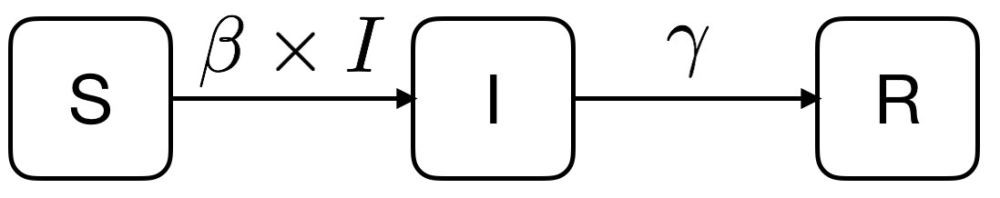

<style>
body {
text-align: justify;
font-size: 12pt}
</style>


```{r setup, include=FALSE}
knitr::opts_chunk$set(echo = TRUE)
```

## 1. What Is a Differential Equation, and Why Should We Care?

Every multivariate model we've built so far in this course - from a simple linear regression to a Poisson GLM - has had the same basic shape: we plug in some $x$ values to some function $f(\cdot)$ and get a prediction for $y$.

$$\hat{y} = f(x)$$

A **differential equation** asks a rather different kind of question. Instead of relating $y$ directly to $x$, it relates a function to its own **rate of change**. Formally:

> A differential equation is an equation that connects a function, its independent variable(s), and the derivative(s) of that function.

Two examples to get a feel for it.

First, let's say that we have a function denoted as $f$ that has an input argument/parameter denoted as $x$. So, we have a classic $y=f(x)$ function. We don't know what this $f(x)$ function is, but we do know that its **rate of change, or in other words, its first derivative** is $3$ times the input parameter value $x$ times the squared value of the $f(x)$ function itself.

$$\frac{df}{dx} = 3xf^2(x) = 3xy^2$$

I think for this one, it is easy to see that the $y=f(x)$ function that solves this differential equation is $$y=f(x)=-\frac{2}{3x^2}$$

Since the first derivative for this function is $$\frac{df}{dx} = f'(x) = \frac{4}{3}x^{-3}$$

And if You take the squared $f$ function $y^2=f^2(x)=4/3^2 \times x^{-4}$ and multiply it with $3x$, You have the first derivative, $f'(x)$:

$$y^2 \times 3x = \frac{4}{3^2} \times x^{-4} \times 3x = \frac{4}{3}x^{-3} = f'(x)$$

So, we are back at where we began, which **proves that $y=f(x)=-2/(3x^2)$ is a good solution** to this differential equation.

For <a href="https://youtu.be/X1H-xUrdSS8?t=143" target="_blank">simplicity</a>'s sake, we usually don't use the $y=f(x)$ notation in differential equations, just use letter $y$ to denote that unknown which is the function itself this time: $y(x)$.

So, using this $y(x)$ notation, let's see our second example.

$$\frac{d^2y}{dx^2} - 4\frac{dy}{dx} + 3y = 1$$

The solution for this second equation is the function $$y(x)=e^x + \frac{1}{3}$$

It can be shown that this function satisfies the differential equation given above the same way as we did in the first example, but <a href="https://i.redd.it/vrsnwsgpg0761.png" target="_blank"> this is left as an exercise for the reader</a>. What You need to note here that this equation contains the second derivative of our function as well: $(d^2y)/(dx^2) = y''(x)$. This means that this is a so-called *second-order* differential equation here.

The **order** of a differential equation is just the highest derivative that shows up in it, so the first equation above is first-order, and the second one is second-order.

Now, after seeing our first two horrific examples of these differential equations, the natural question is **why would we ever want to write down a nasty equation like this instead of a normal one?**

Unfortunately, the asnwer is that **because it is useful in practice**. :( In an enormous number of real situations, it's easier to say something about how fast a quantity is changing, than to say directly what its value is. A few classics:

- **Radioactive decay / Population growth**: the rate of change of a quantity expressed as a function of time like $y(t)$ is proportional with a constant $k$ to the quantity itself: $\frac{dy}{dt}=ky$ (with $k<0$ for decay, $k>0$ for growth).
- **Newton's law of cooling**: an object's temperature at time $t$ (denoted as $u(t)$) changes at a rate $k$ that is proportional to the gap between its own temperature ($u(t)$) and the ambient temperature ($A$): $\frac{du}{dt}=k(A-u)$.
- **Logistic (capacity-limited) growth**: a population at time $t$ (denoted as $P(t)$) grows in proportion with some constant $k$ to both its current size ($P(t)$) *and* the amount of unused "room" left in the environment (expressed as $P_{max}-P$): $\frac{dP}{dt}=kP(P_{max}-P)$.
- **Epidemics**: the number of new infections per day depends on how many people are currently susceptible *and* how many are currently infectious - this is exactly the idea we'll build into a full model in Section 2.

> Now, notice all these examples have some unknown parameters (like $k, A, P_{max}$) that need to be estimated based on observed data. This is exactly what we aim to do now!

However, **before we can apply our usual statistical estimation theory** (like OLS, MLE or MM) on differential equations, we need to learn a little bit about how **to solve these differential equations** in general.

To solve a differential equation means to **recover** the function $y(x)$ (or $y(t)$) that **makes the equation true - not a single number, but an entire function**.

### 1.1. A Solvable Case: Growth and Decay by Hand

The equation $\frac{dy}{dt}=ky$ is what's called **separable**: we can shove all the $y$'s to one side and all the $t$'s to the other, and then just integrate both sides. $$\frac{dy}{y}=k\,dt \quad\Rightarrow\quad \int\frac{dy}{y}=\int k\,dt \quad\Rightarrow\quad \log y = kt+C \quad\Rightarrow\quad y(t)=y_0e^{kt}$$

Notice the constant $C$ (or, after exponentiating, $y_0$) that pops out of the integration. This is completely generic: solving an $n$-th order differential equation leaves you with $n$ unknown constants, because you needed $n$ integrations to undo $n$ derivatives. On its own, $y(t)=y_0e^{kt}$ is called the **general solution** - it describes a whole family of curves, one for every possible $y_0$. To pin down a single, specific curve, we need to know the value of the function at some point in time, an **initial condition**. Together, the differential equation plus an initial condition is called an **initial-value problem**, and its solution is a single, specific function rather than a family of them.

For instance, a bacteria colony that starts at $1000$ individuals and grows to $4000$ after $6$ hours gives us both the differential equation and the initial condition we need to nail down $k$ and predict the colony's size at any later time:

```{r}
# y(t) = y0 * exp(k*t), y(0) = 1000, y(6) = 4000
y0 <- 1000
k <- log(4000 / y0) / 6 # solving 4000 = 1000*exp(6k) for k
k

y_t <- function(t) y0 * exp(k * t)
y_t(15) # population after 9 more hours (t = 6 + 9 = 15)
```

So this little colony is projected to have around $32000$ members after $15$ hours total - and we got there with nothing more than algebra, because $\frac{dy}{dt}=ky$ happens to be **separable**.

### 1.2. When We Can't Solve by Hand: Numerical Methods

Most differential equations that show up in real applications are **not** nicely **separable**, and have **no closed-form solution** at all. Take $\frac{dy}{dx}=y-x$: perfectly simple-looking, but let's not even try to integrate it directly. What we *can* always do, though, is exploit the very definition of the derivative to inch our way forward. If we know $y$ at some point $x$, then for a small step $\Delta x$: $$y(x+\Delta x)\approx y(x) + y'(x)\Delta x = y(x) + F(x,y)\Delta x$$

This is **Euler's method**: start from a known point $(x_0, y_0)$, use the differential equation to compute the slope there, take a small step in that direction to land on the next point, and repeat. Let's code it up by hand for the initial-value problem $y'=y-x$, $y(0)=2$, using steps of $\Delta x = 0.1$:

```{r}
euler_step <- function(x, y, dx) y + dx * (y - x) # y' = y - x

dx <- 0.1
x_vals <- seq(0, 1, by = dx)
y_vals <- numeric(length(x_vals))
y_vals[1] <- 2 # initial condition y(0) = 2

for (i in 2:length(x_vals)) {
  y_vals[i] <- euler_step(x_vals[i - 1], y_vals[i - 1], dx)
}

euler_table <- data.frame(x = x_vals, y = round(y_vals, 4))
euler_table
```

This particular equation *does* actually have a closed-form solution ($y=x+1+e^x$), so we can check how well we did in $x=1$:

```{r}
exact_y <- function(x) x + 1 + exp(x)
c(euler_approx = y_vals[x_vals == 1], exact = exact_y(1))
```

Not bad for such a crude method - within about $2.6\%$ of the true value with only $10$ steps, and we'd get closer still with a smaller $\Delta x$ (at the cost of more steps). Euler's method is the conceptual starting point, but it's rarely what's used in practice: production-grade numerical solvers (like the *Runge-Kutta* family of algorithms) use the same core idea - take a small step, using the derivative to guess where to go next - but combine several intermediate slope estimates per step to get much better accuracy for the same computational cost.

In R, the `deSolve` package's `ode()` function is exactly this kind of professional-grade solver, and it's what we'll rely on for the rest of this chapter - especially once we move from a single equation to several equations that all depend on each other at once, which is precisely what happens in epidemic models.

So, let's immediately install and load this package to our R environment and say goodbye to the <a href="https://youtu.be/Ojo59x1rNeo?t=20" target="_blank">uncivilized</a> way of solving differential equations by hand. :)

```{r eval=FALSE}
install.packages("deSolve")
library(deSolve) # Don't bother with the possible Warnings as usual! :)
```
```{r echo=FALSE}
library(deSolve)
```

## 2. The SIR Model: A System of Differential Equations

### 2.1. Setting Up the Model

Epidemics are a natural home for differential equations, because what we can easily describe is the *rate* at which people move between health states, not their absolute numbers directly. The classic starting point is the **SIR model**, which splits a population of size $N$ into three compartments in each time point, $t$:

- $S(t)$: **susceptible** individuals, who haven't caught the disease yet at time $t$,
- $I(t)$: **infectious** individuals, who currently have it and can transmit it at time $t$,
- $R(t)$: **recovered** (or removed) individuals, who are no longer infectious at time $t$ - either because they recovered and are now immune, or, in grimmer applications, because they died.

The **story is simple**: susceptibles get infected at a rate equal to an *infectious contact rate* $\beta$ times the number of infectious people they're exposed to, and infectious people recover (leaving the infectious pool) at a rate $\gamma$.

**Visually**, the process is still simple.

<br>
<center>
{width=50%}
</center>
<br>

Translated into differential equations, with $\beta$ and $\gamma$ as the model's two parameters, the story becomes a bit more complex as we have **system of three differential equations** here: $$\frac{dS}{dt}=-\beta SI,\qquad \frac{dI}{dt}=\beta SI-\gamma I,\qquad \frac{dR}{dt}=\gamma I$$

You can notice that the rate of change of each compartment depends on the current values of the *other* compartments too, so we can't just solve one equation and move to the next - all three have to be solved simultaneously. This is also why a nice closed-form solution, like the one we found for $y'=ky$, isn't available here: numerical integration is really our only option.

Furthermore, the **main statistical task** here is to **estimate the equation parameters** $\{\beta, \gamma\}$ **based on** some real-world, time series **data** on the observed number of infections, $I(t)$, for example.

However, if we can successfully solve our tasks at hand (estimating the $\{\beta, \gamma\}$ parameters and solving the differential equations), we gain a very useful quantity, that is the **basic reproduction number** $$R_0=\frac{\beta}{\gamma}N$$ which is (roughly) the expected number of new infections caused by a single infectious individual in an otherwise fully susceptible population. If $R_0>1$, the epidemic can take off; if $R_0<1$, it fizzles out.

It is the **most important statistical metric to look out for if a new pandemic**, like COVID-19, **starts**. This number should be the basis of determining how strict lock down and quarantine measures to take for governments. Furthermore, the effectiveness of these measures are also determined with $R_0$: if they are successful in bringing the reproduction number below $1$, then they are successful and an easing might be considered, but if $R_0$ remains above $1$ after the introduced lock down, then some more stricter measures are to be considered. COVID-19 produced some <a href="https://pmc.ncbi.nlm.nih.gov/articles/PMC7074654/" target="_blank">interesting research</a> in this topic that is <a href="https://webhomes.maths.ed.ac.uk/~swood34/covid-jrssa.pdf" target="_blank">recommended to read</a> for every statistician.

### 2.2. Solving the SIR Model in R

We can apply the `ode()` function from the `deSolve` package to numerically integrate the system. It needs

- a function that computes the derivatives given the current state and the parameters (this'll be `sir_equations`)
- the parameter values $\{\beta,\gamma\}$
- the initial values of $S$, $I$ and $R$ at $t=0$
- the time points $t$ at which we want the solution evaluated

```{r}
sir_equations <- function(time, variables, parameters) {
  with(as.list(c(variables, parameters)), {
    dS <- -beta * S * I
    dI <-  beta * S * I - gamma * I
    dR <-  gamma * I
    list(c(dS, dI, dR))
  })
}
```

The `with()` wrapper lets us refer to `S`, `I`, `beta`, etc. by name directly inside the function body, instead of having to index into `variables` (containing $S$, $I$ and $R$) and `parameters` (containing $\beta$ and $\gamma$) vectors by the `[]` symbols.Unfortunately, the `with()` wrapper only works with lists, so first we need to convert the input `variables` and `parameters` vectors to lists and apply `with()` on these converted versions.<br>
With these technical side quest done, **the `sir_equations` function returns the values of the three derivatives in our system** for given values of $S$, $I$ and $R$.

Let's pick some random parameter values ($\beta=0.004,\gamma=0.5$), imagining a population of $N=1000$ where a single infectious person shows up at time $t=0$. So, $I(0)=1,S(0)=1000-1=999$, and $R(0)=0$. With these initial assumptions, the `ode()` function can solve our SIR system and return the values of all three components ($S$, $I$ and $R$) for the 10 days given ($t=\{0,1,2,...,10\}$)

```{r}
parameters_values <- c(beta = 0.004, gamma = 0.5) # infectious contact rate, recovery rate
initial_values <- c(S = 999, I = 1, R = 0) # at t=0
time_values <- seq(0, 10) # days past since outbreak

sir_out <- ode(y = initial_values, times = time_values,
               func = sir_equations, parms = parameters_values)
sir_out <- as.data.frame(sir_out)
sir_out
```

And, of course, a picture (since this is time series data, a line chart) is worth a thousand rows of a data frame:

```{r}
library(ggplot2)

ggplot(sir_out, aes(x=time)) + 
  geom_line(aes(y=S, color="S(t)"), linewidth=1) +
  geom_line(aes(y=I, color="I(t)"), linewidth=1) +
  geom_line(aes(y=R, color="R(t)"), linewidth=1)
```

Textbook epidemic shape: susceptibles get depleted, infectious cases rise and then fall back to (near) zero as people recover, and the recovered curve climbs monotonically to (almost) the full population. With $N=1000$, $\beta=0.004$ and $\gamma=0.5$, our $R_0$ here is:

```{r}
N <- sum(initial_values)
N * parameters_values["beta"] / parameters_values["gamma"]
```

So **each infectious person is, on average, expected to infect $8$ other people** in this fully susceptible population - a genuinely explosive epidemic (for COVID-19 $R_0$ typically ranged from $2.5$ to $6.0$), which matches the steep curve we just plotted.

## 3. Parameter Estimation for Differential Equations

Now, we have the tools to solve the SIR system with arbitrary chosen $\beta$ and $\gamma$ parameters. Now, the **time has come** to actually **fit the SIR model on observed data by estimating these $\beta$ and $\gamma$ parameters** with the methods we've covered on this course so far.

Everything in Section 2 assumed we already **knew** $\beta$ and $\gamma$. In practice, of course, we never do - **what we actually have** is a handful of **observed case counts**, and we need to work backwards to figure out which parameter values best explain them. This is exactly the same logical move we made for GLMs in <a href="Chapter08.html" target="_blank">Chapter 8</a>: there, we searched over regression coefficients $\beta_j$ to find the ones that made the observed claims most plausible; here, **we'll search over $(\beta,\gamma)$ to find the ones that make the observed case counts most plausible**. The mechanics turn out to be strikingly similar.

### 3.1. The Data: A Flu Outbreak in a Boarding School

We'll use a small, famous dataset: an influenza outbreak in an English boys' boarding school with $N=763$ boys in total, running from January 22nd, 1978 (day $t=0$) to February 4th, 1978 (day $t=13$). The `cases` column records how many boys were confined to bed (i.e. infectious) on each day.

```{r}
flu <- read.table("https://raw.githubusercontent.com/choisy/DMo2019/master/data/flu.txt",
                  header = TRUE)
flu
```

Let's see how badly our arbitrary guess from Section 2.2 ($\beta=0.004$, $\gamma=0.5$) fits this real outbreak. We'll wrap the solution of the SIR equations into a small helper function (`sir_1`), since we'll be calling it over and over throughout this section:

```{r}
sir_1 <- function(beta, gamma, S0, I0, R0, times) {
  # unname() matters here: passing a *named* numeric like param["beta"]
  # straight through would silently clash with R's own beta() function
  # (Euler's Beta function!) once it lands inside sir_equations().
  beta <- unname(beta); gamma <- unname(gamma)

  parameters_values <- c(beta = beta, gamma = gamma)
  initial_values <- c(S = S0, I = I0, R = R0)
  out <- ode(y = initial_values, times = times,
            func = sir_equations, parms = parameters_values)
  as.data.frame(out)
}

N <- 763
I0 <- flu$cases[1]
guess <- sir_1(beta = 0.004, gamma = 0.5, S0 = N - I0, I0 = I0, R0 = 0, times = flu$day)

flu$guess_cases <- guess$I

ggplot(flu, aes(x=day, y=cases)) + geom_point() +
  geom_line(aes(y=guess_cases, color="SIR guess"), linewidth=1)
```

Hmm, <a href="https://www.youtube.com/watch?v=NYvwLLxKqhM" target="_blank">f\*\*\*k</a>. This is way off - our guessed epidemic peaks far too early and far too low compared to what actually happened. Time to let the data tell us what $\beta$ and $\gamma$ should be.

### 3.2. Measuring the Mismatch: Sum of Squares

The most intuitive way to score "how wrong" a set of parameter values is, is to add up the squared vertical distances between the model's predicted $I(t)$ and the observed case counts - exactly the same **sum of squared errors** ($SSE$) idea behind ordinary least squares regression. Note that our `sse` function takes the population size $N$ as a fixed parameter (remember, we have `763` boys in the school altogether). We need to provide $N$ so the solution of the differential equations by `sir_1` are comparabel with the observed number of new infectious cases each day!

```{r}
sse <- function(beta, gamma, data = flu, N = 763) {
  I0 <- data$cases[1]
  times <- data$day
  predictions <- sir_1(beta = beta, gamma = gamma,
                       S0 = N - I0, I0 = I0, R0 = 0, times = times)
  sum((predictions$I[-1] - data$cases[-1])^2) # skip day 0: I0 fits it by definition
}

sse(beta = 0.004, gamma = 0.5)
```

That's a big number even for *squared* errors, consistent with the terrible fit we just saw in the plot. To build some intuition before jumping to a full search, let's fix $\gamma=0.5$ and scan over a grid of plausible $\beta$ values, tracking how the sum of squares changes:

```{r}
beta_grid <- seq(from = 0.0016, to = 0.004, length.out = 100)
sse_grid <- sapply(beta_grid, sse, gamma = 0.5) # get SSE for each beta value defined in beta_grid

grid_df <- data.frame("beta" = beta_grid,
                      "sse" = sse_grid)

min_index <- which.min(grid_df$sse) # get index of beta with minimum sse
min_beta <- grid_df$beta[min_index] # get the beta itself with minimum sse

ggplot(grid_df, aes(x=beta, y=sse)) + geom_line() +
  geom_vline(xintercept = min_beta, color="red", linetype="dashed")
```

There's a clear, well-defined minimum, which is reassuring - the sum-of-squares surface isn't flat or wildly bumpy, so an optimizer should have no trouble finding it.

If we want to be really fancy, we can get the $SSE$ values for every combination of 10 $\beta$ and 10 $\gamma$ values with the help of `expand_grid()` and `Map()` functions. The `expand_grid()`produces every possible combination of the two parameters and `Map()` works like the `apply()` functions like `sapply()` (what we used for $\beta$ before), it just can be applied for two lists of parameter values to try, not just for one.

```{r}
n <- 10 # number of parameter values to try
beta_val <- seq(from = 0.002, to = 0.0035, le = n)
gamma_val <- seq(from = 0.3, to = 0.65, le = n)
param_val <- expand.grid(beta_val, gamma_val) # get every combination of betas and gammas

sse_val <- with(param_val, Map(sse, Var1, Var2)) # calculate the SSE for every combination in 'param_val'
sse_val <- matrix(unlist(sse_val), n) # arrange the results in an 'n by n' matrix
```

And finally, with the `persp()` function, we can plot the whole optimization surface in 3D. :)

```{r}
persp(beta_val, gamma_val, sse_val, theta = 40, phi = 30,
      xlab = "beta", ylab = "gamma", zlab = "sum of squares")
```

Perhaps, it's more fancy showing the negtive sum of squares, converting everything to a maximization problem.

```{r}
persp(beta_val, gamma_val, -sse_val, theta = 40, phi = 30,
      xlab = "beta", ylab = "gamma", zlab = "negative sum of squares")
```

### 3.3. Automating the Search: `optim()`

Scanning a grid one or two parameters at a time is fine for building intuition, but it doesn't scale (imagine doing this for $5$ or $10$ parameters at once). Just like we did for the Poisson regression coefficients by hand in <a href="Chapter08.html" target="_blank">Section 1.1 of Chapter 8</a>, we can hand the whole job over to R's general-purpose optimizer, `optim()`. It needs a function that takes *all* the parameters bundled into a single vector and returns one number to minimize:

```{r}
sse_v2 <- function(x) sse(beta = x[1], gamma = x[2])

starting_param_val <- c(0.004, 0.5)
sse_optim <- optim(starting_param_val, sse_v2)
sse_optim
```

```{r}
beta_hat <- sse_optim$par[1]
gamma_hat <- sse_optim$par[2]
N * beta_hat / gamma_hat # R0 estimate based on the cases data
```

So, based on the model fitted with least squares alone, this outbreak had an estimated $R_0$ of roughly $4.1$ - a substantially less explosive epidemic than our original wild guess suggested, but still comfortably above the epidemic threshold of $1$ and in the range of COVID-19's $2.5-6.0$.

### 3.4. From Sum of Squares to Maximum Likelihood

Minimizing a sum of squares is, quietly, already a maximum likelihood procedure - just recall from <a href="Chapter08.html" target="_blank">Section 3.4 of Chapter 8</a> that OLS and MLE coincide exactly when we assume the errors are **normally distributed** around the model's predictions. Making that assumption explicit lets us do everything a proper likelihood framework offers: standard errors, confidence intervals, and formal comparisons between competing error models - which is exactly why we bothered introducing likelihoods at all the way back in <a href="Chapter03.html" target="_blank">Chapter 3</a>.

Let's **write the (negative log-)likelihood by hand**, following the same recipe we used for `neg_ll_poi` in <a href="Chapter08.html" target="_blank">Chapter 8</a>: plug the SIR model's predictions in as the *mean* of a normal distribution, and estimate an extra noise (standard deviation) parameter $\sigma$ alongside $\beta$ and $\gamma$. Again, we need to provide the population size $N$ as a fixed parameter just like for the `sse` function in Section 3.2.

```{r}
mLL <- function(beta, gamma, sigma, day, cases, N = 763) {
  beta <- exp(beta); gamma <- exp(gamma); sigma <- exp(sigma) # keep all 3 positive
  I0 <- cases[1]
  observations <- cases[-1]
  predictions <- sir_1(beta = beta, gamma = gamma,
                       S0 = N - I0, I0 = I0, R0 = 0, times = day)
  predictions <- predictions$I[-1]
  -sum(dnorm(x = observations, mean = predictions, sd = sigma, log = TRUE))
}
```

Notice the `exp()` trick: since `optim` (and, underneath, the `mle2` function we're about to use) happily searches over the whole real line, we optimize over the *logs* of $\beta$, $\gamma$ and $\sigma$ so that whatever values it tries, the back-transformed parameters are guaranteed to stay positive - a rate or a standard deviation can never sensibly be negative. It's the same trick as with the link function of GLMs in <a href="Chapter08.html" target="_blank">Chapter 8</a>.

Rather than call `optim` ourselves again, let's use the `bbmle` package's `mle2()` function, which is really just a friendlier wrapper around `optim` purpose-built for likelihood work - it automatically produces a coefficient table, standard errors and confidence intervals, the same things `summary.glm` gave us for free in <a href="Chapter08.html" target="_blank">Chapter 8</a>.

```{r}
library(bbmle)

starting_param_val <- list(beta = 0.004, gamma = 0.5, sigma = 1)
estimates <- mle2(minuslogl = mLL, start = lapply(starting_param_val, log),
                  method = "Nelder-Mead", data = c(flu, N = 763))
summary(estimates)
```

The coefficients above are still on the log scale (that's what we optimized over), so we need to `exp()` them to get back to the natural units of $\beta$, $\gamma$ and $\sigma$:

```{r}
exp(coef(estimates))
```

```{r}
exp(confint(estimates))
```

Reassuringly close to our sum-of-squares estimates from Section 3.3 - which makes sense, since (as noted above) minimizing the sum of squares is maximum likelihood under normality. What we've gained here is the confidence intervals: we now know $\beta$ is estimated fairly precisely (a narrow band around $0.0025-0.0027$), while $\gamma$'s interval is a bit wider.

### 3.5. A Better Error Model for Count Data: Poisson

The normal-error assumption above is a convenient default, but `cases` is a **count** - and just as we reached for a Poisson distribution for count outcomes back in <a href="Chapter08.html" target="_blank">Section 1 of Chapter 8</a>, it's natural to ask whether a Poisson error model fits this outbreak better than a normal one. The nice thing about a Poisson error is that it needs no separate noise parameter (like $\sigma$ in the normal distribution) at all - the variance is tied directly to the mean, so we go back down to just $2$ parameters.

```{r}
mLL_pois <- function(beta, gamma, day, cases, N = 763) {
  beta <- exp(beta); gamma <- exp(gamma)
  I0 <- cases[1]
  observations <- cases[-1]
  predictions <- sir_1(beta = beta, gamma = gamma,
                       S0 = N - I0, I0 = I0, R0 = 0, times = day)
  predictions <- predictions$I[-1]
  if (any(predictions < 0)) return(NA) # guard against invalid lambdas
  -sum(dpois(x = observations, lambda = predictions, log = TRUE))
}

starting_param_val <- list(beta = 0.004, gamma = 0.5)
estimates_pois <- mle2(minuslogl = mLL_pois, start = lapply(starting_param_val, log),
                       data = c(flu, N = 763))
exp(coef(estimates_pois))
```

```{r}
exp(confint(estimates_pois))
```

The point estimates barely move. So which of the two error models - normal or Poisson - should we actually trust? Exactly like we did to compare GLMs with a different number of parameters in <a href="Chapter08.html" target="_blank">Section 3.6 of Chapter 8</a>, $AIC$ (or some other $IC$ based on our preference for parsimony) is the right tool, since it automatically penalizes the normal model for its extra $\sigma$ parameter:

```{r}
AIC(estimates, estimates_pois)
```

A bit counter to what we might have expected for count data: $AIC$ actually favors the **normal** model here, despite `cases` being counts and despite it costing us one extra parameter. The likely explanation is that this is a small, noisy outbreak (only $14$ data points) with day-to-day fluctuations bigger than a rigid Poisson (where the variance is forced to equal the mean) can comfortably absorb, while the free $\sigma$ in the normal model gives it the flexibility to soak up that extra variability. "Homework" is to check that even the strictest $BIC$ still prefers the normal model with its extra parameter. A useful reminder that **"the theoretically appropriate distribution" and "the best-fitting distribution in a finite, noisy sample" don't always coincide** - which is exactly why we compare models with $IC$s instead of just picking one on principle.

### 3.6. Visualizing the Fitted Model

Let's wrap up by plotting the normal-error model's fitted epidemic curve, $I(t)$ (our $AIC$-preferred model) against the observed cases data, together with a $95\%$ confidence interval built from the estimated $\sigma$ and the quantiles of the assumed normal distribution on $I(t)$.

```{r}
param_hat <- exp(coef(estimates))
time_points <- seq(min(flu$day), max(flu$day), length.out = 100)

best_predictions <- sir_1(beta = param_hat["beta"], gamma = param_hat["gamma"],
                          S0 = N - I0, I0 = I0, R0 = 0, times = time_points)

alpha <- 0.05 # for a 95% band

band <- data.frame(
  time = time_points,
  fit = best_predictions$I,
  lwr = pmax(0, qnorm(alpha/2, mean = best_predictions$I, sd = param_hat["sigma"])),
  upr = qnorm(1 - alpha/2, mean = best_predictions$I, sd = param_hat["sigma"])
)

ggplot() +
  geom_ribbon(data = band, aes(x = time, ymin = lwr, ymax = upr),
             fill = "tomato", alpha = 0.15) +
  geom_line(data = band, aes(x = time, y = fit), color = "tomato", linewidth = 1) +
  geom_point(data = flu, aes(x = day, y = cases), size = 2) +
  labs(x = "day", y = "number of infectious boys",
      title = "Fitted SIR model vs. observed flu cases") +
  theme_minimal()
```

Much better than our first blind guess back in Section 3.1! The fitted curve captures the timing and rough height of the peak, and the observed points mostly sit comfortably inside the $95\%$ confidence band. There's still visible daily noise the smooth SIR curve can't chase - which is exactly why that band, and the $\sigma$ parameter behind it, is there for.

And that's the general recipe for calibrating *any* differential-equation model against real data:

1. Write the equations
2. Solve them numerically for a given set of parameters
3. Turn the mismatch between predictions and data into a (negative log-)likelihood
4. Let `optim` (or `mle2`) search for the parameter values that make the observed data as plausible as possible

Everything else - confidence intervals, model comparison via $IC$s, diagnostic plots - carries straight over from the GLM toolkit we already established back in <a href="Chapter08.html" target="_blank">Chapter 8</a>.

Now, let's see one more example to really get the hang of it! :)

## 4. Growth of the Deep-Sea Urchin *Echinus affinis*

This time, we are gonna see a case where the differential equation turns out to be **solvable by hand** rather than needing `deSolve::ode()`, which is a nice opportunity to see that the entire inferential toolkit built up in Section 3 - `optim()`, the Hessian, extended with some GLRT - doesn't actually care whether the differential equation was solved numerically or analytically. It only cares that we can compute the model's prediction, for any given predictor (explanatory variable) values.

### 4.1. The Data: How Fast Does a Deep-Sea Urchin Grow?

*Echinus affinis* is a species of sea urchin living in the deep sea. In a <a href="https://link.springer.com/article/10.1007/BF00428213" target="_blank">1985 paper</a>, Gage and Tyler reported measurements on *E. affinis* individuals collected from the Rockall Trough: for $142$ animals, they recorded a volume measurement (`vol`) and an age in years (`age`) - sea urchins conveniently grow annual rings, much like trees, so age can be read off directly. Definately google ‘<a href="https://cdn.kqed.org/wp-content/uploads/sites/2/2024/02/DSC01160-uncropped-1536x1024.jpg" target="_blank">sea urchin pictures</a>’ if you don’t know what sea urchins look like. :)

```{r}
uv <- read.table("https://webhomes.maths.ed.ac.uk/~swood34/TOI/urchin.vol.dat")
head(uv)
```

Once, we have the data in a nice little data frame, let's plot volume as a function of age.

```{r}
ggplot(uv, aes(x = age, y = vol)) +
  geom_point(alpha = 0.6) +
  labs(x = "age (years)", y = "volume",
      title = "Echinus affinis: volume vs. age")
```

There's an obvious pattern here: growth is fast while the animals are young, and then seems to level off into something close to a straight line for the older individuals. That "*fast, then straight*" shape is exactly what the model in the next section is built to capture.

### 4.2. A Two-Phase Growth Model We Can Solve by Hand

<a href="https://strathprints.strath.ac.uk/41567/" target="_blank">Nisbet and Gurney (1998)</a> proposed a simple energy-budget argument for this kind of growth curve: **an animal puts all its energy into growing, as fast as it can, until its growth rate hits some ceiling; from that point on, growth is capped, and the surplus energy gets diverted into reproduction instead.** Written as a differential equation for volume $V$ as a function of age $a$:

$$\frac{dV}{da} = \begin{cases} \gamma V & V < \phi/\gamma \\ \phi & \text{otherwise} \end{cases}$$

with initial volume $V(0)=\omega$. So we have **three model parameters**: $\gamma$ (the exponential growth rate while young), $\phi$ (the capped, constant growth rate once mature), and $\omega$ (volume at birth).

Notice that the first regime, $dV/da=\gamma V$, is *exactly* the growth-and-decay equation we solved by hand back in Section 1.1 - so we already know how to solve it:

$$\frac{dV}{V}=\gamma\,da \quad\Rightarrow\quad V(a)=\omega e^{\gamma a} \qquad (a<a_m)$$

using $V(0)=\omega$ as the initial condition. This exponential growth continues until $V$ reaches $\phi/\gamma$ - the volume at which the growth rate $\gamma V$ would exceed the ceiling $\phi$ - at some **critical age** $a_m$ marking the switch to phase two.

Phase two, $dV/da=\phi$, is separable too - trivially so, since the right-hand side doesn't even involve $V$:

$$dV=\phi\,da \quad\Rightarrow\quad V(a)=\phi a + C \qquad (a\ge a_m)$$

We pin down $C$ by requiring the volume not to jump instantaneously at the switch: $V(a_m)$ has to agree with the value phase one hands off, $\phi/\gamma$. That gives $C=\phi/\gamma-\phi a_m$, so

$$V(a) = \frac{\phi}{\gamma}+\phi(a-a_m) \qquad (a\ge a_m)$$

and setting $\omega e^{\gamma a_m}=\phi/\gamma$ and solving for $a_m$ gives us the critical age itself:

$$a_m = \frac{1}{\gamma}\log\left(\frac{\phi}{\gamma\omega}\right)$$

Two integrations by hand, and we have a full analytic solution - no numerical solver required this time. Let's code $V(a)$ up directly:

```{r}
urchin_V <- function(age, omega, phi, gamma) {
  am <- log(phi / (gamma * omega)) / gamma # critical age: end of the fast-growth phase
  before <- age < am
  V <- numeric(length(age))
  V[before]  <- omega * exp(gamma * age[before])
  V[!before] <- phi / gamma + phi * (age[!before] - am)
  V
}
```

### 4.3. From Model to Likelihood

$V(a)$ above is the *expected* volume at age $a$; real urchins scatter around it with some standard deviation $\sigma$. A reasonable observation model, following the same normal-errors logic we used for the flu counts in Section 3.4, is

$$\sqrt{v_i} = \sqrt{V(a_i)} + \varepsilon_i, \qquad \varepsilon_i \stackrel{ind}{\sim} N(0,\sigma^2)$$

(the square root is a common trick when a growth quantity's spread tends to increase along with its size - it keeps the residuals roughly homoscedastic). That gives us four parameters to estimate in total: $\theta=\{\omega,\phi,\gamma,\sigma\}$.

```{r}
urchin_nll <- function(theta, age, vol) {
  theta <- exp(theta) # keep omega, phi, gamma, sigma all positive - same trick as Section 3.4
  omega <- theta[1]; phi <- theta[2]; gamma <- theta[3]; sigma <- theta[4]
  V <- urchin_V(age, omega, phi, gamma)
  -sum(dnorm(sqrt(vol), mean = sqrt(V), sd = sigma, log = TRUE))
}
```

Like in SIR, none of the parameters ($\omega,\phi,\gamma,\sigma$) makes sense as a negative number, so we optimize over their logs and exponentiate on the way in - the same device we used for $\beta,\gamma,\sigma$ in the SIR likelihood.

### 4.4. Fitting with `optim()`

We need starting values in the right ballpark. Looking at the plot in Section 4.1, the smallest observed volume is a reasonable stand-in for $\omega$, and $\gamma=\phi=1$ are harmless first guesses for the two growth-rate parameters:

```{r}
min(uv$vol) # ~0.1 -> use as a starting guess for omega

theta0 <- log(c(omega = 0.1, phi = 1, gamma = 1, sigma = 1)) # starting values, log scale

fit <- optim(theta0, urchin_nll, method = "BFGS",
            age = uv$age, vol = uv$vol, hessian = TRUE)
fit$convergence # 0 means optim thinks it converged
```
We can extract the estimated parameters (the $\hat{\theta}$ values) to their own vector, called `theta_hat`. Do not forget `exp()` to scale the estimators back to their original scale, as they were fed into the likelihood on a log-scale!

```{r}
theta_hat <- exp(fit$par)
names(theta_hat) <- c("omega", "phi", "gamma", "sigma")
theta_hat
```

Back on the original scale, that's roughly $\hat\omega\approx0.018$, $\hat\phi\approx1.19$, $\hat\gamma\approx0.81$ and $\hat\sigma\approx0.47$. Plugging these into $a_m$ gives an estimated "*switch age*" of around $5.4$ years - these urchins spend their first five-ish years growing as fast as they can, then settle into slower, constant growth for the rest of their lives. Let's see how the fitted curve compares to the observed volume data:

```{r}
uv$V_hat <- urchin_V(uv$age, theta_hat["omega"], theta_hat["phi"], theta_hat["gamma"])

ggplot(uv, aes(x = age)) +
  geom_point(aes(y = vol), alpha = 0.6) +
  geom_line(aes(y = V_hat), color = "tomato", linewidth = 1) +
  labs(x = "age (years)", y = "volume",
      title = "Fitted two-phase growth model vs. observed urchin volumes")
```

A good match to that "fast, then straight" shape we noticed back in Section 4.1 - the gentle curve for young animals and the near-linear trend for older ones are both captured by a single, four-parameter model.

### 4.5. Confidence Intervals from the Hessian

Exactly the same large-sample result that gave `mle2()` its standard errors for free in Section 3.4 (and `summary.glm()` its standard errors back in <a href="Chapter08.html" target="_blank">Chapter 8</a>) applies here - we just have to do it by hand this time, since we called `optim()` directly. Hope that we remember <a href="Chapter04.html" target="_blank">Chapter 4</a> rather well, as we have covered there that asymptotically, $\hat\theta\sim N\big(\theta,\, \mathcal{I}(\theta)^{-1}\big)$, and the Hessian of the negative log-likelihood at the MLE - which `optim()` will compute numerically for us if we ask for `hessian=TRUE` - is a perfectly good estimate of the observed Fisher information $\mathcal{I}(\theta)$:

```{r}
cov_theta <- solve(fit$hessian) # approximate covariance matrix, on the log scale
se_theta <- sqrt(diag(cov_theta)) # the standard errors, on the log scale
```

Once, we have the standard errors, we can use the standard normal distribution to get the 95% confidence interval of all our 4 estimators. Just like back in <a href="Chapter04.html" target="_blank">Section 7 of Chapter 4</a>. 

```{r}
alpha <- 1-0.95
ci_log <- cbind(fit$par - qnorm(1-alpha/2) * se_theta,
                fit$par + qnorm(1-alpha/2) * se_theta)
ci_original <- exp(ci_log) # back-transform to omega, phi, gamma, sigma
dimnames(ci_original) <- list(c("omega", "phi", "gamma", "sigma"), c("2.5%", "97.5%"))
ci_original
```

A couple of things worth noticing. First, because we built a *symmetric* interval *on the log scale* and then exponentiated its endpoints, the resulting interval on the original scale is **not symmetric** around $\hat\theta$ - exactly as it should be, for a parameter that's constrained to stay positive, it is natural that it has a right-tailed sampling distribution. Second, $\hat\omega$ and $\hat\gamma$ come out with quite wide intervals (there simply isn't much data at the youngest ages to pin down the early growth phase precisely), while $\hat\phi$ and $\hat\sigma$ are estimated a fair bit more tightly.

### 4.6. Testing $H_0:\phi=1$ with a GLRT

Notice that the $95\%$ CI for $\phi$ above, roughly $(1.09, 1.29)$, doesn't cover $1$ - suggesting $\phi=1$ isn't a plausible value for the mature growth rate. Let's check that formally with a generalized likelihood ratio test, in the same spirit as the model comparisons in Section 3.5 (there via $AIC$; here directly via the test statistic). We fit a **restricted** model with $\phi$ fixed at $1$, leaving $\omega,\gamma,\sigma$ free to be re-estimated:

```{r}
urchin_nll_phi1 <- function(theta, age, vol, phi_fixed) {
  theta <- exp(theta)
  omega <- theta[1]; gamma <- theta[2]; sigma <- theta[3]
  V <- urchin_V(age, omega, phi_fixed, gamma)
  -sum(dnorm(sqrt(vol), mean = sqrt(V), sd = sigma, log = TRUE))
}

fit0 <- optim(theta0[-2], urchin_nll_phi1, method = "BFGS", # drop the phi starting value
             age = uv$age, vol = uv$vol, phi_fixed = 1)

lambda <- 2 * (fit0$value - fit$value) # fit$value and fit0$value are both *negative* log-likelihoods
lambda
pchisq(lambda, df = 1, lower.tail = FALSE)
```

We lose one free parameter going from the full model to the restricted one, so the test statistic is compared against a $\chi^2(1)$ distribution - and since $\phi=1$ sits comfortably in the *interior* of the parameter space (unlike, say, testing whether a variance component is exactly zero), the usual large-sample GLRT theory applies here without any complications. The resulting p-value comes out less than any common $\alpha$ significance levels, so we reject $H_0:\phi=1$: the estimated mature growth rate for these urchins is significantly different from $1$.

And that's really the point of this second example: **even though the urchin growth equation happened to be solvable by hand rather than needing `deSolve::ode()`, absolutely nothing about the inference changed**. Solving the differential equation - step 2 of the four-step recipe from the end of Section 3 - was "easier" this time around, but building a likelihood, searching for the MLE with `optim()`, and getting confidence intervals and hypothesis tests out of it (via the Hessian, and GLRT) is exactly the **same recipe every time, whatever the differential equation looks like**.
