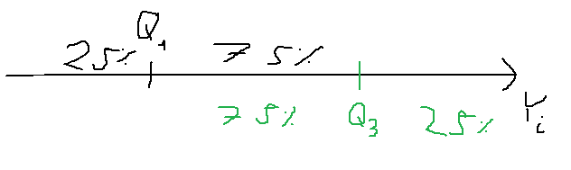
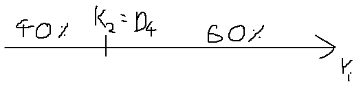

<style>
body {
text-align: justify;
font-size: 12pt}
</style>

```{r setup, include=FALSE}
knitr::opts_chunk$set(echo = TRUE)
```

## 1. Working with data frames in the `tidyverse`

We have already discussed in <a href="Prelude01.html" target="_blank">Prelude 1</a> how some fundamental operations can be done with data frames objects, like **filtering** some records, **selecting** some columns or **aggregate** the records to a different level. These fundamental operations in <a href="Prelude01.html" target="_blank">Prelude 1</a> were done in **base R**, meaning we did not apply any external packages to do these operations with data frames. However, since R is an opens source platform, there are **loads of ways to do these operations on data frames**.<br>
In this course, we'll sometimes apply the so called **tidy way**, which essentially means that we're utilizing **functions from the `tidyverse` package** (which is actually a collection of lots of other packages like `tidyr`, `dplyr` and `purrr`) to **handle some operations on data frames in R**.<br>
The reason for using the **tidy way** to handle data frames is that it **produces easy to understand program code**, which makes understanding what our R code does easier. **Writing easy to understand code** is an extremely **useful** skill if someone, like **some kind of regulator needs to review and audit our calculation in R**.<br>
In this prelude chapter, **we are doing mostly the same filtering and selection operations on the <a href="https://github.com/KoLa992/Computational-Statistics-Lecture-Notes/blob/main/COVID_0326.csv" target="_blank">COVID_0326.csv</a> dataset that we did in <a href="Prelude01.html" target="_blank">Prelude 1</a>** to see how the `tidyverse` logic of R coding is different from the base R logic, but produces the same results.

The `tidyverse` package was installed in <a href="Prelude01.html" target="_blank">Section 7 of Prelude 1</a>, so we can just include the functions from these packages to our R environment.

```{r}
library(tidyverse)
```

In this report after including the `tidyverse` package package in our R environment, on the one hand we can see what kind of packages are loaded as part of the `tidyverse`: `dplyr`, `readr`, `forcats` and so on. On the other hand, in the `Conflicts` part we can see that functions called `filter` and `lag` are existing in both the `tidyverse` and in base R as well. And this `Conflicts` part informs us that after loading the `tidyverse`, its `filter` and `lag` functions become the defaults. If we want to use the original, base R version of these two functions, then we can do it by using them with the `stats::` prefix. Like `stats::filter` and `stats::lag`.<br>
Otherwise, there is nothing extra in this long message after loading the `tidyverse` package. The machine spirit is pleased :)

### 1.1. The pipeline logic

The main concept of the tidyverse that it **applies composite functions in so called pipelines**. Like **normally** we would interpret and read the $\sin(\cos(\pi))$ function as **the sine of cosine of pi**. This is the **logic along which base R operates** as well:

```{r}
sin(cos(pi))
```

But, if we have a **composite function of several functions**, this kind of **program code would become hard to read**. Instead, in the **tidy way**, we look at this **composite function from the inside out, as we take pi, apply on it the sin function and then the cosine function**. So at the starting point, we have the data, which is *pi*, and then we list all the function we apply on it. This **"listing of functions" is the pipeline**. **In this so called "tidyverse", elements of the pipeline are connected with the "pipe" operator**: `%>%`, as seen below.

```{r}
pi %>% cos %>% sin
```

Our result is the same, but in this new code it's **much easier to follow what was the starting data and which transformation functions were applied on it and in which order**.

### 1.2. Selecting rows and columns in the `tidyverse`

Now, let's read the contents of the <a href="https://github.com/KoLa992/Computational-Statistics-Lecture-Notes/blob/main/COVID_0326.csv" target="_blank">COVID_0326.csv</a> file from the first class to a data frame called `COVID`. Remember to set the working directory before using the `read.csv` function!

```{r eval=FALSE}
setwd("~/Github Repok/Computational-Statistics-Lecture-Notes")
COVID <- read.csv("COVID_0326.csv")
str(COVID)
```
```{r echo=FALSE}
COVID <- read.csv("COVID_0326.csv")
str(COVID)
```

Ok, we're done, we have the data frame with all its $9$ variables and $100$ observations.

Now, let's select the `COVID19_CasesPerMillion` column with the `select` function from the `dplyr` package. Note that we don't need to use quotations here for the column names. Also, **additional parameters for the `select` function can be given the usual way, between brackets in the pipeline logic as well**. We just say that from the `COVID` data frame, we `select` the `COVID19_CasesPerMillion` column (or variable):

```{r}
COVID %>% select(COVID19_CasesPerMillion)
```

We got a data frame with $100$ rows and $1$ column as a result.

If we select the column with the `$` sign, the result is a `numerical` vector with $100$ elements:

```{r}
COVID$COVID19_CasesPerMillion
```

With the `select` function, we can select more columns at once and save the result in a new data frame.

```{r}
SelectedCols <- COVID %>% select(Country, COVID19_CasesPerMillion, Prop_UrbanPop)
SelectedCols
```

We can select the columns by their number in the original data frame as well:

```{r}
COVID %>% select(1, 7, 4)
```

We can select all the columns from the $2$nd to the $7$th more easily than giving every column number the following way:

```{r}
COVID %>% select(2:7)
```

Great! :) All things the `select` function can do for columns, the `slice` function can do for rows (the observations). Like, let's select the complete $42$th observation from the `COVID` data frame:

```{r}
COVID %>% slice(42)
```

We can see that it's the country of *Greece*.

We can also select several rows by their numbers the same way we just did with columns.

First select the $22$th, $32$th and $42$th rows:

```{r}
COVID %>% slice(22, 32, 42)
```

Then, select every observation from row $32$ to row $42$:

```{r}
COVID %>% slice(32:42)
```

We can apply the `select` and `slice` functions after each other to select specific values. Like let's select the $42$th value from the $7$th column:

```{r}
COVID %>% select(7) %>% slice(42)
```

Be careful that the result here is also a data frame with $1$ element! If you want this element as a number, you must convert the result with the `as.numeric` function!

```{r}
as.numeric(COVID %>% select(7) %>% slice(42))
```

The case is similar if we have selected an element from the data frame that is a text:

```{r}
selected_text <- COVID %>% select(8) %>% slice(42)
selected_text
as.character(selected_text)
```

### 1.3. Filtering a data frame in the `tidyverse`

If we switch the `slice` function to the `filter` function, we can **select observations by logical statements**. In other words, we can **filter the data frame**.

Now, let's give the names and COVID case numbers of the countries where the number of COVID cases is above $100$ per million people:

```{r}
COVID %>% filter(COVID19_CasesPerMillion > 100) %>% select(Country, COVID19_CasesPerMillion)
```

We can also select the countries where number of COVID cases is above $100$ per million, but the proportion of urban population is $60\%$ tops:

```{r}
COVID %>%
  filter(COVID19_CasesPerMillion > 100 &
           Prop_UrbanPop <= 60) %>%
  select(Country, COVID19_CasesPerMillion, Prop_UrbanPop)
```

Let's see the name of the countries, where either the constitunional form is *absolute monarchy* or the proportion of urban population is below $35\%$:

```{r}
# first, take a look at the unique values of the ConstitutionalForm variable
unique(COVID$ConstitutionalForm)
# we can see from the results that the proper filter condition is "Absolute monarchy"

COVID %>%
  filter(ConstitutionalForm == "Absolute monarchy" |
           Prop_UrbanPop <= 35) %>%
  select(Country, COVID19_CasesPerMillion, Prop_UrbanPop)
```

Let's select the population densities and COVID cases per million people for Belgium,Hungary and Croatia:

```{r}
COVID %>%
  filter(Country %in% c("Belgium", "Hungary", "Croatia")) %>%
  select(Country, COVID19_CasesPerMillion, PopDens)
```

Save the constitutional form and COVID cases per million people for countries that are **not** republics. Show the first 4 rows of the results:

```{r}
NotRep <- COVID %>%
  filter(ConstitutionalForm != "Republic") %>%
  select(Country, COVID19_CasesPerMillion, ConstitutionalForm)
head(NotRep, n=4)
```

Give the names of the countries that are **not** republics and **not** constitutional monarchies:

```{r}
COVID %>%
  filter(!(ConstitutionalForm %in% c("Absolute monarchy", "Republic"))) %>%
  select(Country, ConstitutionalForm)
# Note that "!" is the symbol for negation generally
```

Of course, if we utilize the `unique` function, we can see that these countries are simply the constitutional monarchies, but I wanted to show the general negation symbol (or in another word operator) in R. :)

```{r}
unique(COVID$ConstitutionalForm)
```

Now, let's try to select the constitutional monarchies directly:

```{r}
COVID %>%
  filter(ConstitutionalForm == "Constitutional monarchy") %>%
  select(Country, ConstitutionalForm)
```

Ooops, something went wrong! We have no results! :( The reason for this is that in the data frame all the "*Constitutional monarchy*" texts have a special character encoding for *space* that cannot be reproduced by simply typing the phrase in.<br>
In these situations, the best solution is to use the results of the `unique` function as a filter condition:

```{r}
ConstFormVector <- unique(COVID$ConstitutionalForm)
ConstFormVector # 2nd elemetnis what we want
TargetConstForm <- ConstFormVector[2]

COVID %>%
  filter(ConstitutionalForm == TargetConstForm) %>%
  select(Country, ConstitutionalForm)
```

Ok, now we have the correct countries. Victory! :)

Based on these examples, I hope you can see that the same kind of special symbols can be utilized to form logical statements in `tidyverse` as in base R. But here's the summary table again, just in case:

```{r, echo=FALSE}

x <- data.frame("Symbol" = c("<", ">", "==", "!=","<=", ">=", "&", "|", "%in%", "!"),
                "Meaning" = c("Less","Greater", "Equal", "Not Equal","Maximum", "Minimum",
                               "AND", "OR", "CONTAINS", "NEGATION"))

knitr::kable(
  x, align = "cc"
)
```

## 2. Modifying a data frame in the `tidyverse`

You can also calculate new columns in this **tidy way** and also modify some values in existing columns.

First, let's calculate the area of these countries in acres (1 km2 = 100 ac). Again, remember: population density is in people/km2! We apply the `mutate` function for this and overwrite the original data frame with the results:

```{r}
COVID <- COVID %>%
  mutate(Area = (Pop/PopDens)*100)

COVID %>% select(Country, Area)
```

The `mutate_at` function can be used to modify some values in specific columns. Now, let's correct the wrong spaces in the *Constitutional monarchies* of the `ConstitutionalForm` variable. We also use the `str_replace` function which can replace a given text to another.

But first, let's install and include the `stringr` package that contains the `str_replace` function.

```{r eval=FALSE}
install.packages("stringr")
library(stringr)
```

```{r echo=FALSE}
library(stringr)
```

Now, back to fixing those poor *Constitutional monarchies*! :) Unfortunately, there are some technicalities in the `mutate_at` function:
- The column or columns we want to modify, must be given az a character vector. So, We need to use the quotations on column names again.
- The modification (which is the `str_replace` function now) must be embedded in a wrapper function called `funs`.

```{r warning=FALSE}
COVID <- COVID %>% mutate_at(c("ConstitutionalForm"), funs(str_replace(.,TargetConstForm, "Constitutional monarchy")))

# Let's try the filter again by simply typing "Constitutional monarchy"
COVID %>%
  filter(ConstitutionalForm == "Constitutional monarchy") %>%
  select(Country, ConstitutionalForm)
```

Looks like the constitutional monarchies have healed! Praise the machine spirit! :)

## 3. Aggregating a data frame in the `tidyverse`

We can apply the `group_by` and `summarise` functions to produce aggregated tables based on our original data frame.

Let's create an aggregated table that shows the mean and median COVID cases per million people and the number of observations by constitutional forms:

```{r}
COVID %>%
  group_by(ConstitutionalForm) %>%
  summarise(Frequency = n(),
            Mean_COVID_Cases_per_Million = mean(COVID19_CasesPerMillion),
            Median_COVID_Cases_per_Million = median(COVID19_CasesPerMillion))
```

We can see that the hardest hit countries are mainly constitutional monarchies, since the outlier effect distorting the means compared to the median is the strongest there. Also, they have the highest median case number as well. But this could be attributed in part at least to their low frequency of $18$. Though absolute monarchies have a frequency of $3$, they still have a lower mean and median case number than constitutional monarchies. However, these $3$ absolute monarchies being more isolated Middle-Eastern countries, they are better protected against a virus than more open countries. So, we would not advise a constitutional monarch to take absolute power to prevent the pandemic. :)

To emphasize these findings, we can create an aggregated table that is ordered in decreasing order according to the mean-median differences of each constitutional form. Ordering in `tidyverse` is supported by the `arrange` function. Descending order is achieved by applying the `desc` function on the column that is the basis of the ordering inside the `arrange` function. In our case this will be the `Mean_Median_Diff` column:

```{r}
COVID %>%
  group_by(ConstitutionalForm) %>%
  summarise(Frequency = n(),
            Mean_COVID_Cases_per_Million = mean(COVID19_CasesPerMillion),
            Median_COVID_Cases_per_Million = median(COVID19_CasesPerMillion),
            Mean_Median_Diff = Mean_COVID_Cases_per_Million-Median_COVID_Cases_per_Million) %>%
  arrange(desc(Mean_Median_Diff))
```

Perfect!

We can also aggregate by several columns and can take the statistical measures of different columns in the `summarise` function.

For example, we can create a table that shows the median number of COVID cases per million people and the median proportion of urban population by constitutional forms and the roles for the head of state:

```{r}
COVID %>%
  group_by(ConstitutionalForm, HeadOfState) %>%
  summarise(Frequency = n(),
            Median_COVID_Cases_per_Million = median(COVID19_CasesPerMillion),
            Median_Prop_UrbanPop = median(Prop_UrbanPop))
```

It can be seen that one very probable reason for republics having lower median COVID cases is that their median proportion of urban population is also low.<br>
But the difference in median COVID cases inside republics with ceremonial and executive heads of state is still interesting since it cannot be explained by a similar difference in the median proportion of urban population. Maybe the reason for this difference is that countries with executive head of state spend less on healthcare, so they cannot afford to test much, which results in fewer COVID cases per million people.<br>
Let's check!

```{r}
COVID %>%
  group_by(ConstitutionalForm, HeadOfState) %>%
  summarise(Frequency = n(),
            Median_COVID_Cases_per_Million = median(COVID19_CasesPerMillion),
            Median_Prop_UrbanPop = median(Prop_UrbanPop),
            Median_HealthExp = median(PerCapita_HealthExp_2016))
```

It seems like our idea proved to be correct and a low median health expenditure can also partly explain the low median case numbers for absolute monarchies as well.

In the `tidyverse`, you can also apply the `summary` function from <a href="Prelude02.html" target="_blank">Prelude 2</a> on groups created by a character variable, like `ConstitutionalForm`. You'll need the `split` and `map` functions for this. Note that you need to **give the name of the grouping variable by using the `.$` prefix**:

```{r}
COVID %>% select(ConstitutionalForm, Prop_UrbanPop,
                 PerCapita_HealthExp_2016, COVID19_CasesPerMillion) %>% # select some specific columns to avoid overcrowded results
  split(.$ConstitutionalForm) %>%
  map(summary)
```

You can see for example, that in republics the upper quartile of health expenditures is also low compared to the other two constitutional forms. Although, the maximum value s noticeably low in the $3$ absolute monarchies.

A visual representation for the summary function grouped by a nominal variable is a box plot grouped by the same nominal variable. Let's see this in action for the box plot of the `PerCapita_HealthExp_2016` variable grouped by the different constitutional forms. The `~` symbol is the key in the `boxplot` function:

```{r}
boxplot(COVID$PerCapita_HealthExp_2016 ~ COVID$ConstitutionalForm)
```

We can see the same things as in the results of the summary: the typical $50\%$ of republics spend less on healthcare than the median level of the two monarchy groups. Though, we have some republics that spend more on healthcare than the maximum of absolute monarchies, but these are considered outliers in republics based on the box plot. It's also interesting to see that health expenditures are very volatile in constitutional monarchies since the typical $50\%$ has an enormous range there.

## 4. Some Additional Remarks on Frequency Tables and Histograms

Frequency tables are the simplest descriptive statistical tools that can show a compressed, easy to understand view of the information one statistical variable can contain.<br>
As the name suggests, the tool simply lists the unique values and gives the number of occurrences (frequencies) of these values in the data frame. This a tool so simple that it can be applied on every scale of measurement, even on nominal variables.

An easy example is the `ConstitutionalForm` variable. The frequencies of each constitutional form is given by the table function:

```{r}
table(COVID$ConstitutionalForm)
```

As we've already seen in <a href="Prelude01.html" target="_blank">Prelude 1</a>, most of the counties in our table are republics (79/100, so roughly 4/5 of the data), a minority of them are constitutional monarchies and we have only 3 absolute monarchies.

The standard frequency table however becomes quite an uninformative tool when we select a variable with lots of unique values. These variables are usually numerical variables measured on interval or ratio scales, like the `COVID19_CasesPerMillion`.

```{r}
table(COVID$COVID19_CasesPerMillion)
```

As we can see, we have $100$ different values for $100$ countries, which makes this frequency table useless when the goal is to compress teh information in our $100$ observations.

For this reason, we apply **binned frequency tables for numerical variables with lots of unique values**. We create bins that cover a predefined range of the value set of our numeric variable. Like in the case of the `COVID19_CasesPerMillion` variable a bin would be for countries with COVID case numbers between 50-100 per million people since we hope that we have more than 1 country with case numbers in this range.

Before we apply this binned frequency table, let's think about how to form these bins so they can **show the frequency distribution of our variable in the most interpretable way**:

- The **bins must have equal length**. If one bin is wider than the rest, it will naturally have greater frequency as well.
- The **number of the bins** must be small enough so that the table can actually compress information, but it must be large enough so that we don't lose too much information from the original variable. Like 2 bins wouldn't show much from the frequency distribution of the variable resulting in the loss of too much information.

In R, `binnedCounts` function of the `RcmdrMisc` package creates bins of equal length and satisfies the second point for the number of bins by applying something called the "*square-root rule*". It simply states that the number of bins ($k$) should be equal to the square root of the number of observations ($n$): $k=\sqrt{n}$.

Let's install the package and try the function:

```{r eval=FALSE}
install.packages("RcmdrMisc")
library(RcmdrMisc)
```

```{r echo=FALSE}
library(RcmdrMisc)
```

Apply the function on the `COVID19_CasesPerMillion` variable:

```{r}
binnedCounts(COVID$COVID19_CasesPerMillion)
```

We can see that the function created $k=11$ bins and the length of a bin is $50$. This is so since the function also tries to archive "*a nice, integer number*" for the legth of the bins. If we would strictly apply $k=\sqrt{100}=10$, then at he length of a bin would be $\frac{Y_{max}-Y_{min}}{k}=53.5977$.

```{r}
(max(COVID$COVID19_CasesPerMillion)-min(COVID$COVID19_CasesPerMillion))/sqrt(nrow(COVID))
```

For this reason, the `binnedCounts` function creates an extra $11$th bin and rounds the length of bins to $50$.

If we don't want to accept the $k$ based on this square-root rule, we can always redfine it by the `breaks` parameter of the `binnedCounts` function.<br>
If we want only $k=6$ bins:

```{r}
binnedCounts(COVID$COVID19_CasesPerMillion, breaks = 6)
```

But let's switch back to the original version:

```{r}
binnedCounts(COVID$COVID19_CasesPerMillion)
```

Based on the results, we can see that 63 countries out of the 100 had COVID cases below 50 per million people on 26/03/2020. We had only 4 countries with COVId cases between 300 and 350 per million people. The **Percent** column contains the percentage of the current frequency compared to the total number of observations. This column is also called **relative frequency**. Now, these values are the same as the "*raw frequencies*" since the number of observation is $N=100$ and $\frac{14}{100}=0.14=14\%$. :)

If we save the binned frequency table as a data frame, we can add a column to the table called cumulative frequency with the `cumsum` function:

```{r}
freq_table <- as.data.frame(binnedCounts(COVID$COVID19_CasesPerMillion))

# fix column name
colnames(freq_table) <- "Freq"

# get cumulative frequencies
freq_table$CumFreq <- cumsum(freq_table$Freq)

# see results
freq_table
```

Cumulative frequencies give the number of elements below the upper border of the bin. So, for example, we have 77 countries with case number below 100 per million people.

Cumulative values can be calculated for relative frequencies as well, we just need to add the simple relative frequencies first to the `freq_table` data frame:

```{r}
# get simple relative frequencies
freq_table$RelFreq <- freq_table$Freq/sum(freq_table$Freq)

# get cumulative relative frequencies
freq_table$CumRelFreq <- cumsum(freq_table$RelFreq)

# see results
freq_table
```

So, we can see that $8\%$ of the countries have a case number between 100 and 150 cases per million people, but $85\%$ of the countries have a case number below 150 cases per million people.<br>

It's **important to note** that the **value of the last row in the cumulative frequency column must match the number of observations** and the the value of the last row in the cumulative relative frequency column must always be $1=100\%$. Since **every value in the variable is smaller than the maximum value**.

Visual representation of the binned frequency table is the **histogram**, which is essentially a bar chart from the frequency table. The `hist` function can create it:

```{r}
hist(COVID$COVID19_CasesPerMillion)
```

It can be seen that the bins of the frequency table are on the *x* axis, while the frequencies themselves are on the *y* axis. On the histogram it is clearly visible that a great majority of countries has a really low COVID case number per million people, but we also have countries with greater case numbers like 400-500 cases/million people, but these countries are rather rare.

We can also switch the number of bins here with the `breaks` parameter:

```{r}
hist(COVID$COVID19_CasesPerMillion, breaks = 6)
```

As we can see the main tendencies remain (lost of small values and greater values occur wit less and less frequency), but the histogram is more compact due to the smaller number of bins ($k$).

## 5. Measures of Location and Central Tendency

The main purpose of these measures is to capture the "*typical*" value of a variable in some way. We have **already seen two examples for measures of location: the mean and the median. Their properties and typical use cases were already covered in the lecture notes of <a href="Prelude02.html" target="_blank">Prelude 2</a>, so they are not repeated here.**

However, there's a $3$rd **measure of location not yet covered: the mode**.

### 5.1. The Mode

As a statistical measure, **the mode** is perhaps more simple than the median and the mean. It simply **takes the most frequent element of the variable**.<br>
For this reason, it can be calculated based on the frequency table by taking the maximum point in the table.<br>
Let's see this in action on the `Prop_UrbanPop` variable. The element with maximal frequency is looked up by the `which.max` function.

```{r}
which.max(table(COVID$Prop_UrbanPop))
```

We can see that in most of the countries $56\%$ of the population lives in urban areas. The 18 means that it's the 18th element in the table, so *18 isn't the frequency* behind the $56\%$.

By definition, **the mode can be determined for variables on every scale of measurement, even for nominal variables**. Like we know that the mode of the `ConstitutionalForm` variable is "*Republic*" since it's the most frequent form of government in our 100 countries.

```{r}
which.max(table(COVID$ConstitutionalForm))
```

Now, there's another, **more problematic property of the mode coming straight from its definition: it is not always a uniqe value**. The most extreme case for this is the `COVID19_CasesPerMillion` variable: here everything occurs only once, so everything is a mode... :)

This can be best visualized by combining the `table` function with the `plot` function, creating a bar char from the frequency table. This is **not a histogram**, since it doesn't use bins!

```{r}
plot(table(COVID$COVID19_CasesPerMillion))
```

Well...unpleasant result, everything really has a frequency of $1$! :(

We can see that the **mode is not a quite useful measure when the number of unique values is large in a variable**, since in cases like this, it "*cannot really rule the variable*", as it has a low frequency, even though it is the most frequent element. Or in the most extreme cases, the mode simplye does not exist, as we've just seen with the `COVID19_CasesPerMillion` variable.

If we see the bar chart from the frequency table of the `Prop_UrbanPop` variable, we can see that the mode of $56\%$ also has a low frequency of $5$. So it doesn't really cover most of the $N=100$ countries. This is due to the variable having too many unique values.

```{r}
plot(table(COVID$Prop_UrbanPop))
```

In the classic histogram of the `Prop_UrbanPop` variable, we can see that the mode of $56%$ takes place in the most frequent bin of $50-60$:

```{r}
hist(COVID$Prop_UrbanPop)
```

However, for the `ConstitutionalForm`, the mode (Republic) does cover $79$ out of $N=100$ countries. This is mainly due to this variable having only 3 unique values.

```{r}
plot(table(COVID$ConstitutionalForm))
```

A positive property of the **mode** is that it's **not really sensitive to outliers**. If the mode is stable and has a truly great frequency, it does not matter for the mode, as the most frequent element, whether a value in the `Prop_UrbanPop` variable is recorded as $6000$ instead of $60$.

### 5.2. Mean and Median

**The properties and typical use cases of these two measures were already covered in the lecture notes of <a href="Prelude02.html" target="_blank">Prelude 2</a>, so they are not repeated here.** However, I give You a **brief summary of the properties for these 3 measures of location**:

- **Mode** - $Mo$
  * Scales of measurement it can be applied on: nominal, ordinal, interval, ratio
  * Robust: not sensitive to outliers
  * Not necessarily a unique value
  * Not useful when number of unique values is large in a variable
- **Median** - $Me$
  * Scales of measurement it can be applied on: ordinal, interval, ratio
  * Robust: not sensitive to outliers
  * Always a unique value
  * Not useful when number of unique values is small in a variable
- **Mean** - $\bar{Y}=\mu$
  * Scales of measurement it can be applied on: interval, ratio
  * Not Robust: sensitive to outliers
  * Always a unique value

### 5.3. The Shape of the Distribution and Measures of Location

**For numeric** (interval or ratio scale) **variables**, the **relation between the three measures of location** (Mean = $\bar{y}$, Median = $Me$ and Mode = $Mo$) is **determined by the skewness of the frequency distribution** which is easily **visible on the shape of the histogram**:

<center>
{width=70%}
</center>

<br>As we can see, the **relation of the three measures of location depends on where the outliers are** in the distribution. If we have a long left tail, we have outliers on the bottom, so the mean (sensitive to outliers) is the lowest of the three measures. While with a long right tail, outliers are upwards, so the mean is the largest of the measures. The mode is always at the maximum of the frequencies and the mean is in between the other two measures.

We have a variable with an **extremely long right tail**: `COVID19_CasesPerMillion`

```{r}
hist(COVID$COVID19_CasesPerMillion)
```

In this case, the mean and median behave "*as they should based on the skewness of the distribution*", but the mode is not interpretable due to the large number of unique values.

```{r}
median(COVID$COVID19_CasesPerMillion)
mean(COVID$COVID19_CasesPerMillion)
```

The variable `Prop_UrbanPop` has a **mild left tail** since the mean is a little bit lower than the median. This mild left tail is also visible on the histogram as well. The mode is not interpretable again due to the large number of unique values.

```{r}
hist(COVID$Prop_UrbanPop)
median(COVID$Prop_UrbanPop)
mean(COVID$Prop_UrbanPop)
```

## 6. Quantiles in General

If we remember, in the lecture notes for <a href="Prelude02.html" target="_blank">Prelude 2</a>, we introduced the concept of quartiles. They are statistical measures that **break the increasingly ordered variable $Y$ to four parts of equal frequency**. So, $Q_1$ is a measure that separates the lower $25\%$ from the upper $75\%$ and $Q_3$ is a measure that separates the lower $75\%$ from the upper $25\%$. Consequently, $Q_2=Me$ is a measure that separates the lower half from the upper hald of the variable $Y$.

<center>
{width=60%}
</center>

So, we have **3 measures that break the variable to 4 parts with equal frequency**. Based on this logic, we can further generate "*little siblings*" to these measures, **colletively called quantiles**:

- **Quartiles**: $3$ measures that break the variable to $4$ parts with equal frequency
- **Quintiles**: $4$ measures that break the variable to $5$ parts with equal frequency
- **Deciles**: $9$ measures that break the variable to $10$ parts with equal frequency
- **Percentiles**: $99$ measures that break the variable to $100$ parts with equal frequency

Let's see a few examples: **second quintile**, $K_2$,is a point which separates the lower $\frac{2}{5}=40\%$ of the variable from the upper $\frac{3}{5}=60\%$:

<center>
{width=60%}
</center>

This also the **fourth decile**, $D_4$, since $D_4$ is the point which separates the lower $\frac{4}{10}$ from the upper $\frac{6}{10}$.

The **30th percentile**, $P_{30}$,is a point which separates the lower $\frac{30}{100}=30\%$ of the variable from the upper $\frac{70}{100}=70\%$. This is of course also the **third decile**, $D_3$:

<center>
{width=60%}
</center>

These **quantiles inherit all the properties from the median**: they can be interpreted on variables with at least ordinal scale, they're robust to outliers, but not informative or useful when number of unique values in a variable is small.

Let's see some quantiles on the `COVID19_CasesPerMillion` and `Prop_UrbanPop` variables in R. We utilize the `quantile` function, where the `probs` parameter sets the percentage for the data that is **lower** than the quantile we're looking for:

```{r}
# K1(Prop_UrbanPop)
quantile(COVID$Prop_UrbanPop, probs = 0.2)

# K4(COVID19_CasesPerMillion)
quantile(COVID$COVID19_CasesPerMillion, probs = 0.8)
```

So, only $20\%$ of countries have a smaller proportion of urban population than $52\%$ and only $20\%$ of countries have more COVID cases than $109.9$ per million people.

If we give a *vector* in the `probs` parameter, we can calculate several quantiles at once:

```{r}
quantile(COVID$PerCapita_HealthExp_2016, probs = c(0.2,0.4,0.6,0.8))
```

So, for example $40\%$ of the countries spent less on healthcare in2016 than 851 dollars per capita. But only the top $20\%$ of countries spent more on healthcare than 2592 dollars per capita in 2016.

## 7. Standard Deviation

Let's take a look at the <a href="https://github.com/KoLa992/Computational-Statistics-Lecture-Notes/blob/main/PolishInvestments.xlsx" target="_blank">PolishInvestments.xlsx</a> file. it contains the daily price changes in *euro* for two investment funds for $1229$ trading days between 2017 and 2022:

- One trades in **Polish Stocks** (<a href="https://www.vigam.hu/en/funds/vig-polish-equity-investment-fund/" target="_blank">webpage for the fund</a>)
- The other trades in **Polish Bonds** (<a href="https://www.vigam.hu/en/funds/vig-polish-bond-investment-fund/" target="_blank">webpage for the fund</a>)

Excel files can be loaded by using the `read_excel` function from the `readxl` package.

If we have only one worksheet with data and the data table starts at the cell *A1*, then the `read_excel` function puts the data table into an R data frame without any extra parameters:

```{r}
library(readxl)
Invest <- read_excel("PolishInvestments.xlsx")
str(Invest)
```

All right, we have the $1229$ observations for both funds. We can see from the results of the `str` function that the $3$rd observation is for *21th Sept 2017* and on this day the *BondFund*'s value *grew* by $3.27$ euros, but the *StockFund*" value *lost* $6.3$ euros.

If we have 100 euros to invest and we must decide which of these two options to invest in, then it's tempting to simply choose the one where the mean daily price changes are higher:

```{r}
mean(Invest$StockFund)
mean(Invest$BondFund)
```

We can see that on an average day, the *StockFund* generates $+0.38$ euros, while the *BondFund* generates only $+0.09$ euros a day. At this point it becomes very tempting to invest our 100 euros into the *StockFund*, since on an average day it generates higher revenue for us.

But, with our current knowledge, we are vary to follow this tactic and cleverly take a look at the three quartiles at least with `summary` the function:

```{r}
summary(Invest)
```

What we can see from the relation of the quartiles and the minimum-maximum values that **we have outliers in both variables in both directions**! Like in case of stocks: $75\%$ of the trading days we have price changes below 10 euros, but we have a day with a price chane of +114 euros as well. With the bonds, the bottom $25\%$ of the price changes starts at a loss of only 3.66 euros, but we have a loss of 36.46 euros as well.

So, we have outliers in both variables, but since the **outliers happen in both directions, simply getting a mean-median difference does not necessarily show that a unique value in the variable can differ greatly from the mean**. The best example for this is the *BondFund*, where the mean is essentially the same the median, but we can see that the range of the "typical $50\%$" is far away from both the minimum and maximum values.<br>
That is why, we need a **measure that can show us what is the expected difference between one observation of a variable and the mean of the variable**. This measure is the **standard deviation**.

Based on the verbal description of this measure given just above, it would logical to calculate this measure in the following way. We take a look at the difference of each $y_i$ observation from the $\bar{y}$ mean and the take the mean of these new $y_i-\bar{y}$ differences.

So, the formula for the standard deviation would be $$\frac{\sum_{i=1}^n{y_i-\bar{y}}}{n}$$

Where we continue to denote the number of observations by $n$.

Let's try this formula for the *StockFund* and show the result:

```{r}
n <- nrow(Invest)
mean_stocks <- mean(Invest$StockFund)
sum(Invest$StockFund - mean_stocks) / n
```

Well, that's awkward...our standard deviation is pragmatically $0$. Well quite specifically it's $-4.3 \times 10^{-17}$, but that's essentially $0$. Strange, right? :)

Well, the explanation is that a specific $y_i$ observation can differ from the mean *to the upside and to the downside as well*! The **differences with different signs can cancel out each other**, making the sum in the numerator $0$.

This can be corrected two ways:

- taking the absolute values of the $y_i-\bar{y}$ differences
- taking the squares of the $y_i-\bar{y}$ differences

We take the second approach. The most important reason for this is that the $x^2$ function is differentiable at every point, while the $|x|$ function is not (it doesn't have a derivative at 0). We will take advantage of this differentiable property later.

So, at first we calculate the **squared standard deviation called variance**: $$\sigma^2=\frac{\sum_{i=1}^n{(y_i-\bar{y})^2}}{n}$$

And by taking a square root, we have the **standard deviation**:$$\sigma=\sqrt{\sigma^2}=\sqrt{\frac{\sum_{i=1}^n{(y_i-\bar{y})^2}}{n}}$$

Let's calculate the standard deviation for both funds manually:

```{r}
# Stocks
mean_stocks <- mean(Invest$StockFund)
sqrt(sum((Invest$StockFund - mean_stocks)^2) / n)

# Bonds
mean_bonds <- mean(Invest$BondFund)
sqrt(sum((Invest$BondFund - mean_bonds)^2) / n)
```

We can **interpret** these results the **following way**:

- For the *BondFund*, on a specific trading day, the price changes can differ on average by $\pm 7.68$ euros from the mean price change.
- For the *StockFund*, on a specific trading day, the price changes can differ on average by $\pm 16.98$ euros from the mean price change.

Based on these results, we can say that in case of the *StockFund*, daily price changes vary mor intensively around the mean price changes than the price changes of the *BondFund* do. So, the **StockFund has greater volatility**.

Unfortunately, the **built-in R function for standard deviation does not operate with this formula given above**. The `sd` function in R calculates standard deviation the following way: $$\sigma=\sqrt{\sigma^2}=\sqrt{\frac{\sum_{i=1}^n{(y_i-\bar{y})^2}}{n-1}}$$

So, it has $n-1$ in the denominator. Reasons for this will be discussed in detail in <a href="Chapter04.html" target="_blank">Chapter 4</a>. But **for a high $n$,** like in our case we have $n=1229$, **this difference does not really matter in the end result**.<br>
We can check this calculation in R:

```{r}
# Stocks: R version for standard deviation manually
mean_stocks <- mean(Invest$StockFund)
sqrt(sum((Invest$StockFund - mean_stocks)^2) / (n-1))

# Stocks: bulit-in R function
sd(Invest$StockFund)
```

Ok, so the two ways match up.

So, we can see that the *StockFund* is more volatile, but still: it has a higher revenue on an average day! How to decide now? Well, these kinds of dilemmas can be solved by applying the **relative standard deviation**, which is simply **the ratio of the standard deviaton and the mean**: $$V=\frac{\sigma}{\bar{y}}$$

It shows us a **kind of risk/reward ratio: how many times an asset is more volatile than its average return**.

Let's see its value for our two investment funds:

```{r}
# Stocks: Relative SD
sd(Invest$StockFund)/mean(Invest$StockFund)

# Bonds: Relative SD
sd(Invest$BondFund)/mean(Invest$BondFund)
```

Hm, looks like we got some **irrational results since the mean is below $1$.** Let's **add constant of $1$ to both**:

- means will change equally: $\bar{y}=\frac{\sum_{i=1}^n{(y_i+1)}}{n}=\frac{\sum_{i=1}^n{(y_i)}}{n}+\frac{n \times1}{n}=\bar{y}+1$
- standard deviations won't change as $(y_i+1)-(\bar{y}+1)=y_i-\bar{y}+1-1$

So **we do not distort the results** by adding the same constant to both variables:

```{r}
# add a constant of 1 --> effects on sd and mean
mean(Invest$StockFund)
sd(Invest$StockFund)

mean(Invest$StockFund+1)
sd(Invest$StockFund+1)

# Stocks: Relative SD
sd(Invest$StockFund+1)/mean(Invest$StockFund+1)

# Bonds: Relative SD
sd(Invest$BondFund+1)/mean(Invest$BondFund+1)
```

So, for the *StockFund*, the volatility is $12.3$ times higher than the mean return of a day, while for the *BondFund*, the volatility is just $7$ times higher than the average return on a day. So, based on this "*ultimate measure*", the *BondFund* seems the ideal choice since we risk less with it compared to its average gain.

### 7.1. Mean as an Optimal Statistical Measure

Now, let's see why we solved the differing signs problem in the $Y_i-\bar{Y}$ part problem by taking its square rather than taking its absolute value: the **square function is differentiable everywhere, while the absolute values function is not**. This property is useful, because we can **give a number denoted as $A$ such that if we replace every value in the variable with this $A$, then we have minimal standard deviation**.

As You well know, we can find minima or maxima of a function $f(x)$ by taking its derivative and find where the derivative equals $0$.<br>
Like I know that the minimal value of the function $f(x)=x^2-x$ is $-\frac{1}{4}$ at $x=\frac{1}{2}$ since $f'(x)=2x-1$ and the solution of the quation $2x-1=0$ is $x=\frac{1}{2}$.

Let's apply this theory on the standard deviation! I want to find a statistical measure called $A$ such that the variance is minimal. Since $N$ is a fix constant as the number of observations does not change, so we **only need to examine the numerator of the variance**. So, **I want to see which $A$ number results in the minimum value of the following function**: $$f(A)=\sum_{i=1}^n{(y_i-A)^2}$$

Let's take the derivative of $f(A)$ based on the <a href="https://en.wikipedia.org/wiki/Chain_rule" target="_blank">chain rule</a>: $$f'(A)=\sum_{i=1}^n{2 \times (y_i-A) \times(-1)}=-2\sum_{i=1}^n{(y_i-A)}=-2(\sum_{i=1}^n{y_i} - \sum_{i=1}^n{A})$$

At this point we can exploit that if I sum the number $A$ $n$ times, then it's $n \times A$, so: $$\sum_{i=1}^n{A}=n \times A$$

Therefore, I need to solve the following equation: $$f'(A)=0 \rightarrow -2(\sum_{i=1}^n{y_i} - n \times A) = 0$$

Dividing by $-2$ and taking $n \times A$ to the right hand side (RHS): $$\sum_{i=1}^n{y_i} = n \times A$$

Finally, dividing by $n$: $$A=\frac{\sum_{i=1}^n{y_i}}{n}=\bar{y}$$

So, **the mean is the statistical measure $A$, such that if every $y_i$ values are replaced by $A$, then I make the less mistake, or lose the less information**. This why the mean is "*loved*" as the third measure of location along the mode and median: since **using the mean results in the smallest standard deviation**. 