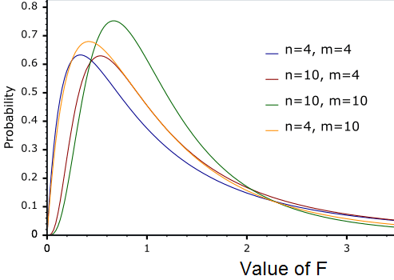

<style>
body {
text-align: justify;
font-size: 12pt}
</style>


```{r setup, include=FALSE}
knitr::opts_chunk$set(echo = TRUE)
```

## 1. Budapest Flats Revisited

The <a href="https://github.com/KoLa992/Computational-Statistics-Lecture-Notes/blob/main/BP_Flats.xlsx\" target="_blank">BP_Flats.xlsx</a> file is a data table that stores data for 10 variables (columns) for 1406 apartments in Budapest:

- Price_MillionHUF: price of the flat in million HUF
- Area_m2: area of the flat in square meters
- Terrace: number of terraces in the flat
- Rooms: number of rooms in the flat
- HalfRooms: number of half-rooms in the flat
- Bathrooms: number of bathrooms in the flat
- Floor: the number of floor the flat is on
- IsSouth: is the flat looking at the South? (1 = yes; 0 = mo)
- IsBuda: is the flat in Buda? (1 = yes; 0 = no)
- District: district of Budapest the flat is in (1 - 22)

Read the data table from Excel into an R `data frame` as we did in back in <a href="Prelude02.html" target="_blank">Prelude 2</a>!

```{r}
BP_Flats <- readxl::read_excel("BP_Flats.xlsx")
str(BP_Flats)
```

At first glance, everything looks good: we have 10 columns = variables with appropriate column names, and everywhere there are 1406 observations. We won’t bother with the datatypes, we can let everything stay numerical for now.

We've used this dataset already to examine the correlation coefficient in <a href="Prelude02.html" target="_blank">Prelude 2</a>. As a reminder, let’s look at the correlation matrix containing the actual numerical variables and the two binary variables (IsSouth, IsBuda). We thus inspect the correlation between the variables in the first 9 columns.

```{r}
library(corrplot)
CorrMatrix <- cor(BP_Flats[,1:9])
corrplot(CorrMatrix, method="number")
```

We pay special attention to the correlations between the prices of the flats and the other variables. We can see, that the prices correlate really well (above 0.7) with Area and Rooms.

From gathering this information, one might assume that a model containing the area of the flats as an explanatory variable could predict the prices of the flats (this variable’s correlation is the highest with **Price** in absolute value.) The model we will build is called the **bivariate (simple) linear regression**!

This regression model is the line that fits best on the dots in a $y = Price$ and $x = Area$ scatter plot.

```{r}
library(ggplot2)
ggplot(data = BP_Flats, aes(x = Area_m2, y = Price_MillionHUF)) +
  geom_point() +
  stat_smooth(method=lm) # this chunk of code gives us the line best fitting the dots on the plot
```

The line has a noticeably positive slope (the connection is one-way) and the dots are close to it (the connection is significant). The blurred strip behind the line is the 95% confidence interval. This means that the actual line we try to predict from the sample is between these boundaries in the statistical population (in the world outside the 1406 flats inspected).

We can also check this by calculating the correlation:

```{r}
cor(BP_Flats$Price_MillionHUF, BP_Flats$Area_m2)
```

The correlation is positive and its absolute value is over 0.7, so there is a tight one-way connection between `Area` and `Price`.

Taking the square of the correlation ($r$) we obtain the coefficient of determination $R^2$ = $r^2$. Since correlation falls into the interval $[-1, +1]$, its square will fall into $[0,1]$, thus it can be interpreted as a percentage: it shows how well $x$ can explain the change/variance of $y$:

```{r}
cor(BP_Flats$Price_MillionHUF, BP_Flats$Area_m2)^2 * 100
```

In our case, **Area explains 73.889% of the change in Price**. Or put differently: knowing the Area of a certain flat, we can predict the Price of said flat with an accuracy of 73.889% using the best regression line (also known as trend line). This is a pretty good model, since we say that a model with an $R^2$ less than 10% has **weak** explanatory power, between 10%-50% is considered **moderate**, and over 50% is **strong**.

Let’s see how we can use this regression line for prediction, and take a look at how we can plot this line with the `ggplot` package on a scatter plot.

## 2. OLS Estimation and Prediction in Simple Linear Regression

In the previous section we introduced the basic notations, but as a reminder let’s recap:

- $y$ := Price (**Target** variable, which we want to predict)
- $x$ := Area (**Predcitor** variable, which we want to use to predict the target variable)

In high school we used the following equation to describe a line in the $x$, $y$ coordinate system:

$$y=mx+b$$

Here, $m$ is the slope of the line, while $b$ is some constant, or the intercept of the $y$ axis. $b$ gives us the place our line intercepts the $y$ axis, while $m$ gives the change in $y$ required to stay on the line when we step forward by one unit on the $x$ axis. In other words, the slope tells us how fast the line decreases/increases.

The equation above takes the following form in a linear regression:

$$\hat{y}=\beta_1x+\beta_0$$

Here $\hat{y}$ is the **predicted price**. This is the most important modification in the equation, since $\hat{y} \neq y$!! would be the actual value of $y$ (the real price of the flat), while $\hat{y}$ is the predicted value given by the known $Area$. $\hat{y} = y$ can only be true if $R^2=100\%$, but as we saw on the scatter plot, the **line does not fit the dots perfectly**! We can also see that we basically renamed the slope and intercept to: $\beta_1=m$ and $\beta_0=b$.

In the equation $x$ is known for each flat, so we only have to determine $\beta_0$ and $\beta_1$ to be able to predict $y$. This is exactly what ggplot does when it creates the line on the scatter plot.

Determining the $\beta_i$ is very logical, given ($y$) we strive for obtaining coefficients to get the **smallest prediction error**. We measure prediction error with the so called Sum of Squared Errors or $SSE$ : $$SSE = \sum_{i=1}^n(y_i-\hat{y_i})^2$$
In $SSE$, our error function, we take the squares of $y_i - \hat{y_i}$ for two reasons:

- We have to penalize the predictions below and above the actual value …
- …BUT the absolute value function is not differentiable, which is necessary to minimize a function.

Let’s see how $SSE$ works in practice! First, let’s give some **initial guesses** for $\beta_j$s, then we calculate all the $\hat{y_i}$.

```{r}
# Initially we set all Beta to 1
Beta0 <- 1
Beta1 <- 1

# We calculate the predicted y with these Betas
BP_Flats$PredPrice <- Beta1*BP_Flats$Area_m2 + Beta0

# We can calculate the prediction error for each flat
BP_Flats$Error <- BP_Flats$Price_MillionHUF - BP_Flats$PredPrice

# Let's see what we created
head(BP_Flats[,c("Price_MillionHUF", "PredPrice", "Error")])
```

We can see, that our initial predictions for the Betas are not too good, our prediction is like 22-24 million HUF off for each flat.

Let’s look at the shape of the regression line determined by the $\hat{y_i}$-s in `PredPrice` takes, given all the Betas are equal to 1! Here I will use a little trick, in `ggplot` I put an `aes` function into `geom_point`, and set the coordinate $y$ of the plot in here, not in the `ggplot` function. After this in a different layer I draw a line diagram using `geom_line`, and use `aes` in its input to define the $y$ coordinates. This way I can plot two variables at the same time:

```{r}
ggplot(data = BP_Flats, aes(x = Area_m2)) +
  geom_point(aes(y = Price_MillionHUF, color="Actual Prices")) +
  geom_line(aes(y = PredPrice, color="Predicted Prices"))
```

Our regression line is quite pathetic, it’s way higher than it should be, it doesn’t fit the dots at all.

Let’s calculate the $SSE$! We use the fact that we can calculate with the columns of a data frame as `vectors` in R:

```{r}
# One method
sum(BP_Flats$Error^2)

# Other method
sum((BP_Flats$Price_MillionHUF - BP_Flats$PredPrice)^2)
```

The $SSE$ is enormous, but we are not surprised given the plot we saw previously :)

Based on the scatter plot we have seen just now, we can conclude, that the regression line starts too high on the $y$ axis, and its slope is very high (it increases too rapidly). Thus we have to use smaller $\beta_j$s. Just by looking at the plot it could be a good idea to have the interception at -0.5 ($\beta_0 = -0.5$), and cut the rate of increase in half: $\beta_1 = 0.5$. Let’s see what we created:

```{r}
# Redefine the Betas
Beta0 <- -0.5
Beta1 <- 0.5

# Calculate the predicted prices using the new Betas
BP_Flats$PredPrice <- Beta1*BP_Flats$Area_m2 + Beta0

# We can also calculate the prediction error
BP_Flats$Error <- BP_Flats$Price_MillionHUF - BP_Flats$PredPrice

# Let's plot our new regression line on a scatter plot
ggplot(data = BP_Flats, aes(x = Area_m2)) +
  geom_point(aes(y = Price_MillionHUF, color="Actual values")) +
  geom_line(aes(y = PredPrice, color="Predicted values"))
```

This looks way better! Did the $SSE$ also decrease?

```{r}
sum(BP_Flats$Error^2)
```

Yepp, $352004.7<4767764$, so we can objectively conclude that the fitting significantly improved. :)

Before going further I will now introduce a new notation, we will refer to the error or residual term of the regression as $\epsilon$. With this, the first equation looks like this: $SSE=\sum_{i=1}^n(\epsilon_i)^2$.

After all this we can stop doing everything manually. Let’s ask the machine to find the best Betas which result in the smallest $SSE$!

To do this, we create a function to calculate $SSE$, which takes the form $SSE(\beta_0,\beta_1)$. The function will give us the $SSE$ as a function of the $\beta_j$s:

```{r}
# Define the function
SSE <- function(x) {
  sum((BP_Flats$Price_MillionHUF-(x[1]+x[2]*BP_Flats$Area_m2))^2)
}

# Using the function with $\beta_j$ = 1 as its parameters
SSE(c(1,1))
```
Surprise, surprise, we got the same $SSE$ with the same $\beta_j$s as before :)

Now, using this $SSE$ function we can make our computer find the $\beta_j$s that result in the smallest Sum of Squared Errors.

```{r}
result <- optim(c(1,1),SSE) # We set (1,1) as our initial beta values, we start the optimization from here
```

From the new result object which is a list we can obtain the $\beta_j$s we were looking for:

```{r}
result$par # par - parameters, these our our Betas
result$value # The minimalized SSE
```

Our final equation is: $PredPrice=-4.328 + 0.400\times Area$. This is the solution of the so called **Ordinary Least Squares problem**.

We can look at the regression line determined by the $\beta_j$s we found. This is exactly the same as the one `ggplot` gave us:

```{r}
# Redefine the Betas
Beta0 <- result$par[1]
Beta1 <- result$par[2]

# Calculate the predicted prices
BP_Flats$PredPrice <- Beta1*BP_Flats$Area_m2 + Beta0

# We can also calculate the prediction error
BP_Flats$Error <- BP_Flats$Price_MillionHUF - BP_Flats$PredPrice

# We can plot the new regression line on a scatter plot
ggplot(data = BP_Flats, aes(x = Area_m2)) +
  geom_point(aes(y = Price_MillionHUF, color="Actual Prices")) +
  geom_line(aes(y = PredPrice, color="Predicted Prices"))
```

One thing that is very important to note is that these $\beta_j$s **are exact**, so they are always the same no matter how many times we run the optimization. We can always take the sum of the incorrect values, but the computer makes no mistakes! There is always a chance we obtain different $\beta_j$s when we calculate manually, and we couldn’t even decide if the $\beta_j$s we got actually do minimize the $SSE$.

This problem is nonexistent while using the squared error terms and making the computer do all the heavy lifting. The reason for this is that the computer **doesn’t actually search** for the $\beta_j$s. The OLS task has an exact solution that gives us the $\beta_j$s with the smallest $SSE$.

The computer obtains the minima of the function $SSE(\beta_0,\beta_1)=\sum_{i=1}^n(y_i-\hat{y_i})^2=\sum_{i}(y_i-\beta_0-\beta_1x_i)^2$ . Since in our data frame the dependent variable ($y$) and explanatory variables ($x_i$) are known, these are constant, so the only two variables of the function are $\beta_0$ and $\beta_1$. Thus we can find the minima of the function by taking the partial derivatives of the $SSE(\beta_0,\beta_1)$ error function by the $\beta_j$s, and make them equal 0.

Simply put, we solve the following system of equations:

$$\frac{\partial SSE(\beta_0,\beta_1)}{\partial \beta_0}=0$$

$$\frac{\partial SSE(\beta_0,\beta_1)}{\partial \beta_1}=0$$

Solving the system of equations, we can find the exact equation which produces the $\beta_0$ and $\beta_1$ that minimize the error function:

$$\hat{\beta_1}=\frac{\sum_{i=1}^n{(x_i-\bar{x})(y_i-\bar{y})}}{\sum_{i=1}^n{(x_i-\bar{x})^2}}$$

$$\hat{\beta_0}=\bar{y}-\hat{\beta_1}x$$

We see that the function `optim` is not even necessary to solve the problem because the problem has an exact solution. **This is the reason people like to use OLS regression and will continue to use it for a long time: the $\beta_j$s can be found using a fixed equation, and we don’t have to optimize!**

## 3. Measuring the Explanatory Power of the OLS Regression

We can measure how well the (%) variance of the flats’ area can explain the variance of their prices around the average value. We have already done this using the square of the correlation, the coefficient of determination ($R^2$) and we obtained $73.899\%$. This value can also be calculated by our $SSE$ error function as well!

To do this, we have to calculate the total “fluctuation” of the dependent variable, or the information that can be explained. We measure this by looking at what the $SSE$ would be in case we tried to predict the flat prices using 0 explanatory variables. The idea is that this is the worst possible model we can possibly produce, so we can only reduce the sum of error using a nonempty model. If we have no explanatory variables, our prediction will be the average price for all flats: $\hat{y}=\bar{y}$.

We can say that our null modell’s $SSE$ is in fact the $SumOfSquaredTotals=SST=\sum_{i=1}^n(y_i-\bar{y})^2$, which is the sum of the squared differences between each of the flats and the mean price. We call this the total explainable information in the dependent variable.

Let’s calculate this!

```{r}
SST <- sum((BP_Flats$Price_MillionHUF - mean(BP_Flats$Price_MillionHUF))^2)
SST
```

If we want to calculate the error rate of the model, we can simply divide the $SSE$ by $SST$. By doing this we get the percentage our model could not explain from the total explainable information ($SSE$).
Obviously, if we take the complement of this quotient (1-), we get the explained information ratio. This is the already familiar R-squared, or the coefficient of determination: $R^2=1-\frac{SSE}{SST}$.

Let’s calculate it:

```{r}
1 - result$value / SST
```

The **area of the flats can explain 73.889% of the variance of the flats’ prices**. This is still not a bad model! :)

To sum up:

<center>
{width=50%}
</center>

## 4. Explanatory Power of Regression on Unobserved Data

It’s very nice to see that my regression’s explanatory power is 74%, but this only tells us that **area can explain 74% of the variance in prices for only our 1406 observations**! Since I would like to use the $\hat{y}$ predictions to predict the prices of flats in Budapest not seen before, we have to check the behavior of our regression considering the whole **population of flats** in Budapest!

The tool to do this is **hypothesis testing**!

The question we want to answer is: what happens when we apply our regression model for flats not in our sample? Will our generalized model’s $R^2$ stay roughly the same or will it be useless?

The general process of statistical hypothesis testing

1. **Formulating our two hypothesis (statements)**
    1. We always need a null hypothesis ($H_0$), which is always some equality ($=$).
    2. We also always need an alternative hypothesis ($H_1$), which can be everything but an equality: $\{>, <, ≠\}$
2. **Calculation of the empirical test statistic from our sample**
3. **Calculation of the p-value via some probability distribution**
    1. In case $H_0$ is true, the distribution of the test statistic among many samples is known
    2. From this distribution we can calculate the **p-value**
    3. The **p-value tells the probability of rejecting a true $H_0$**, based on the test statistic calculated from our sample.
4. **We decide by a pre-determined significance-level ($\alpha$) whether we can accept $H_0$ or not.**
    1. With $\alpha$ we define a limit (the probability) we can reject a true $H_0$
    2. The p-value gives us the probability of falsely rejecting $H_0$
        1. If a p-value calculated by a test statistic is **less** than $\alpha$, then we assume $H_0$ to be false. (Since the probability of rejecting true $H_0$ is less than the maximum $\alpha$ value)
        2. If a p-value calculated by a test statistic is **more** than $\alpha$, then we assume $H_0$ to be true. (Since the probability of rejecting a true $H_0$ is higher than the maximum $\alpha$ value)
    
Hypothesis testing for $R^2$: **Global F test**

In our example the 4-step process above looks like this:

1. We are pessimists, we think that our model does not explain anything beyond our sample, so $R^2$ = 0.
    * This is a statement that contains equality, it can go straight into $H_0$ –> $H_0: R^2 = 0$ (Our model is not significant in the population)
    * Let’s be optimistic a little! The explanatory power we measured from our sample will also be there when we look at new flats from the population $H_1: R^2 > 0$ (Our model is significant in the population)
2. Let’s calculate the test statistic using the $R^2$ obtained from the sample, the sample size ($n$) and the $\beta$ parameters used in the equation ($p$ which is the number of parameters used)!
    * In our case: $R^2=0.7391438, n=1405, p=2$
    * The formula of the test statistic: $\frac{R^2/(p-1)}{(1-R^2)/(n-p)}=\frac{0.7391438/(2-1)}{(1-0.7391438)/(1406-2)}\approx3978$
3. **If $H_0$ is true, this test statistic** has a so called **F-distribution**
    * The graph of the distribution is controlled by two degrees of freedom (df): <center>
{width=50%}
</center>
    * The two degrees of freedom can be obtained from the sample size and the number of explanatory variables.
        * $df_1=p-1=2-1=1$ and $df_2=n-p=1406-2=1404$
    * $H_0$ is true (with 100% probability) if $R^2$ is already 0 in the sample.
    * Hence we measure the “distance” of the this state using the p-value from the distribution assuming that $H_0$ is true.
    * So the p-value is the area under the test statistic in the corresponding F-distribution. Hence when the value of the test statistic is 0 we get p = 100%, which means that rejecting the $H_0$ hypothesis is surely a mistake. The test statistic will increase simultaneously with $R^2$, so at higher test statistic values the are under the curve will be smaller. This means that the probability of falsely rejecting $H_0$ is low.
    * In case of an F-distribution we get the desired probability as follows: `1-pf(3978, df1=1, df2=1404)` = 0.
4. This p-value is very low, it’s literally 0 so I can confidently reject $H_0$ even at 99% significance level.
    * Thus I can safely reject $H_0$, because the probability of a mistake is 0%.

**!!!WARNING!!!** –> *When using sufficiently large samples we can often obtain a result which would imply that rejecting $H_0$ would be a mistake even with an $R^2$ as low as let’s say 3.4%! This means that the 3.4% can be generally true for the world outside of our observed sample. Obviously this is nowhere near as great of a result as a 74% $R^2$, but it might be significant nevertheless.*

*Note*: We can formulate $H_0$ in the case of a Global F-test as follows: $\beta_1=0$. $H_0$ would simply be the following: the slope is not 0: $\beta_1\neq0$.

## 5. The `lm` Function

Luckily we don’t have to always manually calculate everything when we are faced with an OLS regression problem.

We can find the most important things that are relevant and OLS regression in R’s `lm` function. It is better to save the output of the `lm` function in an object, and use the `summary` function on this object. This will show us the most important characteristics of an OLS regression. Note that the variables do not have to be referred to using the `$` sign, we only have to set the data frame we want to use as a parameter of the `lm` function.

```{r}
model<- lm(Price_MillionHUF ~ Area_m2, data = BP_Flats) # Notice, that the dependent variables is separated by a ~ sign
summary(model)
```

Here is everything we need to know:

- In the `Coefficients` table’s `Estimate` column we can see the betas, so we can write down the predicted equation of the model: $PredPrice=-4.312 + 0.400\times Area$
- We see, that $R^2=73.9\%$
- The test statistic of the Global F-test is equal to 3978
- The degrees of freedom of the F-test: $p=1$ and $n-p=1404$
- The p-value of the F-test < $2.2 \times 10^{-16}$, hence the value we obtained was 0.

The `lm` function gives us one extra thing that might be interesting: the **standard residual error of the model** = $10.04=\sqrt{\frac{SSE}{n-p}}$. This value tells how much the prediction of the regression model $\hat{y}$ is expected to differ from the actual value of $y$.
So in our case the predicted values of the regression will differ by $\pm 10.04$ million HUF from the actual values.

The other parts of the `lm` function’s `Coefficients` table is irrelevant for us right now, we will deal with that later.

## 6. Interpretation of the Coefficients and their Confidence Intervals

The $\beta$ coefficients of our regression are the following and they should be interpreted as follows:

- $\beta_0=-4.312$ –> This is the intercept of the $y$ axis, this tells us the prediction’s value at $x = 0$.
- $\beta_1=+0.400$ –> $\hat{y}$ This is the slope of the regression line, this tells us the change in $\hat{y}$ that a +1 unit step in $x$ will cause.

In our case this means that a flat’s predicted price with 0 $m^2$ area is -4.312 MHUF. Obviously this interpretation makes no sense, because there is no flat with an area of 0. :)
Looking at the slope we can say that +1 $m^2$ to a flat’s area would mean that the flat’s **expected value** (we are talking about $\hat{y}$) would increase by 0.400 MHUF. We could say that the *utility* of +1 $m^2$ is 400.000 HUF :)

We have to take extra care when we try to interpret $\beta_1$. **The interpretation depends heavily on the unit of measure!** So a +1 change in $x$ is always understood to be a change in $x$’s unit of measure, which is $m^2$ in our case. The change given by $\beta_1$ is obviously understood to be in $y$’s unit of measure, which is MHUF in our example.

We can calculate a confidence interval for the coefficients of a regression for every significance level using the `confint` function. For example, a 97% confidence interval for $\beta_1$ gives us the interval that the real value is located with 97% probability.

Let’s see this calculation in R:

```{r}
confint(model) # 95% confidence level is the default
confint(model, level = 0.99) # But we can change that of course
```

For example the first result tells us that the $\beta$ of `Area` would fall between 0.384 and 0.417 with 97% probability in the population (for flats NOT observed in our sample with 1406 observations)
If I wanted to calculate $\hat{y}$ with this confidence-interval, we would simply draw two lines and we would obtain the confidence strip that `ggplot` plots.